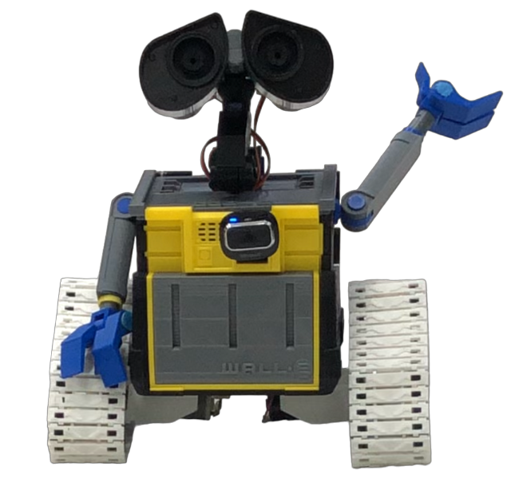

# Resultados Finais

Os resultados finais foram positivos e são possíveis de serem vistos nos vídeos abaixo.

**Resultado Final Wall-e**

Fonte: Autoria Própria

[Video - Teste do Wall-e com checagem de colisão e identificação de lixo](https://www.youtube.com/watch?v=cx0_UOhC5lk)

Neste primeiro vídeo é possível análiser o wall-e evitando colisão com a parede verde (tem melhor resultado), porém como o lixo foi posicionado fora da zona da câmera, por conta da cãmera usada ter um zoom, o mesmo não identificou o lixo em primeiro momento, porém após evitar a colisão com a parede se direcionou para o lixo, assim o observando e indo até o mesmo e fazendo uma sinalização com o buzzer por conta da presença da caixa de leite (lixo).

[Video 1 - Teste 1 do Wall-e de identificação de lixo](https://youtu.be/kif78zdigpE)

[Video 2 - Teste 2 do Wall-e de identificação de lixo](https://youtu.be/n7UwL3ediy8)

Fonte: Autoria Própria