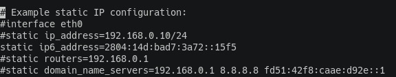
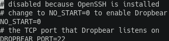
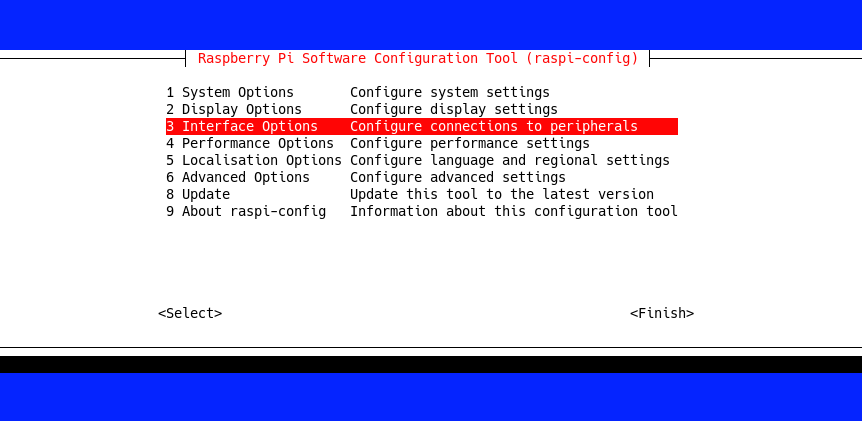
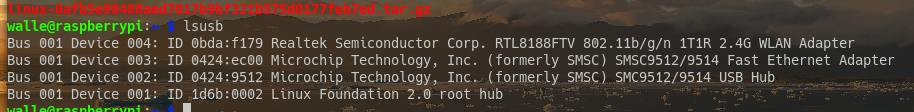

# Configuração da Raspberry Pi

Essa página documenta todo o processo de configuração da Raspberry Pi usada no projeto. Esse processo foi feito com a Raspberry conectada a um monitor com interface gráfica, e alimentada com um carregador de 5V. Serão fornecidas algumas instruções para caso queiram reproduzir as configurações desse projeto.

Foi necessário baixar o Raspberry Pi OS do site oficial da [Raspberry Pi](https://www.raspberrypi.com/software/operating-systems/). E escrevê-lo em um cartão uSD. Depois colocá-lo em um adaptador de uSD para SD. Assim, pode-se inseri-lo na Raspberry Pi.

Assim que a Raspberry Pi iniciou pela primeira vez, foi necessário criar um usuário. Os scripts de sincronização pressupõe o uso do nome Wall-e. Então foi criado um com esse nome. A senha escolhida foi "Oct211809".


## Informações da Raspbery Pi usada

Para verificar as informações da Raspberry Pi, use o seguinte comando:

```shell
cat /proc/cpuinfo
```

O resultado dele, para a Raspberry Pi usada nesse projeto foi o seguinte:

```
processor       : 0
model name      : ARMv6-compatible processor rev 7 (v6l)
BogoMIPS        : 697.95
Features        : half thumb fastmult vfp edsp java tls
CPU implementer : 0x41
CPU architecture: 7
CPU variant     : 0x0
CPU part        : 0xb76
CPU revision    : 7

Hardware        : BCM2835
Revision        : 000e
Serial          : 000000003171b557
Model           : Raspberry Pi Model B Rev 2
```

Nesse projeto foi utilizado uma Raspberry Pi modelo B revisão 2.


## IPV6 fixo

Para descobrir qual o da Raspberry Pi, use o comando abaixo. Ele mostra o ipv4 e ipv6 da Raspberry Pi. Nesse caso, o IPV6 foi "2804:14d:bad7:3a72::15f5".

```sh
hostname -I
```

Depois disso, foi necessário ajustar as configurações do DHCP para usar o IPV6 fixo. No caso da Raspberry Pi, o cliente DHCP era o Dhcpcd e seu arquivo de configuração era o '/etc/dhcpcd.conf'. Para usar IPV6 fixo, basta adicionar a seguinte linha:

```
static ip6_address=<IPV6 obtido na etapa anterior>
```

No caso desse projeto, o resultado foi:



Além disso, é necessário configurar o IP fixo no arquivo de configuração do repositório. Ajuste o parâmetro 'IP' do arquivo [../env/conf](../env/conf). Lembre que ele deve ser criado anteriormente, como descrito na [documentação do código](../)


## SSH

Para instalar o Dropber na Raspberry Pi, execute o comando:

```shell
sudo apt install dropbear
```

Para configurar o Dropbear, edite o arquivo '/etc/default/dropbear' e remova a alinha:

```
NO_START=1
```

E adicione a seguinte linha:

```
NO_START=0
```

O resultado foi o seguinte:




### Chaves públicas

O acesso via SSH deve ser feito usando as chaves e certificados criadas conforme documentado na [pasta do código](../). Então, deve-se levar o diretório 'env/' do computador para a Raspberry Pi. Foi usado um pendrive.

É necessário definir uma chave privada para o Dropbear (servidor SSH)

```sh
sudo cp env/ssh/dropbear_ed25519_host_key /etc/dropbear/
```

Também é necessário criar o diretório: /root/.ssh

```sh
sudo mkdir /root/.ssh
```

E mover a chave privada do cliente para o arquivo: '/root/.ssh/authorized_keys'

```sh
sudo cp env/ssh/client-ssh.pub /root/.ssh/authorized_keys
```

Foi necessário repetir o processo anterior para o usuário Wall-e.
```sh
mkdir -p ~/.ssh
cp env/ssh/client-ssh.pub ~/.ssh/authorized_keys
```

O servidor SSH funcionou corretamente depois dessas configurações, mas é necessário tomar cuidado ao atualizar as chaves SSH no computador do administrador. Fazer isso, exigirá que o servidor SSH da Raspberry Pi seja reconfigurado.

Se deseja realizar essa configuração, há o script [setup.sh](./setup.sh) disponível para isso.


## Rsync

Para instalar o Rsync, use:

```shell
sudo apt install rsync
```

O Rsync necessita do Dropbear funcionando. Primeiro, foi necessário criar o diretório onde estará o código: "~/code". Após isso, basta copiar o arquivo de configuração do Rsync [rsyncd.conf](rsyncd.conf) desse repositório para o "/etc/rsyncd.conf" da Raspberry Pi (foi usado um pendrive).


## Configuração do código

Agora será apresentado as configurações necessárias para executar o código.


### Pinout da Raspberry Pi

Para listar o pinout da Raspberry Pi, use o seguinte comando:

```shell
pinout
```

O resultado obtido para a Raspberry Pi usada foi o seguinte:

```
+------------------| |--| |------+
| ooooooooooooo P1 |C|  |A|      |
| 1oooooooooooo    +-+  +-+      |
|    1ooo                        |
| P5 oooo        +---+          +====
|                |SoC|          | USB
|   |D| Pi Model +---+          +====
|   |S| B  V2.0                  |
|   |I|                  |C|+======
|                        |S||   Net
|                        |I|+======
=pwr             |HDMI|          |
+----------------|    |----------+

Revision           : 000e
SoC                : BCM2835
RAM                : 512MB
Storage            : SD
USB ports          : 2 (of which 0 USB3)
Ethernet ports     : 1 (100Mbps max. speed)
Wi-fi              : False
Bluetooth          : False
Camera ports (CSI) : 1
Display ports (DSI): 1

P1:
   3V3  (1) (2)  5V
 GPIO2  (3) (4)  5V
 GPIO3  (5) (6)  GND
 GPIO4  (7) (8)  GPIO14
   GND  (9) (10) GPIO15
GPIO17 (11) (12) GPIO18
GPIO27 (13) (14) GND
GPIO22 (15) (16) GPIO23
   3V3 (17) (18) GPIO24
GPIO10 (19) (20) GND
 GPIO9 (21) (22) GPIO25
GPIO11 (23) (24) GPIO8
   GND (25) (26) GPIO7

P5:
    5V (1) (2) 3V3
GPIO28 (3) (4) GPIO29
GPIO30 (5) (6) GPIO31
   GND (7) (8) GND
```


### Configuração das GPIO

Para acessar as GPIO da Raspberry Pi, é necessário o módulo RPi.GPIO do python. Normalmente já vem instalado por padrão. Caso não venha, basta executar o seguinte comando:

```shell
sudo apt install python3-rpi.gpio
```

Se por algum motivo o usuário não possuir permissão de uso das GPIO, use o seguinte comando:

```shell
sudo usermod -a -G gpio walle
```


### Liberar os GPIO do UART e SPI

Nesse projeto, foram usadas algumas GPIO que já estavam sendo usadas por algumas funções da Raspberry. Foi necessário desativar essas funções para poder usá-las.

```shell
sudo raspi-config
```

Deve-se desabilitar as opções 'SPI' e 'Serial Port' entro da aba 'Interface Options'.

Entrando nas opções de interface:



Desabilitando o 'SPI' e 'Serial Port':


### Shutdown sem sudo

Para poder desligar a Raspberry Pi sem necessidade de sudo, basta executar o seguinte comando:

```shell
sudo chmod 4755 /sbin/shutdown
```

OBS.: É possível que, ao atualizar o sistema, esse processo seja revertido e seja necessário refazê-lo.


## Uso da webcam

Para acessar a webcam, é necessário que o usuário pertença ao grupo 'video'. Isso costuma ser configurado por padrão; todavia, se não foi feito, pode-se usar o seguinte comando:

```shell
sudo usermod -a -G video walle
```

Além disso, é necessário instalar o OpenCV (responsável pela captura da imagem).

```shell
sudo apt install python3-opencv
```


## Driver do adaptador wifi (para Raspberry Pi 1)

O adaptador wifi usado foi o [LV-UW06](https://produto.mercadolivre.com.br/MLB-1881821475-adaptador-pendrive-wifi-usb-wireless-notebook-pc-80211n-_JM#position=26&search_layout=grid&type=item&tracking_id=61c3c931-ecfa-43d7-ae36-3989f0f1fbb3). Ele utiliza o driver RTL8188FTV, como mostrado na imagem abaixo:



No Linux, pode-se utilizar o módulo [rtl8188fu](https://github.com/kelebek333/rtl8188fu).

Repositório com as instruções de compilação:

[https://github.com/kelebek333/rtl8188fu](https://github.com/kelebek333/rtl8188fu)

Descobrir qual driver deveria ser usado nesse adaptador wifi foi complexo porque que o fabricante enviou um mini CD com ele. Entretanto, não tinha um leitor adequado disponível. Muitos materiais na internet forneciam informações erradas do driver. Durante esse processo, foi instalado diferentes drivers na Raspberry Pi, mas apenas o rtl8188fu funcionou. Alguns problemas foram evidenciados ao tentar instalar os demais drivers, como descrito a seguir, mas podem não aparecer se apenas os passos de instalação do rtl8188fu forem seguidos.

- Se não for encontrado os headers do kernel, siga as instruções do seguinte repositório: [https://github.com/RPi-Distro/rpi-source](https://github.com/RPi-Distro/rpi-source)

- Para resolver o problema de não encontrar a arquitetura correta ao procurar os headers do kernel, use:

    ```shell
    cd /usr/src/linux-headers-$(uname -r)/arch/
    sudo ln -s arm armv6l
    ```

- Aqui é um exemplo de alguém que passou por problemas semelhantes durante a configuração do Wifi: [https://forums.raspberrypi.com/viewtopic.php?t=326733](https://forums.raspberrypi.com/viewtopic.php?t=326733)

Após o driver estar configurado, basta reiniciar a Raspberry Pi e conectar com o wifi. A conexão foi feita usando a interface gráfica.


### Conexão Wifi

A Raspberry Pi foi registrada na rede com nome de "WalleWifi123" e senha "Nov162302".


## Desabilitar a interface gráfica após tudo estar configurado

Após tudo estar configurado, basta desabilitar a interface gráfica para liberar memória RAM e diminuir o consumo da CPU. A melhor forma de fazer isso é desabilitando o gerenciador de login. No caso da Raspberry Pi, é o Lightdm.

```shell
sudo systemctl disable lightdm
```

Se deseja ativá-lo, basta executar o seguinte comando:

```shell
sudo systemctl enable lightdm
```


## Algorítmo de segmentação

Não foi possível executar o algorítimo de segmentação na Raspberry Pi por problemas de desempenho. Ainda assim, convêm explicar o processo de instalação do Tensorflow e teste do algorítimo. Para instalar, foi seguido o [tutorial de compilação do pacote python do Tensorflow runtime](https://www.tensorflow.org/lite/guide/build_cmake_pip). Uma versão pré-compilada está disponível no diretório atual: é o arquivo 'tflite_runtime-2.13.1-cp39-cp39-linux_armv6l.whl'. Ele foi instalado pelo PIP3.

Ao importar o Tensorflow runtime, apareceu um erro relativo ao Numpy. Para resolvê-lo, foi usado o seguinte comando:

```shell
sudo apt-get install libopenblas-de
```

Dito isso, como demorou em torno de 12s para realizar a segmentação da imagem, optou-se por implementar a segmentação no cliente (usuário).
