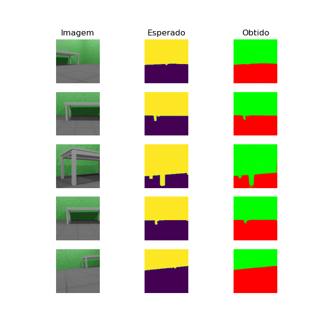

# Código do algorítimo de segmentação

Os códigos disponíveis nesse diretório são referentes ao algorítimo de segmentação semântica usado para identificar qual parte da imagem é se refere a um objeto colidível e qual se refere a uma região segura para se locomover.

Conforme descrito no [Design do modo autônomo](../../../design/autonomo.md), o modelo de segmentação deveria ser o uNET com o mobilnet como backbone. Todavia, os resultados do mobilenet deixaram a desejar. Por isso, foi utilizado o uNET com seu codificador padrão.

Os resultados do modelo treinado (uNET) para identificar colisão em paredes verdes pode ser observado na imagem abaixo:



Os módulos criados para implementar esse projeto estão no diretório ['modulos/'](modulos/). A documentação deles está disponível em [documentação dos módulos](../../docs/_build/markdown/_autosummary/codigo.segmentacao.modulos.md).

Os scripts de teste estão no diretório ['teste/'](teste/). A documentação deles está disponível em [documentação dos scripts de teste](../../docs/_build/markdown/_autosummary/codigo.segmentacao.teste.md).


## Dependências

Para executar os códigos desse diretório é necessário ter o Python 3 e os módulos do Tensorflow. O modulo pode ser instalado pelo PIP3:

```shell
pip3 install tensorflow
```


## Treinamento

As imagens do dataset foram criadas com computação gráfica por meio do Blender. Após isso, foi criado um dataset do Tensorflow para ser usado no treinamento.

Mais informações disso estão disponíveis na [documentação do dataset](datasets).

A criação do modelo foi feita usando o script [cria_modelo.py](cria_modelo.py). É possível continuar o treinamento do modelo já criado por meio do script [treina_modelo.py](treina_modelo.py). Durante o treinamento do modelo, é mostrado a perda (loss) e acurácia. Tanto para o dataset de treino quanto para o de validação. O valor da acurácia de validação é o mais importante para o modelo. Esse valor varia de 0.0 até 1.0. Quanto maior, melhor.

Após isso, é necessário converter o modelo para o formato ftlite para poder ser usado pelo interpretador. Para isso, há o script [converte_tflite.py](converte_tflite.py).

Foi treinado um modelo para uma sala com paredes verdes e pisos cinza. Ele foi pensado para ser usado nos corredores do IFSC. O modelo possui cerca de 80M e o Github recomenda não colocá-lo. Por isso, foi deixado um link abaixo para download. Se deseja executá-lo, basta baixá-lo e renomear para "modelo-segmentacao.tflite". Após isso, coloque-o no diretório atual.

[Baixar modelo](https://drive.google.com/file/d/1H6kcwIucBIYkMRTaoDsZ2ZPjrIL6yn6r/view?usp=drive_link)
