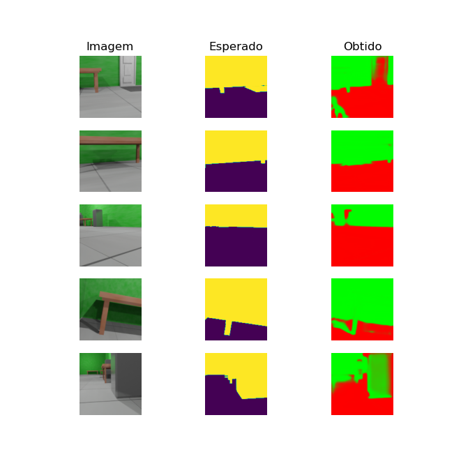

# Código do algorítimo de segmentação

Os códigos disponíveis nesse diretório são referentes ao algorítimo de segmentação semântica usado para identificar qual parte da imagem se refere a um objeto colidível e qual se refere a uma região segura para se locomover.

Conforme descrito no [Design do modo autônomo](../../../design/autonomo.md), o modelo de segmentação deveria ser o uNET com o mobilnetV3 como backbone. Todavia, os resultados do mobilenetV3 deixaram a desejar. Abaixo temos uma imagem de um dataset segmentado usando o modelo com o MobilenetV3 como backbone. O Script do modelo é o [mobilenet_v3_unet.py](modulos/mobilenet_v3_unet.py).



Por isso, foi testado outro modelo. Nesse caso, optamos por testar o uNET com seu codificador padrão (sem o mobilenetV3 como codificador). O código foi baseado nesse [exemplo de implementação do uNET do site pyimagesearch](https://pyimagesearch.com/2022/02/21/u-net-image-segmentation-in-keras/).

Os resultados do modelo treinado (uNET) para identificar colisão em paredes verdes pode ser observado na imagem abaixo:


Os módulos criados para implementar esse projeto estão no diretório ['modulos/'](modulos/). A documentação deles está disponível em [documentação dos módulos](../../docs/_build/markdown/_autosummary/codigo.segmentacao.modulos.md).

Os scripts de teste estão no diretório ['teste/'](teste/). A documentação deles está disponível em [documentação dos scripts de teste](../../docs/_build/markdown/_autosummary/codigo.segmentacao.teste.md).


## Dependências

Para executar os códigos desse diretório é necessário ter o Python 3 e os módulos do Tensorflow e Matplotlib. Eles podem ser instalado pelo PIP3:

```shell
pip3 install tensorflow matplotlib
```


## Treinamento

As imagens do dataset foram criadas com computação gráfica por meio do Blender. Com elas, foi criado um dataset do Tensorflow para ser usado no treinamento. O dataset usado no treinamento dos modelos foi pensado para os corredores do IFSC. São imagens de paredes verdes com pisos de diferentes tonalidades de cinza.

Mais informações da criação de datasets estão disponíveis na [documentação do dataset](datasets).

A criação do modelo foi feita usando o script [cria_modelo.py](cria_modelo.py). É possível continuar o treinamento do modelo já criado por meio do script [treina_modelo.py](treina_modelo.py). Durante o treinamento do modelo, é mostrado a perda (loss) e acurácia. Tanto para o dataset de treino quanto para o de validação. O valor da acurácia de validação é o mais importante para o modelo. Esse valor varia de 0.0 até 1.0. Quanto maior, melhor.

Após isso, é necessário converter o modelo para o formato ftlite para poder ser usado pelo interpretador. Para isso, há o script [converte_tflite.py](converte_tflite.py).

Foi dessa forma que os modelos foram treinados, tanto o mobilenetV3 quanto o uNET. Como arquivos dos modelos são relativamente grandes para o Github mais de 50M. Optou-se por colocá-los no Google Drive e disponibilizar um Link para baixá-los. Para usá-los nesse projeto, basta renomeá-los para "modelo-segmentacao.tflite" e colocá-los o diretório corrente.

[Link modelos](https://drive.google.com/drive/folders/1dwD33YQNWmXR4oi_z7RVapRyitmweZZ_?usp=drive_link)
