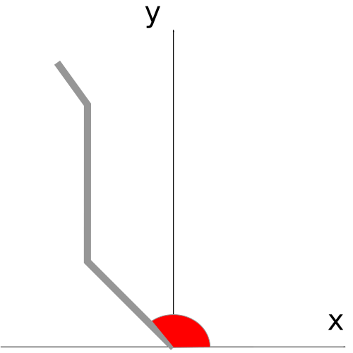

<a id="codigo-controlador-modulos-aestrela"></a>

# codigo.controlador.modulos.aestrela

* **code:**
  [aestrela.py](../../../../codigo/controlador/modulos/aestrela.py)

<a id="module-codigo.controlador.modulos.aestrela"></a>

Implementação do algorítimo de busca A-estrela.

Para utilizar o algorítimo, deve-se criar um objeto da classe [`AEstrela`](#codigo.controlador.modulos.aestrela.AEstrela).

<a id="codigo.controlador.modulos.aestrela.AEstrela"></a>

### *class* codigo.controlador.modulos.aestrela.AEstrela(passo=10)

Base: [`object`](https://docs.python.org/3/library/functions.html#object)

Implementa o algorítimo A\*, para obter o melhor caminho entre dois pontos de um mapa.

Essa classe permite configurar um objeto que traça o menor caminho entre dois pontos
em um mapa usando o algoítimo A\*. Para gerar o caminho, deve ser fornecido um mapa de
entrada e as posições iniciais e finais do caminho.

Os mapas usados nessa implementação são todos matrizes do Numpy do tipo matriz[y][x].
O eixo y é apresentado primeiro para melhor compatibilidade com o Numpy. Os pontos
também usam o formato (y, x). A matriz do mapa que indica as posições permitidas para
se mover e as que não são permitidas (paredes) utiliza valores do tipo uint8. É possível
criar uma matriz desse tipo com o seguinte código:

```pycon
>>> matriz = numpy.zeros((linhas, colunas), dtype=numpy.uint8)
```

Nessa matriz, o valor 0 representa uma região não colidível, e o valor 1 representa
uma região colidível.

É necessário fornecer um mapa, e as posições final e inicial para traçar o caminho.

O mapa é definido pelo método [`define_mapas()`](#codigo.controlador.modulos.aestrela.AEstrela.define_mapas), e os pontos são definidos ao gerar
o caminho com o método [`gera_caminho()`](#codigo.controlador.modulos.aestrela.AEstrela.gera_caminho).

A implementação permite configurar a quantidade de custo adicionada ao mudar de posição
na implementação. O parâmetro é o *passo*, definido ao instanciar a classe. Veja
[`__init__()`](#codigo.controlador.modulos.aestrela.AEstrela.__init__) para mais informações;

O custo é computado usando a função heurística baseada na distância entre dois pontos.

Também é possível usar uma matriz para adicionar valores específicos a função
de custo em cada ponto do mapa. Veja a documentação do método [`define_mapas()`](#codigo.controlador.modulos.aestrela.AEstrela.define_mapas).

É possível alterar os mapas e pontos de início/fim de um objeto sem ter que instanciá-lo
novamente.

Para fins de debug e verificação do funcionamento, é possível retornar um mapa com todas as
posições checadas ao gerar um caminho. Veja o método [`retorna_mapa_checados()`](#codigo.controlador.modulos.aestrela.AEstrela.retorna_mapa_checados) para mais
informações.

É possível aplicar uma função de smoothing ao caminho gerado. Ela é baseada na média dos pontos
próximos. Veja o método [`gera_caminho_smoothing()`](#codigo.controlador.modulos.aestrela.AEstrela.gera_caminho_smoothing) para mais informações.

Também é possível retornar um mapa com o caminho traçado. Veja o método [`gera_caminho_mapa()`](#codigo.controlador.modulos.aestrela.AEstrela.gera_caminho_mapa),
e sua versão com smoothing [`gera_caminho_mapa_smoothing()`](#codigo.controlador.modulos.aestrela.AEstrela.gera_caminho_mapa_smoothing).

Se deseja saber a direção inicial que deve ser seguida para alcançar o ponto de destino, use o método
[`retorna_direcao_inicial()`](#codigo.controlador.modulos.aestrela.AEstrela.retorna_direcao_inicial).

#### WARNING
Esse algorítimo foi pensado para ser usado máscaras de algorítimos de segmentação semântica. Então
foi desenvolvido para operar com paredes espessas: com pelo menos dois blocos de espessura. Usar
esse algorítimo com mapas que possuem apenas um bloco de espessura pode resultar em comportamento
inesperado, mas ele funciona adequadamente com mapas gerados por segmentação semântica.

Se deseja ajustar esse algorítimo para funcionar com mapas com paredes e 1 bloco de espessura,
ajuste o método [`_obtem_caminho()`](#codigo.controlador.modulos.aestrela.AEstrela._obtem_caminho).

<a id="codigo.controlador.modulos.aestrela.AEstrela.__init__"></a>

#### \_\_init_\_(passo=10)

Configura o algorítimo A\*.

O parâmetro *passo* é um peso relacionado ao custo de se movimentar de uma posição para outra adjacente.
Por exemplo, ao mover da posição (0, 1) para (0, 2), será adicionado um custo de *passo* a esse caminho.

* **Parâmetros:**
  **passo** ([*int*](https://docs.python.org/3/library/functions.html#int)) – Peso relacionado ao custo de se movimentar de uma posição para outra adjacente.

<a id="codigo.controlador.modulos.aestrela.AEstrela._checa_pos_valida"></a>

#### \_checa_pos_valida(pos)

Checa se uma posição é valida para entrar na lista aberta.

A posição deve ser uma tupla do tipo (y, x).

Fatores considerados ao checar a validade:

* se a posição é uma parede (ou já esteve na lista aberta)
* se a posição pertence ao mapa (não está extrapolando os limites)

* **Parâmetros:**
  **pos** ([*tuple*](https://docs.python.org/3/library/stdtypes.html#tuple)) – Posição que será testada.
* **Retorna:**
  Se a posição é valida para entrar na lista aberta (não é colidível).
* **Tipo de retorno:**
  [bool](https://docs.python.org/3/library/functions.html#bool)

<a id="codigo.controlador.modulos.aestrela.AEstrela._computa_custo"></a>

#### \_computa_custo(posicao_atual, custo_anterior, passo_diagonal=False)

Computa o custo associado a uma posição do mapa.

O custo associado a uma posição é dado pelos seguintes fatores:

- Custo da posição anterior (pai)
- Custo do passo (mudança de posição)
- Custo da função heurística
- Custo da matriz de custo extra

O custo associado ao passo é definido ao instanciar o objeto. Veja o método
[`__init__()`](#codigo.controlador.modulos.aestrela.AEstrela.__init__) para mais detalhes.

A matriz de custo extra é definida pelo método [`define_mapas()`](#codigo.controlador.modulos.aestrela.AEstrela.define_mapas).

Se o passo (mudança de posição) ocorre na diagonal, o custo do passo é 0.414 vezes maior
(a diagonal de um quadrado é 1.414 vezes o seu lado).

* **Parâmetros:**
  * **posicao_atual** ([*tuple*](https://docs.python.org/3/library/stdtypes.html#tuple)) – Posição atual do ponto.
  * **custo_anterior** ([*float*](https://docs.python.org/3/library/functions.html#float)) – Custo do ponto anterior.
  * **passo_diagonal** ([*bool*](https://docs.python.org/3/library/functions.html#bool)) – Se o passo ocorre na diagonal.
* **Retorna:**
  Custo do ponto atual.
* **Tipo de retorno:**
  [float](https://docs.python.org/3/library/functions.html#float)

<a id="codigo.controlador.modulos.aestrela.AEstrela._funcao_heuristica"></a>

#### \_funcao_heuristica(pos_atual)

Função heurística do modelo.

A função heurística aplicada nesse algorítimo consiste na distância entre os
dois pontos (atual e final).

* **Parâmetros:**
  **pos_atual** ([*tuple*](https://docs.python.org/3/library/stdtypes.html#tuple)) – Posição do ponto cujo custo da função heurística será computado.
* **Retorna:**
  Custo associado a função heurística.
* **Tipo de retorno:**
  [float](https://docs.python.org/3/library/functions.html#float)

<a id="codigo.controlador.modulos.aestrela.AEstrela._gera_mapa_caminho"></a>

#### \_gera_mapa_caminho(vetor_caminho)

Retorna um mapa com o menor caminho traçado.

Retorna um mapa com esse caminho. Esse mapa é um array Numpy do tipo matriz[y][x] de inteiros onde 1
representa uma posição do caminho traçado, e 0 uma posição fora do caminho.

As posições devem ser uma tupla do tipo (pos_y, pos_x).

Esse método deve ser chamado após o [`_obtem_caminho()`](#codigo.controlador.modulos.aestrela.AEstrela._obtem_caminho). As informações da posição
relacionada a esse caminho serão usadas para gerar o mapa.

* **Parâmetros:**
  **vetor_caminho** ([*list*](https://docs.python.org/3/library/stdtypes.html#list)) – Vetor com os pontos do caminho.
* **Retorna:**
  Mapa com o caminho percorrido.
* **Tipo de retorno:**
  [numpy.ndarray](https://numpy.org/doc/stable/reference/generated/numpy.ndarray.html#numpy.ndarray)

<a id="codigo.controlador.modulos.aestrela.AEstrela._gera_mapa_caminho_smoothing"></a>

#### \_gera_mapa_caminho_smoothing(vetor_caminho)

Retorna um mapa com o menor caminho traçado. Usa o algorítimo de suavização.

Funciona de forma semelhante ao método [`_gera_mapa_caminho()`](#codigo.controlador.modulos.aestrela.AEstrela._gera_mapa_caminho), mas com o algorítimo de suavização.

* **Parâmetros:**
  **vetor_caminho** ([*list*](https://docs.python.org/3/library/stdtypes.html#list)) – Vetor com os pontos do caminho.
* **Retorna:**
  Mapa com o caminho percorrido (suavizado).
* **Tipo de retorno:**
  [numpy.ndarray](https://numpy.org/doc/stable/reference/generated/numpy.ndarray.html#numpy.ndarray)

<a id="codigo.controlador.modulos.aestrela.AEstrela._gera_vetor_caminho"></a>

#### \_gera_vetor_caminho(penultimo_ponto)

Gera e retorna um vetor com todos os pontos do caminho.

O primeiro elemento do vetor é o ponto inicial. O último é o ponto de destino (final).

Ao gerar o caminho, as posições checadas são colocadas no vetor de checados ‘vetor_fechado’.
Assim, é possível acessar a ‘posição_pai’ por meio desse vetor. Como os elementos desse vetor
possuem a estrutura (posicao_inicial, posicao_pai, custo), mesma usada no método
[`_obtem_caminho()`](#codigo.controlador.modulos.aestrela.AEstrela._obtem_caminho), é possível, recursivamente, acessar todos os pontos do caminho
saltando entre os elementos do ‘vetor_fechado’.

* **Parâmetros:**
  **penultimo_ponto** ([*tuple*](https://docs.python.org/3/library/stdtypes.html#tuple)) – Ponto anterior ao ponto final. Informações da posição anterior ao ponto final.
* **Retorna:**
  Lista com todos os pontos do caminho. Se não foi possível traçar um caminho, retorna None.
* **Tipo de retorno:**
  [list](https://docs.python.org/3/library/stdtypes.html#list) or None

<a id="codigo.controlador.modulos.aestrela.AEstrela._obtem_caminho"></a>

#### \_obtem_caminho(pos_atual)

Define o menor caminho entre os pontos.

Retorna um tupla do tipo (posicao_atual, posicao_pai, custo). A ‘posicao_atual’ é
uma tupla contendo a posição (y, x) do último ponto andes de conectar com o ponto
de destino. A ‘posicao_pai’ é uma tupla da posição (y, x) do ponto pai (antecedente) ao
ponto retornado. E o ‘custo’ é o valor do custo dessa posição (definida pela função
de custo).

* **Parâmetros:**
  **pos_atual** ([*tuple*](https://docs.python.org/3/library/stdtypes.html#tuple)) – Posição atual no mapa.
* **Retorna:**
  Tupla contendo as informações da posição anterior a de destino. Se não encontrou
  um caminho, retorna None.
* **Tipo de retorno:**
  [tuple](https://docs.python.org/3/library/stdtypes.html#tuple) or None

<a id="codigo.controlador.modulos.aestrela.AEstrela._ponto_smoothing"></a>

#### \_ponto_smoothing(vetor, indice, n_pontos)

Aplica o algorítimo de suavização a um ponto.

O ponto a ser suavizado é o determinado pelo *indice* do *vetor*. O algorítimo de suavização
é baseado na média dos seus *n_pontos* adjacentes.

* **Parâmetros:**
  * **vetor** ([*list*](https://docs.python.org/3/library/stdtypes.html#list)) – Vetor com os pontos.
  * **indice** ([*int*](https://docs.python.org/3/library/functions.html#int)) – Índice do ponto no *vetor*.
  * **n_pontos** ([*int*](https://docs.python.org/3/library/functions.html#int)) – Quantidade de pontos adjacentes usados na suavização.
* **Retorna:**
  Ponto suavizado.
* **Tipo de retorno:**
  [tuple](https://docs.python.org/3/library/stdtypes.html#tuple)

<a id="codigo.controlador.modulos.aestrela.AEstrela._vetor_smoothing"></a>

#### \_vetor_smoothing(vetor, n_pontos)

Aplica o algorítimo de suavização aos pontos de um vetor.

O algorítimo de suavização é o mesmo usado pelo método [`_ponto_smoothing()`](#codigo.controlador.modulos.aestrela.AEstrela._ponto_smoothing).

* **Parâmetros:**
  * **vetor** ([*list*](https://docs.python.org/3/library/stdtypes.html#list)) – Vetor com os pontos.
  * **n_pontos** ([*int*](https://docs.python.org/3/library/functions.html#int)) – Quantidade de pontos adjacentes usados na suavização.
* **Retorna:**
  Lista com os pontos suavizados.
* **Tipo de retorno:**
  [list](https://docs.python.org/3/library/stdtypes.html#list)

<a id="codigo.controlador.modulos.aestrela.AEstrela._vetor_smoothing_media_movel"></a>

#### \_vetor_smoothing_media_movel(vetor, n_pontos)

Aplica o algorítimo de suavização aos pontos de um vetor. Usa média móvel.

Funciona de forma similar ao método [`_vetor_smoothing()`](#codigo.controlador.modulos.aestrela.AEstrela._vetor_smoothing), mas o algorítimo de suavização
não é o mesmo do método [`_ponto_smoothing()`](#codigo.controlador.modulos.aestrela.AEstrela._ponto_smoothing). Utiliza média móvel ao invés disso.

* **Parâmetros:**
  * **vetor** ([*list*](https://docs.python.org/3/library/stdtypes.html#list)) – Vetor com os pontos.
  * **n_pontos** ([*int*](https://docs.python.org/3/library/functions.html#int)) – Quantidade de pontos adjacentes usados na suavização.
* **Retorna:**
  Lista com os pontos suavizados por meio de média móvel.
* **Tipo de retorno:**
  [list](https://docs.python.org/3/library/stdtypes.html#list)

#### NOTE
Esse método não está sendo utilizado atualmente pela classe. Foi deixado para caso o usuário
deseje substituir o algoritmo de suavização por esse.

<a id="codigo.controlador.modulos.aestrela.AEstrela.define_mapas"></a>

#### define_mapas(mapa, mapa_custo=None)

Define o mapa do ambiente onde será traçado o caminho.

Deve ser fornecido um mapa do ambiente onde será traçado o caminho. O mapa é uma matriz do Numpy tipo
matriz[y][x] de uint8 onde 0 representa um lugar por onde pode ser traçado um caminho e 1, uma
barreira sólida que não pode ser ultrapassada.

Também é possível fornecer um mapa de custo cujos valores serão somados a função heurística.
O mapa é uma matriz do Numpy tipo matriz[y][x] de pontos flutuantes. O valor de cada posição será
somado a função custo quando computar o custo associado a essa posição. As dimensões do *mapa_custo*
devem ser iguais às dimensões do *mapa*

* **Parâmetros:**
  * **mapa** ([*numpy.ndarray*](https://numpy.org/doc/stable/reference/generated/numpy.ndarray.html#numpy.ndarray)) – Mapa da região onde será traçado o caminho.
  * **mapa_custo** ([*numpy.ndarray*](https://numpy.org/doc/stable/reference/generated/numpy.ndarray.html#numpy.ndarray)) – Mapa de valores a serem somados a função de custo. Deve ter as mesmas dimensões que o *mapa*.

#### WARNING
Executar esse método apaga o mapa e os resultados anteriores.

<a id="codigo.controlador.modulos.aestrela.AEstrela.gera_caminho"></a>

#### gera_caminho(pos_inicio, pos_fim)

Gera o melhor caminho do ponto inicial até o final no mapa.

Retorna uma lista com esse caminho. Da posição inicial até a posição anterior ao ponto final.
Ela é gerada com os métodos e [`_obtem_caminho()`](#codigo.controlador.modulos.aestrela.AEstrela._obtem_caminho) e [`_gera_vetor_caminho()`](#codigo.controlador.modulos.aestrela.AEstrela._gera_vetor_caminho).

As posições de início e de fim devem ser uma tupla do tipo (pos_y, pos_x). Os pontos da lista
retornada também são desse formato.

* **Parâmetros:**
  * **pos_inicial** ([*tuple*](https://docs.python.org/3/library/stdtypes.html#tuple)) – Posição de início no mapa.
  * **pos_fim** ([*tuple*](https://docs.python.org/3/library/stdtypes.html#tuple)) – Posição de destino do caminho no mapa.
* **Retorna:**
  Lista com os pontos do caminho.
* **Tipo de retorno:**
  [list](https://docs.python.org/3/library/stdtypes.html#list)

<a id="codigo.controlador.modulos.aestrela.AEstrela.gera_caminho_mapa"></a>

#### gera_caminho_mapa(pos_inicio, pos_fim)

Gera um mapa do caminho percorrido com o algorítimo A\*.

O caminho gerado pelo método [`gera_caminho()`](#codigo.controlador.modulos.aestrela.AEstrela.gera_caminho) é usado para gerar um mapa. Esse mapa
é um array Numpy do tipo matriz[y][x] de inteiros onde 1 representa uma posição do caminho
traçado, e 0 uma posição fora do caminho.

As posições devem ser uma tupla do tipo (pos_y, pos_x).

* **Parâmetros:**
  * **pos_inicio** ([*tuple*](https://docs.python.org/3/library/stdtypes.html#tuple)) – Posição de início no mapa.
  * **pos_fim** ([*tuple*](https://docs.python.org/3/library/stdtypes.html#tuple)) – Posição de destino do caminho no mapa.
* **Retorna:**
  Mapa com o caminho percorrido.
* **Tipo de retorno:**
  [numpy.ndarray](https://numpy.org/doc/stable/reference/generated/numpy.ndarray.html#numpy.ndarray)

<a id="codigo.controlador.modulos.aestrela.AEstrela.gera_caminho_mapa_smoothing"></a>

#### gera_caminho_mapa_smoothing(pos_inicio, pos_fim)

Gera um mapa do caminho percorrido com o algorítimo A\*, com smoothing.

Funciona da mesma forma que o método [`gera_caminho_mapa()`](#codigo.controlador.modulos.aestrela.AEstrela.gera_caminho_mapa), mas o caminho será ajustado
com uma técnica de suavização (smoothing).

* **Parâmetros:**
  * **pos_inicio** ([*tuple*](https://docs.python.org/3/library/stdtypes.html#tuple)) – Posição de início no mapa.
  * **pos_fim** ([*tuple*](https://docs.python.org/3/library/stdtypes.html#tuple)) – Posição de destino do caminho no mapa.
* **Retorna:**
  Mapa com o caminho percorrido.
* **Tipo de retorno:**
  [numpy.ndarray](https://numpy.org/doc/stable/reference/generated/numpy.ndarray.html#numpy.ndarray)

<a id="codigo.controlador.modulos.aestrela.AEstrela.gera_caminho_smoothing"></a>

#### gera_caminho_smoothing(pos_inicio, pos_fim)

Gera o melhor caminho do ponto inicial até o final no mapa, com smoothing.

Funciona da mesma forma que o método [`gera_caminho()`](#codigo.controlador.modulos.aestrela.AEstrela.gera_caminho), mas o caminho será ajustado
com uma técnica de suavização (smoothing). A técnica de suavização é dada executada pelo
método [`_vetor_smoothing()`](#codigo.controlador.modulos.aestrela.AEstrela._vetor_smoothing).

* **Parâmetros:**
  * **pos_inicial** ([*tuple*](https://docs.python.org/3/library/stdtypes.html#tuple)) – Posição de início no mapa.
  * **pos_fim** ([*tuple*](https://docs.python.org/3/library/stdtypes.html#tuple)) – Posição de destino do caminho no mapa.
* **Retorna:**
  Lista com os pontos do caminho.
* **Tipo de retorno:**
  [list](https://docs.python.org/3/library/stdtypes.html#list)

<a id="codigo.controlador.modulos.aestrela.AEstrela.retorna_direcao_inicial"></a>

#### retorna_direcao_inicial(pos_inicio, pos_fim, rad=True)

Retorna a direção inicial que deve ser seguida para percorrer o caminho.

Retorna um ângulo em radiano ou em graus, dependendo do parâmetro *rad*. Ele corresponde ao ângulo,
usando as convenções matemáticas padrões, da abertura entre o eixo x da região inferior do mapa e direção
do caminho percorrido, como ilustrado na imagem abaixo.



Fonte: autoria própria

* **Parâmetros:**
  * **pos_inicio** ([*tuple*](https://docs.python.org/3/library/stdtypes.html#tuple)) – Posição de início no mapa.
  * **pos_fim** ([*tuple*](https://docs.python.org/3/library/stdtypes.html#tuple)) – Posição de destino do caminho no mapa.
  * **rad** ([*bool*](https://docs.python.org/3/library/functions.html#bool)*,* *default True*) – Se True, retorna o angulo em radiano. Se False, retorna o angulo em graus.
* **Retorna:**
  Ângulo da direção inicial em radiano ou em graus. Se não foi possível
  definir a direção, retorna None.
* **Tipo de retorno:**
  [float](https://docs.python.org/3/library/functions.html#float) or None

<a id="codigo.controlador.modulos.aestrela.AEstrela.retorna_mapa_checados"></a>

#### retorna_mapa_checados()

Retorna o mapa com todas as posições checadas.

O mapa é uma matriz do Numpy do tipo matriz[y][x] de inteiros onde 1 representa
uma posição checada, e 0 uma posição não checada.

Esse é um método para verificar o funcionamento do algorítimo A\*.

* **Retorna:**
  Mapa com todas as posições checadas.
* **Tipo de retorno:**
  [numpy.ndarray](https://numpy.org/doc/stable/reference/generated/numpy.ndarray.html#numpy.ndarray)
