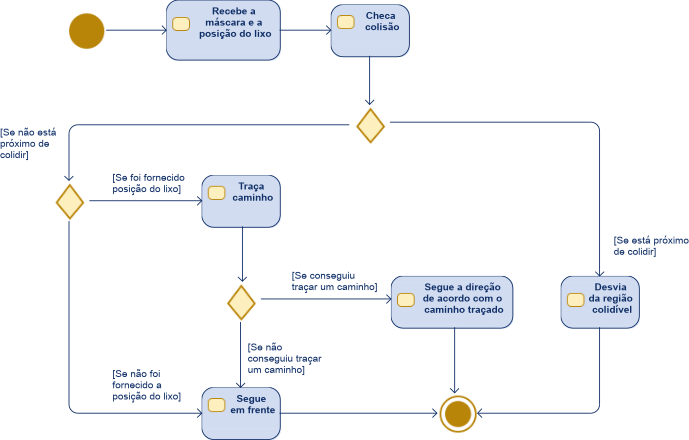

<a id="codigo-controlador-modulos-controlador"></a>

# codigo.controlador.modulos.controlador

* **code:**
  [controlador.py](../../../../codigo/controlador/modulos/controlador.py)

<a id="module-codigo.controlador.modulos.controlador"></a>

Controlador do direcionamento do Wall-e.

Define a classe [`Controlador`](#codigo.controlador.modulos.controlador.Controlador), responsável por definir a velocidade linear e angular do Wall-e no
modo autônomo. Além de definir se o Wall-e deve ativar a sinalização.

<a id="codigo.controlador.modulos.controlador.Controlador"></a>

### *class* codigo.controlador.modulos.controlador.Controlador(formato_mapa: [tuple](https://docs.python.org/3/library/stdtypes.html#tuple) = (60, 60), posicoes_esquerda: [list](https://docs.python.org/3/library/stdtypes.html#list) | [None](https://docs.python.org/3/library/constants.html#None) = None, blocos_tamanho: [int](https://docs.python.org/3/library/functions.html#int) = 3, distancia_minima: [int](https://docs.python.org/3/library/functions.html#int) = 0)

Base: [`object`](https://docs.python.org/3/library/functions.html#object)

Controlador do Wall-e no modo autônomo.

O controlador possui um sistema de checagem de colisão e de direcionamento do Wall-e de forma que o
Wall-e privilegia evitar colidir e, se está em uma direção segura, procurar por lixo. Além disso, se
o Wall-e estiver muito próximo do lixo identificado, para e ativa a sinalização. Mais informações de
como o direcionamento funciona pode ser obtido na documentação do método [`_calcula_velocidades()`](#codigo.controlador.modulos.controlador.Controlador._calcula_velocidades).

Quando o Wall-e está muito próximo do objeto, ele para e ativa a sinalização. Informações de como o
controlador computa isso estão descritas no método [`_calcula_sinalizacao()`](#codigo.controlador.modulos.controlador.Controlador._calcula_sinalizacao).

O controlador possui alguns parâmetros que devem ser definidos. Por exemplo, ao instanciar a classe, deve
ser informado o tamanho do mapa usado pelo controlador. Se for recebido um mapa com formato diferente,
o controlador redimensiona ele para o formato correto.

Também deve ser informado os parâmetros relacionados à checagem de colisão: as posições e tamanho dos
blocos usados para checar as colisões. Além disso, é necessário informar a distância mínima entre o objeto
e o Wall-e antes que a sinalização seja acionada. Consulte a documentação do método [`__init__()`](#codigo.controlador.modulos.controlador.Controlador.__init__)
para mais informações.

O seguinte exemplo inicia o controlador para usar mapas de 60x60, com os blocos definidos por
*posicoes_esquerda* e com tamanho (lados) de 3 blocos. A distância mínima do objeto para o
Wall-e é de 10 blocos do mapa.

```pycon
>>> posicoes_esquerda = [
>>>     (-5, -15),
>>>     (-10, -12),
>>>     (-15, -10),
>>>     (-17, -3)
>>>     ]
```

```pycon
>>> controlador = Controlador((60, 60), posicoes_esquerda, 3, 10)
```

Agora quanto aos parâmetros opcionais, é possível especificar os parâmetros usados para expandir os mapas
de regiões colidíveis com o método [`parametros_expansao()`](#codigo.controlador.modulos.controlador.Controlador.parametros_expansao) e os parâmetros usados para gerar a matriz
de custo por meio do método [`parametros_custo()`](#codigo.controlador.modulos.controlador.Controlador.parametros_custo)

São aplicados dois controladores PID nas velocidades linear e angula (um para cada). Seus parâmetros
podem ser configurados pelos métodos [`parametros_PID_linear()`](#codigo.controlador.modulos.controlador.Controlador.parametros_PID_linear) e [`parametros_PID_angular()`](#codigo.controlador.modulos.controlador.Controlador.parametros_PID_angular). Se
esses métodos não forem chamados, então o controlador não usa os controladores PID.

Para obter a direção de movimento do Wall-e, use o método [`calcula_direcao()`](#codigo.controlador.modulos.controlador.Controlador.calcula_direcao). Ele também informa
se o Wall-e deve acionar a sinalização.

Para verificar onde está ocorrendo a colisão, use o método [`mostra_colisoes()`](#codigo.controlador.modulos.controlador.Controlador.mostra_colisoes).

Para checar o processamento do mapa atual, use o método [`retorna_processamento_mapa()`](#codigo.controlador.modulos.controlador.Controlador.retorna_processamento_mapa).

<a id="codigo.controlador.modulos.controlador.Controlador.__init__"></a>

#### \_\_init_\_(formato_mapa: [tuple](https://docs.python.org/3/library/stdtypes.html#tuple) = (60, 60), posicoes_esquerda: [list](https://docs.python.org/3/library/stdtypes.html#list) | [None](https://docs.python.org/3/library/constants.html#None) = None, blocos_tamanho: [int](https://docs.python.org/3/library/functions.html#int) = 3, distancia_minima: [int](https://docs.python.org/3/library/functions.html#int) = 0)

Inicialização do controlador.

Cria os atributos da classe. Configura o traçador de caminho e a checagem de colisão. É necessário
informar o formato dos mapas usados pelo controlador. Ao receber um mapa, ele será automaticamente
redimensionado para esse formato contanto que seja bidimensional. O formato do mapa é dado pelo
parâmetro *formato_mapa* e deve ser uma tupla do tipo (n_linhas, n_colunas).

As posições a serem testadas (checagem de colisão) também devem ser informadas na instanciação do objeto.
Eles são informadas em tuplas do tipo (y, x). O parâmetro *posicoes_esquerda* deve ser uma lista de tuplas
contendo as posições dos blocos que serão checados à esquerda do mapa. São posições relativas ao ponto
inicial do mapa. Por exemplo, se o ponto inicial é (25, 25), e o parâmetro *posicoes_esquerda* é [(-10, -5)],
então será configurado um bloco com centro em (15,20).

As posições da esquerda são espelhadas para obter as posições da direita. Então informe apenas as posições
da esquerda.

Essas posições são checadas em blocos. O tamanho de cada bloco (largura e altura) é definido pelo
parâmetro *blocos_tamanho*.

Deve-se configurar a distância mínima entre os objetos detectados (mais próximo) e o Wall-e. Para isso, use o
parâmetro *distancia_minima*. Se a distância entre o objeto e o Wall-e for menor que *distancia_minima*, a
sinalização será acionada conforme descrito no método [`_calcula_sinalizacao()`](#codigo.controlador.modulos.controlador.Controlador._calcula_sinalizacao).

* **Parâmetros:**
  * **formato_mapa** ([*tuple*](https://docs.python.org/3/library/stdtypes.html#tuple)) – Formato do mapa usado pelo controlador.
  * **posicoes_esquerda** ([*list*](https://docs.python.org/3/library/stdtypes.html#list)) – Lista de tuplas contendo as posições dos blocos à esquerda do mapa que serão checadas.
  * **blocos_tamanho** ([*int*](https://docs.python.org/3/library/functions.html#int)) – Tamanho de cada bloco onde será checado a colisão no mapa.
  * **distancia_minima** ([*int*](https://docs.python.org/3/library/functions.html#int)) – Distância mínima entre os objetos detectados e o Wall-e.

<a id="codigo.controlador.modulos.controlador.Controlador._calcula_direcao_objeto"></a>

#### \_calcula_direcao_objeto(pos_final)

Calcula a direção que deve percorrer para alcançar um objeto.

Retorna a direção (ângulo em radianos) que o Wall-e deve se mover para alcançar o objeto.

* **Parâmetros:**
  **pos_final** ([*tuple*](https://docs.python.org/3/library/stdtypes.html#tuple)) – Posição de destino do caminho. Onde está o objeto.
* **Retorna:**
  Direção do que o Wall-e deve se mover. O angulo em radianos.
* **Tipo de retorno:**
  [float](https://docs.python.org/3/library/functions.html#float)

<a id="codigo.controlador.modulos.controlador.Controlador._calcula_sinalizacao"></a>

#### \_calcula_sinalizacao(pos_objeto: [tuple](https://docs.python.org/3/library/stdtypes.html#tuple) | [None](https://docs.python.org/3/library/constants.html#None) = None)

Verifica se o Wall-e deve acionar a sinalização.

A sinalização é ativada quando o objeto chega mais perto do Wall-e do que a distância mínima
definida ao instanciar a classe. Veja o método [`__init__()`](#codigo.controlador.modulos.controlador.Controlador.__init__).

A posição do objeto deve ser uma tupla do tipo (centro_y, centro_x, altura, largura). Além disso,
se trata da posição em relação ao mapa após o redimensionamento. Por exemplo, se o mapa original
possui tamanho de 300x300, mas ao ser aplicado como mapa do controlador é redimensionada para 60x60,
a posição que indica o centro é dada por 30x30.

Se está muito perto do Wall-e, o atributo *self._sinalizacao* é definido como True. Caso contrário,
como False.

Se a posição for None, não é checado a sinalização e o resultado é automaticamente False.

* **Parâmetros:**
  **pos_objeto** ([*tuple*](https://docs.python.org/3/library/stdtypes.html#tuple)) – Posição do objeto no mapa.
* **Retorna:**
  Verdadeiro se o Wall-e deve acionar a sinalização.
* **Tipo de retorno:**
  [bool](https://docs.python.org/3/library/functions.html#bool)

<a id="codigo.controlador.modulos.controlador.Controlador._calcula_velocidades"></a>

#### \_calcula_velocidades(pos_objeto: [tuple](https://docs.python.org/3/library/stdtypes.html#tuple) | [None](https://docs.python.org/3/library/constants.html#None) = None)

Calcula as velocidades lineares e angulares do Wall-e no modo autônomo.

O primeiro fator considerado é se o objeto está muito próximo do Wall-e. Se sim, o Wall-e
permanece parado e ativa a sinalização. Caso contrário, o comportamento do controlador é definido
pelo seguinte diagrama:



Fonte: autoria própria.

Considera a checagem de colisão e a posição do objeto. Se estiver identificando colisão, o
Wall-e é direcionado de forma a evitá-la. Caso contrário tenta traçar um caminho até o objeto e,
se conseguiu, direciona o Wall-e até esse objeto.

Se for configurado previamente, aplica dois controladores PID para as velocidades lineares e angulares
(um para cada). Eles servem para suavizar as mudanças nos valores de velocidade linear e angular.

* **Parâmetros:**
  **pos_objeto** ([*tuple*](https://docs.python.org/3/library/stdtypes.html#tuple)) – Posição do objeto no mapa. Se None, desconsidera o processamento do caminho até o objeto e a sinalização.
* **Retorna:**
  * *int* – Velocidade linear do Wall-e.
  * *int* – Velocidade angular do Wall-e.

<a id="codigo.controlador.modulos.controlador.Controlador._checa_colisao_bloco"></a>

#### \_checa_colisao_bloco(pos: [tuple](https://docs.python.org/3/library/stdtypes.html#tuple), tamanho)

Checa se houve colisão em um bloco.

A posição onde será checado deve ser uma tupla do tipo (y, x) indicando o ponto superior esquerdo do bloco.
O tamanho do bloco é dado pelo parâmetro *tamanho*. Esse é o valor da altura e largura do bloco.

* **Parâmetros:**
  * **pos** ([*tuple*](https://docs.python.org/3/library/stdtypes.html#tuple)) – Posição do bloco.
  * **tamanho** ([*int*](https://docs.python.org/3/library/functions.html#int)) – Tamanho do bloco. Altura e largura.
* **Tipo de retorno:**
  True se houve colisão, False caso contrário.

<a id="codigo.controlador.modulos.controlador.Controlador._checa_colisoes"></a>

#### \_checa_colisoes()

Checa as colisões no mapa.

As posições checadas são as definidas ao instanciar o objeto. Assim como o tamanho do bloco.

Verifica as colisões e retorna uma lista com o identificador de cada colisão (True ou False).

* **Retorna:**
  Lista com o identificador de cada colisão (True ou False).
* **Tipo de retorno:**
  [list](https://docs.python.org/3/library/stdtypes.html#list)

<a id="codigo.controlador.modulos.controlador.Controlador._desenha_debug_colisoes"></a>

#### \_desenha_debug_colisoes()

Desenha as colisões na imagem de debug.

As regiões colidindo são marcadas com amarelo, e as regiões não colidindo marcadas com azul.
A imagem de debug é retornada.

* **Retorna:**
  Imagem de debug.
* **Tipo de retorno:**
  [numpy.ndarray](https://numpy.org/doc/stable/reference/generated/numpy.ndarray.html#numpy.ndarray)

<a id="codigo.controlador.modulos.controlador.Controlador._desenha_debug_direcao"></a>

#### \_desenha_debug_direcao(pos_objeto)

Desenha a direção do caminho que deve seguir na imagem de debug.

Desenha a direção do caminho que o Wall-e deve seguir na imagem de debug. Será um desenho de uma reta em
que a dimensão no eixo ‘y’ representa a velocidade linear, e a dimensão no eixo ‘x’ representa a velocidade angular.

Além disso, desenha o caminho que o Wall-e deve seguir na imagem de debug, caso tenha conseguido traçar um
caminho. Ele será desenhado em branco.

Também desenha um ‘+’ na posição do objeto. As dimensões do objeto também são mostradas na imagem de debug.

Se estiver sinalizando a identificação do lixo, escreve a mensagem “Sinalizando!” com letras azuis.

* **Parâmetros:**
  **pos_objeto** ([*tuple*](https://docs.python.org/3/library/stdtypes.html#tuple)) – Posição de destino do caminho. Onde está o objeto que deve ser seguido.
* **Retorna:**
  Imagem de debug com o indicador da velocidade linear e angular que o Wall-e deve seguir.
  Se conseguiu traçar um caminho entre o ponto de início e a *pos_objeto*, mostra esse caminho também.
* **Tipo de retorno:**
  np.ndarray

<a id="codigo.controlador.modulos.controlador.Controlador._pos_mapa2dbg"></a>

#### \_pos_mapa2dbg(pos: [tuple](https://docs.python.org/3/library/stdtypes.html#tuple))

Transforma uma posição do mapa para a imagem de debug.

O parâmetro *pos* deve ser uma tupla do tipo (y, x). O resultado também assume esse formato.

* **Parâmetros:**
  **pos** ([*tuple*](https://docs.python.org/3/library/stdtypes.html#tuple)) – Posição no mapa.
* **Retorna:**
  Posição na imagem de debug.
* **Tipo de retorno:**
  [tuple](https://docs.python.org/3/library/stdtypes.html#tuple)

<a id="codigo.controlador.modulos.controlador.Controlador._pos_original2dbg"></a>

#### \_pos_original2dbg(pos: [tuple](https://docs.python.org/3/library/stdtypes.html#tuple))

Transforma uma posição da imagem original para a de debug.

O parâmetro *pos* deve ser uma tupla do tipo (y, x). O resultado também assume esse formato.

* **Parâmetros:**
  **pos** ([*tuple*](https://docs.python.org/3/library/stdtypes.html#tuple)) – Posição na imagem original.
* **Retorna:**
  Posição na imagem de debug.
* **Tipo de retorno:**
  [tuple](https://docs.python.org/3/library/stdtypes.html#tuple)

<a id="codigo.controlador.modulos.controlador.Controlador._pos_original2mapa"></a>

#### \_pos_original2mapa(pos: [tuple](https://docs.python.org/3/library/stdtypes.html#tuple))

Transforma uma posição da imagem original para a do mapa.

O parâmetro *pos* deve ser uma tupla do tipo (y, x). O resultado também assume esse formato.

* **Parâmetros:**
  **pos** ([*tuple*](https://docs.python.org/3/library/stdtypes.html#tuple)) – Posição na imagem original.
* **Retorna:**
  Posição no mapa.
* **Tipo de retorno:**
  [tuple](https://docs.python.org/3/library/stdtypes.html#tuple)

<a id="codigo.controlador.modulos.controlador.Controlador._reinicia_iteracao"></a>

#### \_reinicia_iteracao()

Reinicia a iteração do controlador.

O controlador é reiniciado para uma nova iteração. Alguns dados anteriores são apagados.

Esse método também pode ser usado para iniciar os atributos referentes a uma iteração.

Uma iteração corresponde a uma nova checagem de colisão, de direção, de sinalização em um novo mapa fornecido.

<a id="codigo.controlador.modulos.controlador.Controlador.calcula_direcao"></a>

#### calcula_direcao(mapa: [ndarray](https://numpy.org/doc/stable/reference/generated/numpy.ndarray.html#numpy.ndarray), pos_objeto: [tuple](https://docs.python.org/3/library/stdtypes.html#tuple) | [None](https://docs.python.org/3/library/constants.html#None) = None, debug=False)

Calcula a direção na qual o Wall-e deve se mover.

Retorna a velocidade linear e angular que o Wall-e deve seguir para continuar se movendo
no modo autônomo. Além de um booleano indicando se deve sinalizar a presença de lixo ou não.

A posição do objeto que o Wall-e deve seguir é dada pelo parâmetro *pos_objeto*. Ela é uma tupla do tipo
(cy, cx, altura, largura), em que ‘cy’ e ‘cx’ representam a posição do centro do objeto, e ‘altura’ e
‘largura’ o tamanho do objeto.

Se o *mapa* for None, não será atualizado. Será utilizado a mapa anterior. O processamento continua de onde parou.

Se *debug* for True, será desenhado indicadores de direção e caminho na imagem de debug, como definido pelo método
[`_desenha_debug_direcao()`](#codigo.controlador.modulos.controlador.Controlador._desenha_debug_direcao).

* **Parâmetros:**
  * **mapa** ([*numpy.ndarray*](https://numpy.org/doc/stable/reference/generated/numpy.ndarray.html#numpy.ndarray)) – Mapa usado para determinar os caminhos possíveis. Se None, usa o mapa anterior.
  * **pos_objeto** ([*tuple*](https://docs.python.org/3/library/stdtypes.html#tuple)*,* *optional*) – Posição do objeto para onde o Wall-e deve se mover. Onde está o objeto que deve ser seguido.
  * **debug** ([*bool*](https://docs.python.org/3/library/functions.html#bool)*,* *default False*) – Se True, desenha os indicadores de direção e caminho na imagem de debug.
* **Retorna:**
  * *linear* – Velocidade linear do Wall-e.
  * *angular* – Velocidade angular do Wall-e.

<a id="codigo.controlador.modulos.controlador.Controlador.define_mapa"></a>

#### define_mapa(mapa: [ndarray](https://numpy.org/doc/stable/reference/generated/numpy.ndarray.html#numpy.ndarray) | [None](https://docs.python.org/3/library/constants.html#None) = None, imagem_debug: [ndarray](https://numpy.org/doc/stable/reference/generated/numpy.ndarray.html#numpy.ndarray) | [None](https://docs.python.org/3/library/constants.html#None) = None)

Define o mapa do controlador.

O mapa é expandido para evitar que o Wall-e se aproxime demais da região colidível. Além disso,
é gerado um mapa de custo a apartir desse mapa expandido. Para saber mais sobre a expansão e o
mapa de custo, veja os métodos [`parametros_expansao()`](#codigo.controlador.modulos.controlador.Controlador.parametros_expansao) e [`parametros_custo()`](#codigo.controlador.modulos.controlador.Controlador.parametros_custo).

Se o *mapa* for None, não será atualizado. Será utilizado o mapa anterior. For fornecido um novo mapa,
o fluxo do controlador é reiniciado, inclusindo a antiga imagem de debug.

É possível passar uma image de debug pelo parâmetro *imagem_debug* para que o controlador possa
mostrar as informações. Se não for fornecida, será criado uma imagem de debug vazia. A imagem de debug
deve ser estar de acordo com o padrão do OpenCV e ser do tipo BGR.

* **Parâmetros:**
  * **mapa** ([*numpy.ndarray*](https://numpy.org/doc/stable/reference/generated/numpy.ndarray.html#numpy.ndarray)) – Mapa usado para determinar a direção.
  * **imagem_debug** ([*numpy.ndarray*](https://numpy.org/doc/stable/reference/generated/numpy.ndarray.html#numpy.ndarray)) – Imagem onde serão desenhadas os registros de debug. Veja os métodos
    [`_desenha_debug_colisoes()`](#codigo.controlador.modulos.controlador.Controlador._desenha_debug_colisoes) e [`_desenha_debug_direcao()`](#codigo.controlador.modulos.controlador.Controlador._desenha_debug_direcao) para mais informações.

<a id="codigo.controlador.modulos.controlador.Controlador.mapa_vazio"></a>

#### mapa_vazio(fomato: [tuple](https://docs.python.org/3/library/stdtypes.html#tuple))

Retorna um mapa vazio com o formato especificado.

Usando o mapa retornado por esse metodo como parâmetro, pode-se ignorar a checagem de colisão.
Basta fornecêlo ao controlador. Por exemplo:

```pycon
>>> controlador.define_mapa(controlador.mapa_vazio((120, 160)))
```

O formato do mapa, específicado por *formato*, é o formato antes do redimensionamento do mapa.
Lembre que o mapa recebido pelo controlador é redimensionado para o formato específicado ao
instanciar o objeto. Veja o método [`__init__()`](#codigo.controlador.modulos.controlador.Controlador.__init__) para mais informações.

* **Parâmetros:**
  **fomato** ([*tuple*](https://docs.python.org/3/library/stdtypes.html#tuple)) – Formato da mapa (linhas, colunas).
* **Retorna:**
  Mapa vazio com o formato de *fomato*.
* **Tipo de retorno:**
  [numpy.ndarray](https://numpy.org/doc/stable/reference/generated/numpy.ndarray.html#numpy.ndarray)

<a id="codigo.controlador.modulos.controlador.Controlador.mostra_colisoes"></a>

#### mostra_colisoes(mapa: [ndarray](https://numpy.org/doc/stable/reference/generated/numpy.ndarray.html#numpy.ndarray), debug=False)

Retorna se houve colisões no mapa.

A identificação de colisão é retornada como uma lista de booleanos indicando as colisões
dos blocos definidos ao instanciar a classe (veja a documentação do método [`__init__()`](#codigo.controlador.modulos.controlador.Controlador.__init__)
para mais informações).

Cada elemento da lista corresponde a colisão em um bloco definido ao instanciar o objeto. O primeiro
elemento corresponde ao primeiro bloco do parâmetro *posicoes_esquerda*. É importante notar as posições
da direita (derivadas a partir das posições da esquerda) também são retornadas por esse método. Elas
estão no final da lista.

Para separar as colisões à esquerda da direta, use:

```pycon
>>> colisoes = controlador.mostra_colisoes(mapa)
>>> colisoes_esquerda = colisoes[0:len(colisoes)//2]
>>> colisoes_direita = colisoes[len(colisoes)//2:]
```

Se o mapa for None, não será atualizado. Será utilizado a mapa anterior.

Se *debug=True*, desenha os identificadores de colisão na imagem de debug. Veja a documentação do método
[`_desenha_debug_colisoes()`](#codigo.controlador.modulos.controlador.Controlador._desenha_debug_colisoes).

* **Parâmetros:**
  * **mapa** ([*numpy.ndarray*](https://numpy.org/doc/stable/reference/generated/numpy.ndarray.html#numpy.ndarray)) – Mapa onde será checado as colisões. Se None, usa o mapa anterior.
  * **debug** ([*bool*](https://docs.python.org/3/library/functions.html#bool)*,* *default False*) – Se True, desenha os identificadores de colisão na imagem de debug.
* **Retorna:**
  Lista de identificadores de colisão.
* **Tipo de retorno:**
  [list](https://docs.python.org/3/library/stdtypes.html#list)

<a id="codigo.controlador.modulos.controlador.Controlador.parametros_PID_angular"></a>

#### parametros_PID_angular(Kp: [float](https://docs.python.org/3/library/functions.html#float), Ki: [float](https://docs.python.org/3/library/functions.html#float), Kd: [float](https://docs.python.org/3/library/functions.html#float))

Configura os parâmetros usados pelo PID da velocidade angular.

A funcionalidade dos PID é suavizar a velocidae angular.

* **Parâmetros:**
  * **Kp** ([*float*](https://docs.python.org/3/library/functions.html#float)) – Ganho proporcional.
  * **Ki** ([*float*](https://docs.python.org/3/library/functions.html#float)) – Ganho integral.
  * **Kd** ([*float*](https://docs.python.org/3/library/functions.html#float)) – Ganho derivativo.

<a id="codigo.controlador.modulos.controlador.Controlador.parametros_PID_linear"></a>

#### parametros_PID_linear(Kp: [float](https://docs.python.org/3/library/functions.html#float), Ki: [float](https://docs.python.org/3/library/functions.html#float), Kd: [float](https://docs.python.org/3/library/functions.html#float))

Configura os parâmetros usados pelo PID da velocidade linear.

A funcionalidade dos PID é suavizar a velocidade linear.

* **Parâmetros:**
  * **Kp** ([*float*](https://docs.python.org/3/library/functions.html#float)) – Ganho proporcional.
  * **Ki** ([*float*](https://docs.python.org/3/library/functions.html#float)) – Ganho integral.
  * **Kd** ([*float*](https://docs.python.org/3/library/functions.html#float)) – Ganho derivativo.

<a id="codigo.controlador.modulos.controlador.Controlador.parametros_custo"></a>

#### parametros_custo(kernel: [tuple](https://docs.python.org/3/library/stdtypes.html#tuple), sigma: [int](https://docs.python.org/3/library/functions.html#int), multiplicador: [float](https://docs.python.org/3/library/functions.html#float))

Configura os parâmetros usados para expandir a imagem.

O mapa de custo é gerado e forma semelhante à expansão do mapa (ver método [`parametros_expansao()`](#codigo.controlador.modulos.controlador.Controlador.parametros_expansao)).
Também é usado um filtro gaussiano. A diferença é não haver um offset aplicado a cada ponto, mas sim
uma operação de multiplicação. O valor multiplicado ao mapa é definido pelo parâmetro *multiplicador*.

O mapa de custo trabalha com valores de ponto flutuante. Diferente do mapa de colisões.

O mapa de custo é aplicado diretamente ao algorítmo A-estrela pelo método
[`define_mapas()`](codigo.controlador.modulos.aestrela.md#codigo.controlador.modulos.aestrela.AEstrela.define_mapas) da classe
[`AEstrela()`](codigo.controlador.modulos.aestrela.md#codigo.controlador.modulos.aestrela.AEstrela). Veja a documentação do módulo
[`aestrela`](codigo.controlador.modulos.aestrela.md#module-codigo.controlador.modulos.aestrela) para mais informações.

* **Parâmetros:**
  * **kernel** ([*tuple*](https://docs.python.org/3/library/stdtypes.html#tuple)) – Tamanho do kernel do filtro gaussiano usado para gerar o mapa de custo.
  * **sigma** ([*int*](https://docs.python.org/3/library/functions.html#int)) – Sigma do filtro gaussiano usado para gerar o mapa de custo.
  * **multiplicador** ([*float*](https://docs.python.org/3/library/functions.html#float)) – Multiplicador aplicado aos valores do mapa de custo.

<a id="codigo.controlador.modulos.controlador.Controlador.parametros_expansao"></a>

#### parametros_expansao(kernel: [tuple](https://docs.python.org/3/library/stdtypes.html#tuple), sigma: [int](https://docs.python.org/3/library/functions.html#int), offset: [float](https://docs.python.org/3/library/functions.html#float))

Configura os parâmetros usados para expandir a imagem.

A expansão do mapa é feita por meio de um filtro gaussiano. Os parâmetros ajustados por esse método
são referentes a esse filtro. O parâmetro *kernel* é o tamanho do kernel, e o parâmetro *sigma* é o
sigma do filtro gaussiano.

O parâmetro *offset* é o valor de offset aplicados aos valores do mapa. Naturalmente, o valor de
uma posição do mapa varia de 0.0 até 1.0. O offset é aplicado a esse valor. Apenas se passar de 1.0,
será considerado região colidível.

* **Parâmetros:**
  * **kernel** ([*tuple*](https://docs.python.org/3/library/stdtypes.html#tuple)) – Tamanho do kernel do filtro gaussiano usado para expandir o mapa.
  * **sigma** ([*int*](https://docs.python.org/3/library/functions.html#int)) – Sigma do filtro gaussiano usado para expandir o mapa.
  * **offset** ([*float*](https://docs.python.org/3/library/functions.html#float)) – Offset aplicado aos valores do mapa. Se o valor de um ponto passar de 1.0, será considerado colidível.

<a id="codigo.controlador.modulos.controlador.Controlador.retorna_imagem_debug"></a>

#### retorna_imagem_debug()

Retorna a imagem de debug.

Retorna a imagem de debug com os resultados do processamento do mapa. Veja o método
[`_desenha_debug_colisoes()`](#codigo.controlador.modulos.controlador.Controlador._desenha_debug_colisoes) e [`_desenha_debug_direcao()`](#codigo.controlador.modulos.controlador.Controlador._desenha_debug_direcao) para mais informações.

* **Retorna:**
  Imagem de debug.
* **Tipo de retorno:**
  [numpy.ndarray](https://numpy.org/doc/stable/reference/generated/numpy.ndarray.html#numpy.ndarray)

<a id="codigo.controlador.modulos.controlador.Controlador.retorna_processamento_mapa"></a>

#### retorna_processamento_mapa(mapa: [ndarray](https://numpy.org/doc/stable/reference/generated/numpy.ndarray.html#numpy.ndarray), pos_objeto: [tuple](https://docs.python.org/3/library/stdtypes.html#tuple) | [None](https://docs.python.org/3/library/constants.html#None) = None)

Retorna o processamento do mapa.

Computa o processamento do mapa pelo algorítimo A-estrela e retorna uma imagem de debug com os seguintes resultados:

- Mapa original redimensionado
- Mapa expandido
- Mapa de custo
- Mapa com as posições checadas
- Mapa do caminho percorrido
- Mapa original com as posições do caminho percorrido

Esse método é usado para debug.

* **Parâmetros:**
  * **mapa** ([*numpy.ndarray*](https://numpy.org/doc/stable/reference/generated/numpy.ndarray.html#numpy.ndarray)) – Mapa que será processado.
  * **pos_objeto** ([*tuple*](https://docs.python.org/3/library/stdtypes.html#tuple)*,* *default None*) – Posição do objeto no mapa.
* **Retorna:**
  Imagem de debug com os resultados do processamento do mapa.
* **Tipo de retorno:**
  [numpy.ndarray](https://numpy.org/doc/stable/reference/generated/numpy.ndarray.html#numpy.ndarray)
