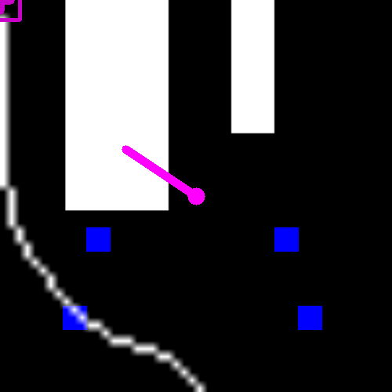

# codigo.controlador.teste.testa_caminho

* **code:**
  [testa_caminho.py](../../../../codigo/controlador/teste/testa_caminho.py)

Script de teste do caminho obtido pelo controlador.

Testa se o controlador consegue traçar o caminho corretamente até o ponto especificado pelo parâmetro *PONTO_DESTINO*.
O mapa é uma imagem definida pelo parâmetro *IMAGEM_PATH*.

O resultado esperado está abaixo:

Fonte: autoria própria.
