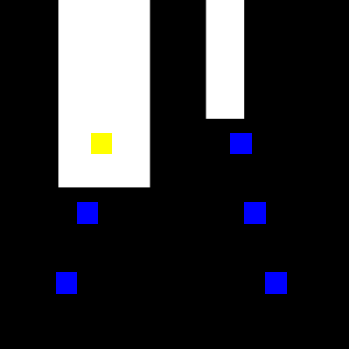

# codigo.controlador.teste.testa_colisao

* **code:**
  [testa_colisao.py](../../../../codigo/controlador/teste/testa_colisao.py)

Script de teste da colisão do controlador.

Checa a colisão em um mapa definido pela imagem do parâmetro *IMAGEM_PATH*. Mostra o resultado visualmente para o usuário.

O resultado esperado está abaixo:

Fonte: autoria própria.
