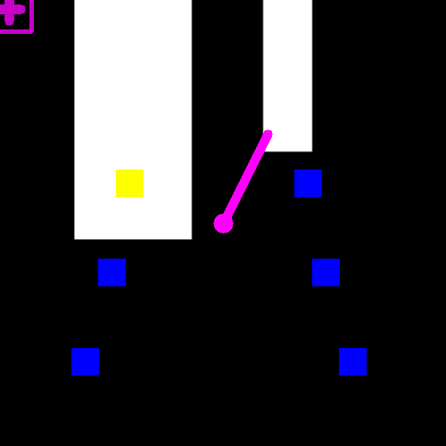

# codigo.controlador.teste.testa_colisoes_e_direcao

* **code:**
  [testa_colisoes_e_direcao.py](../../../../codigo/controlador/teste/testa_colisoes_e_direcao.py)

Script de teste da direção e colisão do controlador.

Checa a colisão e direção em um mapa definido pela imagem do parâmetro *IMAGEM_PATH*. Mostra o resultado visualmente para o usuário.

Tem a mesma funcionalidade dos scripts ‘testa_colisao.py’ e ‘testa_direcao.py’ realizados juntos.

O resultado esperado está abaixo:

Fonte: autoria própria.
