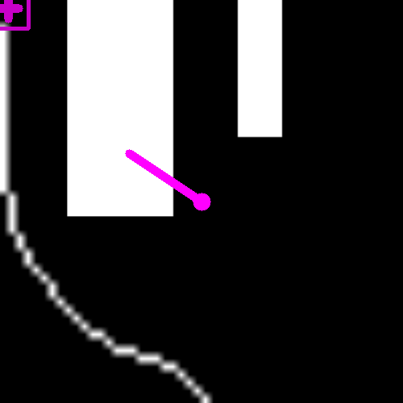

# codigo.controlador.teste.testa_direcao

* **code:**
  [testa_direcao.py](../../../../codigo/controlador/teste/testa_direcao.py)

Script de teste da direção do controlador.

Testa se o controlador consegue definir corretamente a direção.

O mapa é uma imagem definida pelo parâmetro *IMAGEM_PATH*.

O resultado esperado está abaixo:

Fonte: autoria própria.
