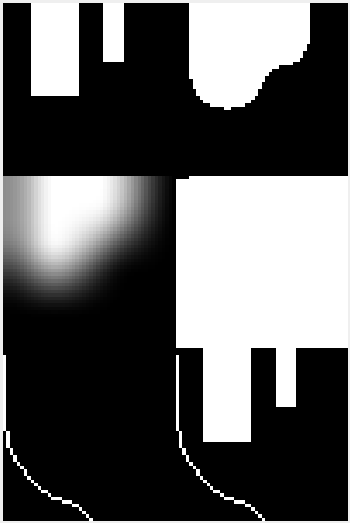

# codigo.controlador.teste.testa_mapa_controlador

* **code:**
  [testa_mapa_controlador.py](../../../../codigo/controlador/teste/testa_mapa_controlador.py)

Script de teste do processamento do mapa feito pelo controlador.

Testa como o controlador processa um mapa dado pelo parâmetro ‘IMAGEM_PATH’. O processamento
também depende do ponto de destino do controlador. Defina ele pelo parãmetro ‘PONTO_DESTINO’.
Esse ponto é relativo à imagem. Assim, se a imagem possi tamanho de 300x300. O ponto equivalente
ao centro seria dado por (150, 150).

O resultado esperado está abaixo:

Fonte: autoria própria.
