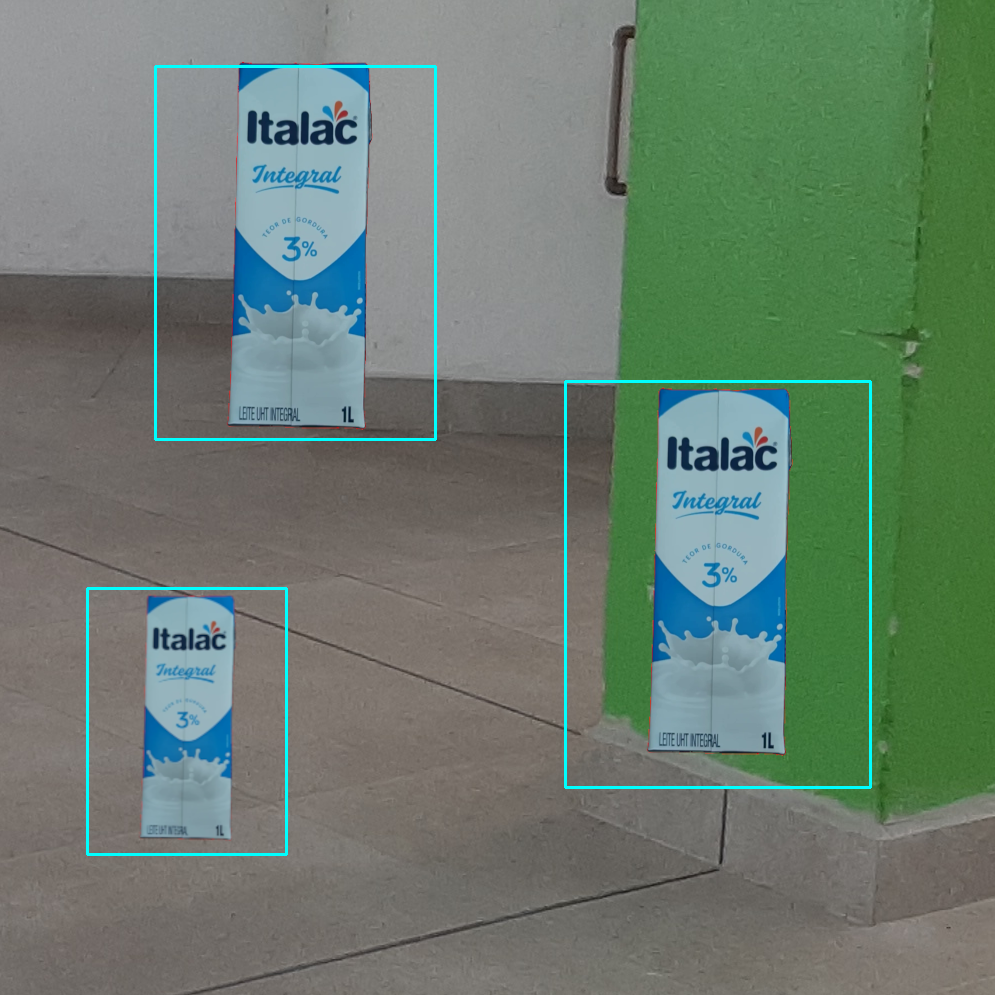

# codigo.identificacao.teste.testa_imagem

* **code:**
  [testa_imagem.py](../../../../codigo/identificacao/teste/testa_imagem.py)

Testa a identificação dos lixos em uma imagem.

A imagem é definida pelo parâmetro ‘IMAGEM’. O modelo de Haar cascade é definido pelo parâmetro ‘CASCADE’.

O teste mostra os lixos identificados. As marcações são feitas de acordo com os
métodos [`identifica_lixo_mais_proximo()`](codigo.identificacao.modulos.identificador.md#codigo.identificacao.modulos.identificador.Identificador.identifica_lixo_mais_proximo)
e [`identifica_lixos()`](codigo.identificacao.modulos.identificador.md#codigo.identificacao.modulos.identificador.Identificador.identifica_lixos). Ambos da classe
[`Identificador`](codigo.identificacao.modulos.identificador.md#codigo.identificacao.modulos.identificador.Identificador).

Resultado experado:

Fonte: autoria própria.
