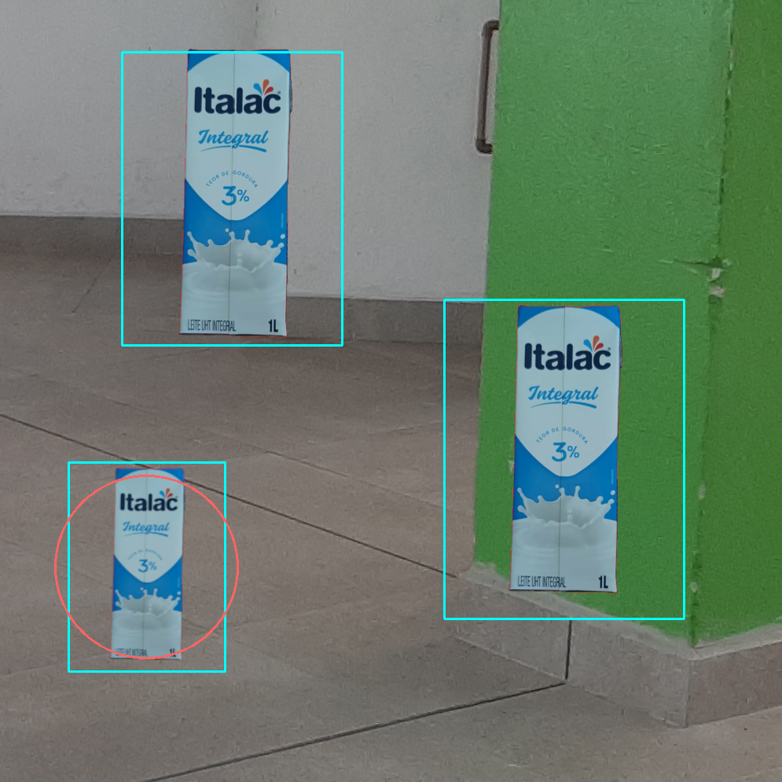

# codigo.identificacao.teste.testa_imagem_mais_proxima

* **code:**
  [testa_imagem_mais_proxima.py](../../../../codigo/identificacao/teste/testa_imagem_mais_proxima.py)

Testa a identificação de lixo mais próximo em uma imagem.

Semelhante ao script [`testa_imagem`](codigo.identificacao.teste.testa_imagem.md#module-codigo.identificacao.teste.testa_imagem), mas esse teste mostra os lixos
identificados e qual é o mais proximo.

A imagem é definida pelo parâmetro ‘IMAGEM’. O modelo de Haar cascade é definido pelo parâmetro ‘CASCADE’.

O teste mostra os lixos identificados e qual é o mais próximo. As marcações são feitas de acordo com os
métodos [`identifica_lixo_mais_proximo()`](codigo.identificacao.modulos.identificador.md#codigo.identificacao.modulos.identificador.Identificador.identifica_lixo_mais_proximo)
e [`identifica_lixos()`](codigo.identificacao.modulos.identificador.md#codigo.identificacao.modulos.identificador.Identificador.identifica_lixos). Ambos da classe
[`Identificador`](codigo.identificacao.modulos.identificador.md#codigo.identificacao.modulos.identificador.Identificador).

Resultado experado:

Fonte: autoria própria.
