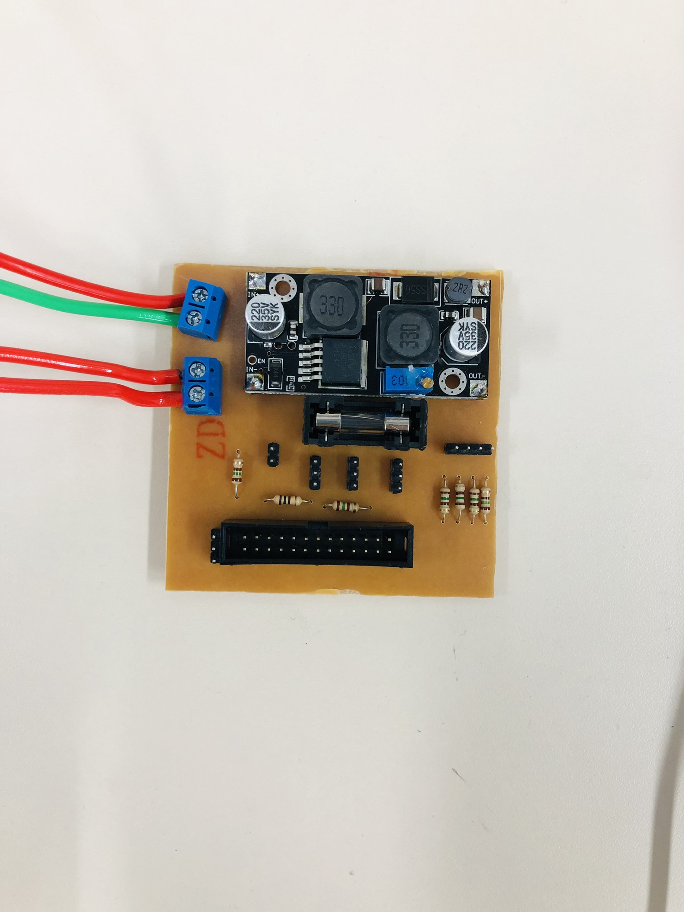

# KiCad Partes

As partes de implementação e criação da PCI (Placa de Circuito Impresso), foram divididas em tópicos e as mesmas foram desenvolvidas ao longo do texto.

## Esquemático Elétrico
Ao longo da implementação do projeto wall-e, observamos alguns erros feitos na parte elétrica na documentação do design, sendo assim, após testes em bancada, foi constatado que era necessário mudanças. Após validações feitas, foi implementada então a placa de circuito impresso.

Fonte: Autoria Própria

Lista de componentes usados para o desenvolvimento da placa de circuito impresso (PCI):
* **Scew connector** - conector barra pino de parafuso
* **Conversor Buck** - módulo DC-DC buck
* **BMS 4s** - monitor de bateria 
* **Fusível Térmico** - proteção térmica
* **Fusível** - proteção elétrica
* **Cabeçalho GPIO Raspberry** - conector fêmea GPIO
* **Barra Pinos** - conexão dos motores de passo e DC
* **Resistores** - proteção para portas GPIO

Após criar o esquemático, foi feita a parte de montagem e organização da PCI. As ligações foram pensadas da melhor forma, economizando assim espaços desnecessários e evitando problemas na implementação final dentro no wall-e.

Fonte: Autoria Própria

Após fazer o esquemático no KICAD, partimos para parte de confecção, porém a primeira placa de circuito impresso teve alguns erros observados e portanto nesta nova versão foram atualizados.
Os componentes BMS e Fusível térmicos, foram retirados do mesmo, o fúsivel por não haver disponibilidade e o BMS foi queimado durante um dos testes.

**Primeiro protótipo**

Fonte: Autoria Própria

Após a validação e correção de possiveis problemas elétricos vistos na etapa de validações de circuitos elétricos, foi então validada a nova PCI e então parte-se para a confecção da mesma.

## Confecção da Placa Final de Circuito Impresso

A confecção da PCI, foi feita usando utilizando uma fresadora disponível no laboratório de protótipos (LPAE) no IFSC. A mesma tem uma documentação extensa de utilização e parâmetros a serem ajustados que mais tarde foram validados por professores, e assim pôde-se iniciar o processo de confecção.

Fonte: Autoria Própria

## Resultados

Após horas de confecção e ajustes, foi obtido um resultado exelente da PCI com a fresadora, como visto na imagem a seguir:

Fonte: Autoria Própria

**Integração dos Componentes**

Fonte: Autoria Própria

Fonte: Autoria Própria