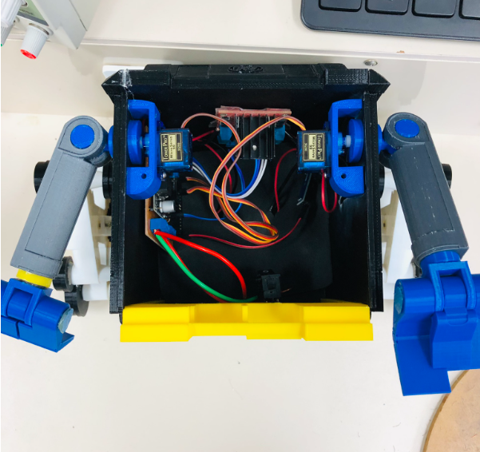
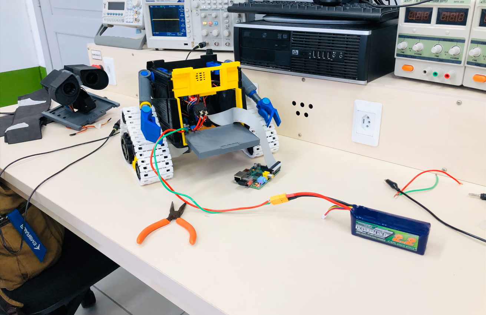

## Teste Primeiro Protótipo Wall-e em Bancada

Após o primeiro protótipo de PCI feito, houveram alguns problemas como:

* **Interligações erradas com BMS** - Resultando na queima do BMS.
* **Problemas com GPIO raspberry** - 3 pinos lógicos iniciavam em nível lógico alto.
* **Vias pequenas e juntas** - Resultando em curtos.

Último teste feito com protótipo, antes da fabricação da placa final, no vídeo é possivel observar o controle dos motores feitos pela raspberry e consumo total do circuito eletrônico.

[Teste em Vídeo Wall-E](https://youtu.be/4ZGaPNGg280)

Fonte: Autoria Própria

## Resultado Final 

Com a PCI final e o circuito validado, partimos os testes finais.

Neste momento foi primeiramente feito a integração de alguns dos componentes dentro do wall-e para já determinar o espaço utilizado.

Fonte: Autoria Própria

**Teste com Bateria** - Primeiro teste do Wall-E com a bateria

Fonte: Autoria Própria

**Testes Finais Motores** 

[Teste Servos Motores - Video](https://www.youtube.com/watch?v=pDrvKetwUg0)

[Teste Motores DC - Video](https://youtu.be/p5OMdVGbefY)

[Teste Wall-E Usando Controle de Interface - Video](https://youtu.be/aoS4w5tfg_o)

Fonte: Autoria Própria

Após finalizado os ultimos testes, parte-se para a parte de integração dos códigos para controle dos motores.