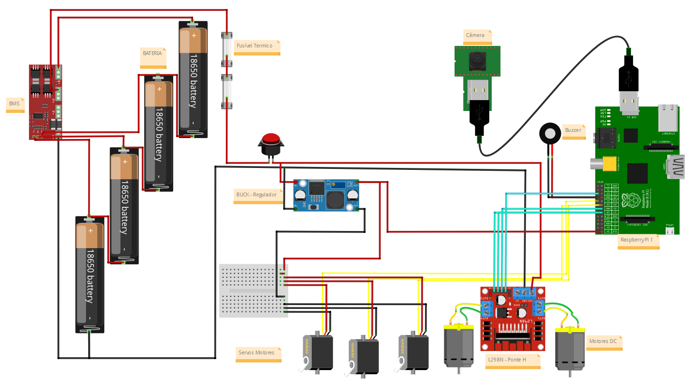
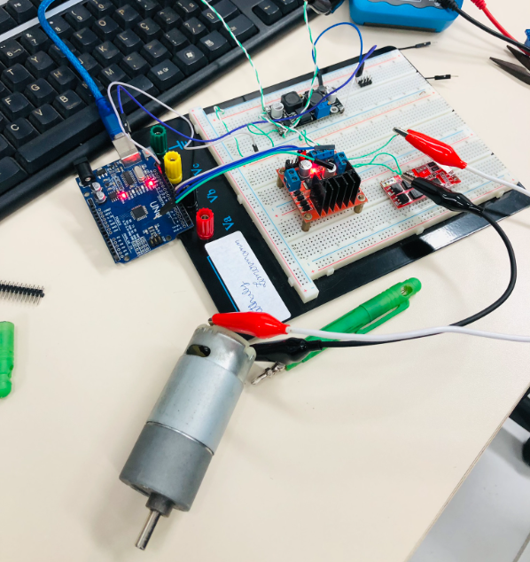
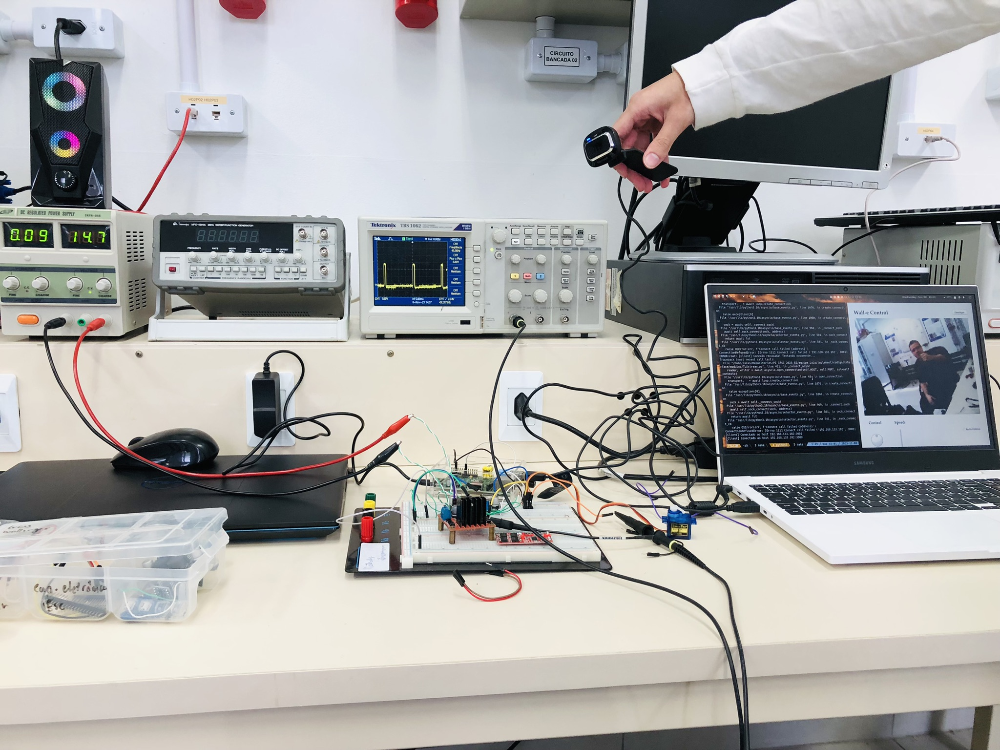
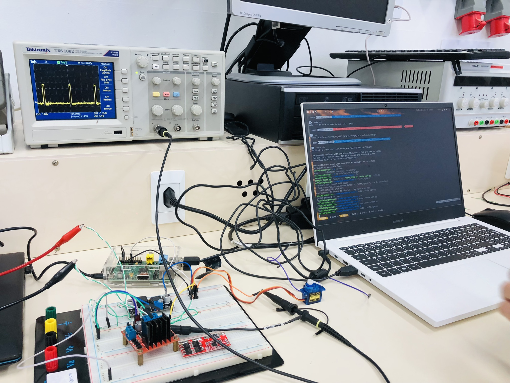
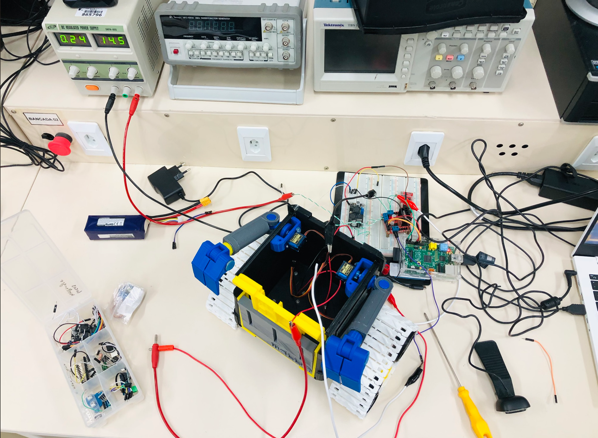

# Validações Sistemas Elétricos

Neste tópico os testes em bancada do sistema elétrico final, antes de fazer uma placa de circuito impresso (PCI), serão feitas e caso a necessidade de correções, as mesmas serão alteradas.

## Correção do Esquemático Elétrico
Na primeira parte do tópico de sistemas elétricos presentes no wall-e, será feito algumas correções de alguns problemas e erros encontrados na parte do design, mais especificamente no esquemático elétrico.

No design alguns equívocos foram cometidos, e portanto a imagem a seguir mostra o esquemático elétrico antigo e logo em seguida a correção do mesmo, e suas determinadas explicações:

Após testes em bancada, se observou problemas com os reguladores de tensao e de corrente:
- LM317 
- LM7805
- Conversores de níveis lógicos

O limitador de corrente LM317 não tem a finalidade de limitar a corrente quando a carga é um motor, do mesmo modo foi observado a não necessidade de um regulador de tensão de 5 V para a alimentação da raspberry, quando visto que o regulador buck DC-DC mantém a tensão constante necessária.
Outrossim, foi observado que não era necessário a utilização de conversores de níveis lógicos, quando a propria raspberry por si os sinais diretos dos motores servos e do driver L298N, sendo assim os mesmos foram retirados.

Outro problema enfrentado pelos projetistas ao longo dos testes, foi o BMS 4s queimado, e portanto não foi usado na placa final, mas seria de extrema importância a utilização da mesma.
Da mesma forma, não foi possível ser comprado nem encontrado no IFSC (Instituto Federal de Santa Catarina), um fusível térmico e portanto não foi utilizado.

**Esquemático Elétrico Atualizado**

Fonte: Autoria Própria

Por fim, tem-se o esquemático atualizado e então a próxima etapa é testa-lo em bancada.

## Validações do Esquemático Elétrico em Partes

A partir dos ajustes feitos anteriormente, chega-se ao momento de testar cada parte do circuito separadamente e após validar o conjunto final, para ao final partir-se para a operação de confecção de placa de circuito impresso.

O primeiro ensaio foi feito com o servo motor, portanto foi montado o circuito do esquemático com o seguintes componentes:

- Fonte DC 14,5 V (simulando a bateria)
- Regulador Buck DC/DC
- Servo Motor 
- Arduino UNO (controlando o PWM)

Não foram utilizados os fusíveis, BMS e botão por conta da não necessidade na parte de validar, porém no contexto final os mesmos serão implementados.

Fonte: Autoria Própria

Após os testes feitos com sucesso do servo motor, foi então montado o circuito para testar o motor DC.

Fonte: Autoria Própria

## Validações do Esquemático Elétrico Total Protoboard

Após os testes feitos com o arduino e com os circuito separadamente, parte-se para o momento de testar os scripts de testes feitos utilizando a raspberry que é a matriz principal do wall-e, portanto foi testado os equipamentos separadamente novamente na seguinte ordem:

* **Interface** - Validação
* **Geração do PWM** - Validação
* **PWM e Interface** - Validação das duas juntas
* **Teste dos motores wall-e** - Validação

Fonte: Autoria Própria

Fonte: Autoria Própria

Fonte: Autoria Própria

Após as validações feitas em bancada com a protoboard, partimos para o primeiro protótipo de PCI feito e começamos os testes. 

## Teste Wall-e em Bancada

Último teste feito, antes da fabricação da placa final, no video é possivel observar o controle dos motores feitos pela raspberry e consumo total do circuito eletrônico, feitos com o primeiro protótipo.

[Teste em Vídeo Wall-E](https://youtu.be/4ZGaPNGg280)

Fonte: Autoria Própria

