<!-- PROJECT LOGO -->

  <h3 align="center">Sistema de Monitoramento de Vazamento de Gás de Cozinha</h3>

  

    <strong>(Design)</strong>
     

## Índice

<!-- TABLE OF CONTENTS -->

  
Table of Contents

  <ol>
    <li>
      <a href="#introdução">Introdução</a>
    </li>
    <li>
      <a href="#esquemático-de-funcionamento">Esquemático de Funcionamento</a>
      <ul>
        <li><a href="#módulo-central">Módulo Central</a></li>
        <li><a href="#módulo-de-sensoriamento">Módulo de Sensoriamento</a></li>
      </ul>
    </li>
    <li>
      <a href="#layout-da-placa-de-circuito-impresso">Layout da Placa de Circuito Impresso</a>
      <ul>
        <li><a href="#módulo-central-1">Módulo Central</a></li>
        <li><a href="#módulo-de-sensoriamento-1">Módulo de Sensoriamento</a></li>
      </ul>
    </li>
    <li>
      <a href="#modelo-3d-do-sistema">Modelo 3D do Sistema</a>
    </li>
    <li>
      <a href="#software">Software</a>
    </li>
  </ol>

---

## Introdução

Este documento detalha o design do projeto de um sistema de monitoramento de vazamento de gás de cozinha. O sistema será composto por um módulo central e dois módulos de sensoriamento.

## Esquemático de Funcionamento

O esquemático abaixo ilustra como funcionará a lógica do sistema. No caso deste projeto, serão utilizados apenas dois sensores que estarão conectados à central via rede, que por sua vez transmitirá os logs de monitoramento para o servidor ThingSpeak. 

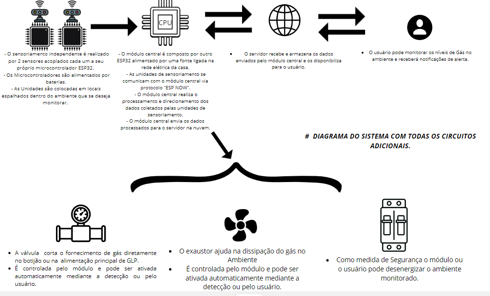

 

### Módulo Central

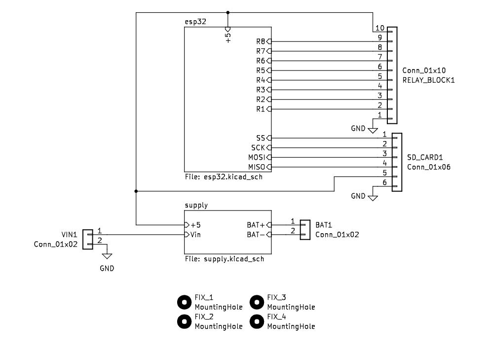
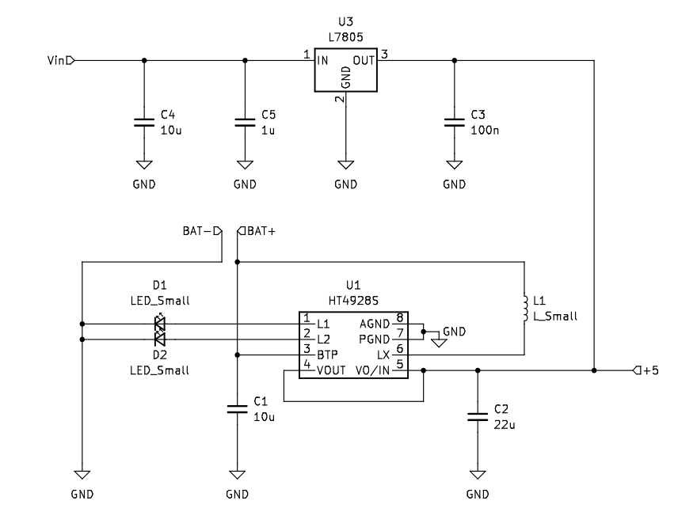
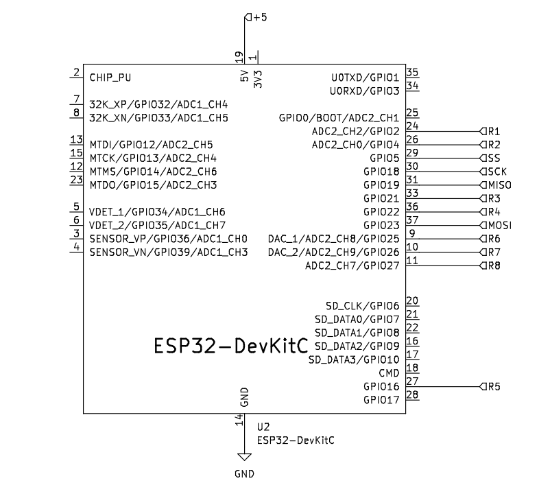

 

### Módulo de Sensoriamento

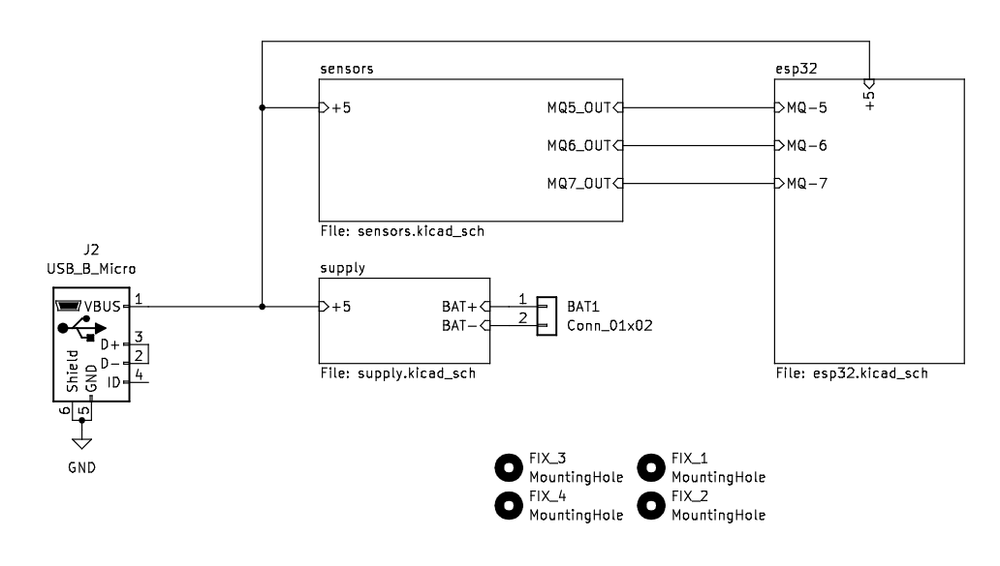
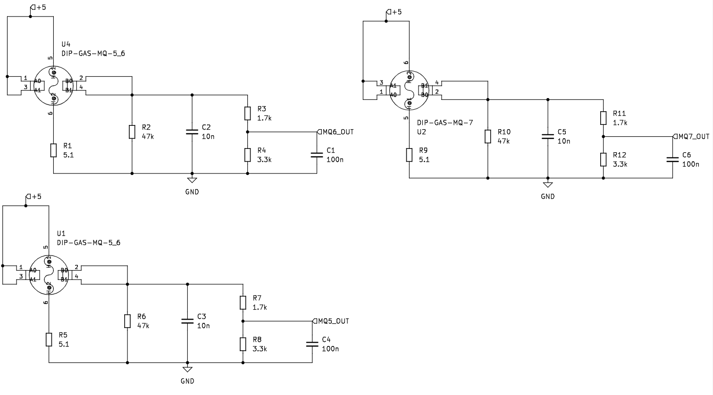

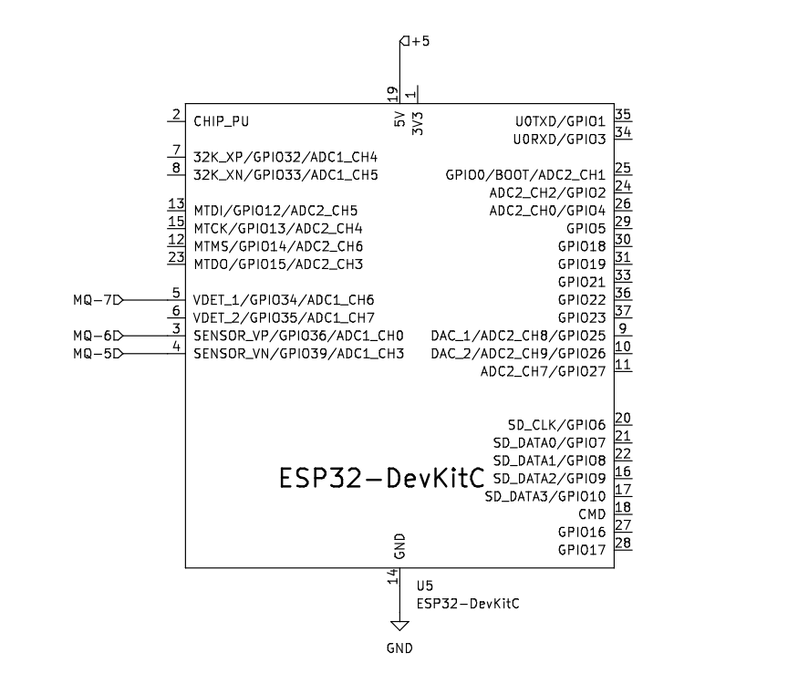

 

## Layout da Placa de Circuito Impresso

### Módulo Central

O módulo central terá entrada de 5 -12V e estará posicionada dentro do quadro de distribuição da residência. Para fazer o controle será utilizado um módulo de relés. Para o mantimento da alimentação após o corte de energia haverá uma célula Li-ion de 3.7V, sendo possível a expansão em paralelo para aumentar a capacidade de armazenamento.

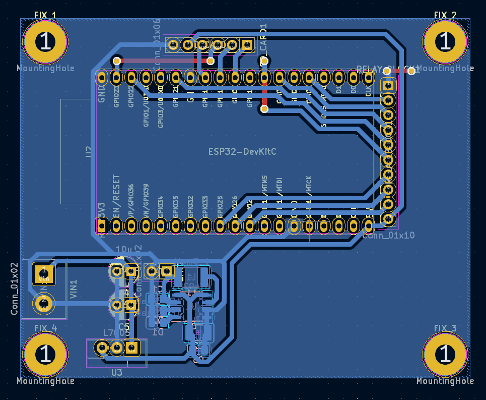
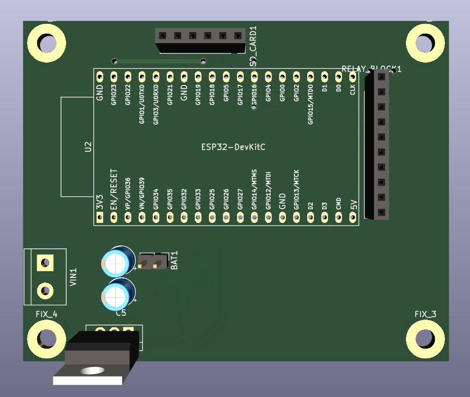

 

### Módulo de Sensoriamento

O módulo de sensoriamento terá entrada de 5V via microUSB. Para o mantimento da alimentação após o corte de energia haverá uma célula Li-ion de 3.7V, sendo possível a expansão em paralelo para aumentar a capacidade de armazenamento.

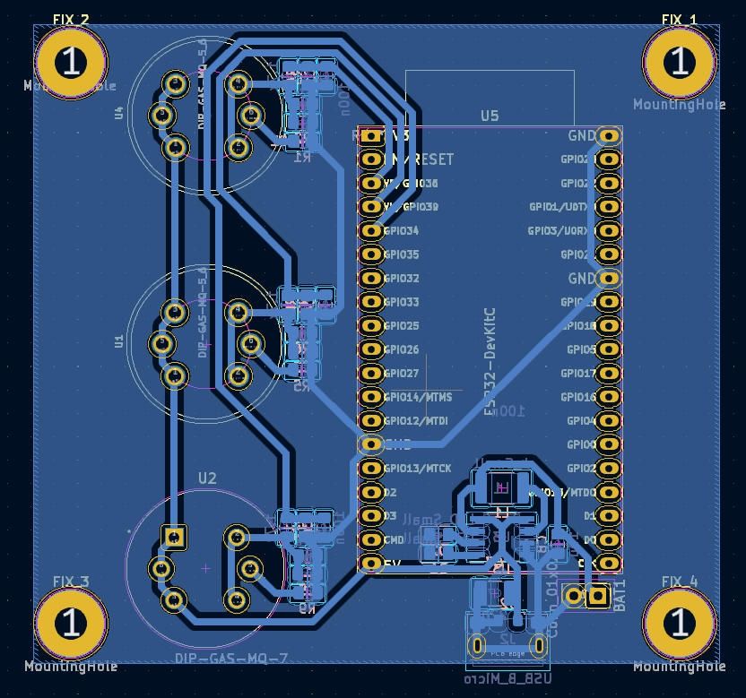

 

## Modelo 3D do Sistema

Os sensores tem a principal qualidade de possibilitar a opção de o próprio usuário alocar sua posição. O recomendado é o mais próximo possível do chão e da potencial fonte de vazamento, considerando a densidade dos gases que desejamos detectar. No modelo abaixo, há dois sensores: Um posicionado logo ao lado da geladeira e outro acima da pia. A case ilustrada no modelo é apenas ilustrativa, não sendo a versão final do produto. A versão final da case estará disponível após testes com a placa e decisão final de componentes e periféricos.

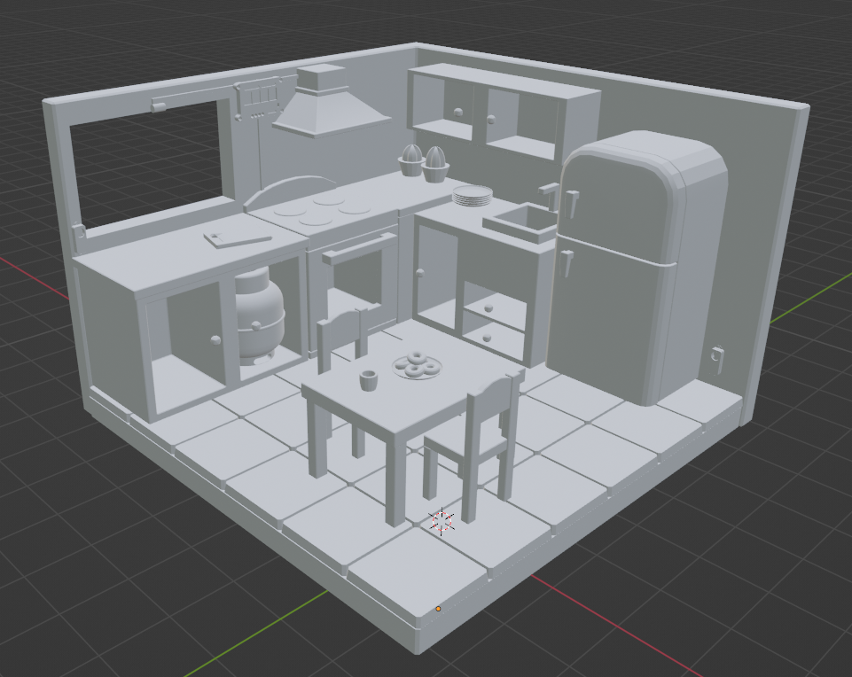

 

## Software

A parte de monitoramento de logs e emissão de notificação será feita pelo servidor ThingSpeak. O código para o ESP32 será desenvolvido em C/C++ na IDE do Arduino. Como EXTRA, há a possibilidade de armazenar os comandos de controle em um cartão SD no módulo central, para que seja possível a atuação do sistema em caso de falha de conexão com a internet.