<!-- PROJECT LOGO -->
<div align="center">
  <h3 align="center">Sistema de Monitoramento de Vazamento de Gás de Cozinha</h3>

  <p align="center">
    <strong>(Implementação)</strong>
    <br />
</div>

## Introdução

Este documento detalha a implementação do projeto de um sistema de monitoramento de vazamento de gás de cozinha. O sistema será composto por um módulo central e módulos de sensoriamento. 

## Sobre o desenvolvimento do projeto 

Na implementação atual, os requisitos prometidos no decorrer do método CDIO foram cumpridos: As *features* principais e extras de slot disponível para cartão SD, aplicativo para celular, bateria externa, internet necessária apenas para o módulo central e possibilidade de acionamento de cargas através de relés foram implementadas. Os testes realizados para alcançar os resultados foram bem sucedidos.

Durante o desenvolvimento algumas melhorias foram sendo feitas, como a implementação de setores de status nas placas, impressão de cases para as placas, mudança da escolha de bateria para uma de maior capacidade e de sensores MQ-2 para MQ-5/6/7 para melhor acurácia e gama de detecção, entre outras.

Houve também a mudança de abordagem em relação ao softare. A ideia inicial era comunicar os ESPs via protocolo ESPNOW. Posteriormente foi descoberto o servidor ThingSpeak, que serve como um banco de dados para os dados coletados pelos módulos de sensoriamento. Por conta da inscrição paga do servidor, foi decidido utilizar o protocolo ESPNOW em conjunto com MQTT e o aplicativo MQTT Dashboard para mostrar gráficos dos sensores e acionar os relés remotamente.

O projeto foi o mais otimizado possível pela equipe: Módulos comerciais (134N3P e sensores MQ) foram dessoldados de suas placas originais e reimplementados em uma placa única, poupando conexões e deixando o projeto mais compacto. A equipe também optou por utilizar um microcontrolador ESP32 para o módulo central e para o módulo sensor, assim reduzindo o custo do projeto e aumentando a compatibilidade entre os módulos.


## Módulo Central

**De acordo com o acordado na etapa de concepção**, o módulo central é responsável por receber os dados dos módulos de sensoriamento e transmitir os logs de monitoramento para o servidor responsável por realizar a coleta e análise dos dados. O módulo central é composto por um microcontrolador ESP32, com acesso à rede WiFi, e com extensão para se conectar a uma matriz de relés de 8 canais e uma interface para cartão microSD para armazenamento dos logs de monitoramento.


### Da implementação da placa de circuito impresso

#### Placa de circuito impresso Kicad


#### Placa de circuito impresso fabricada e montada

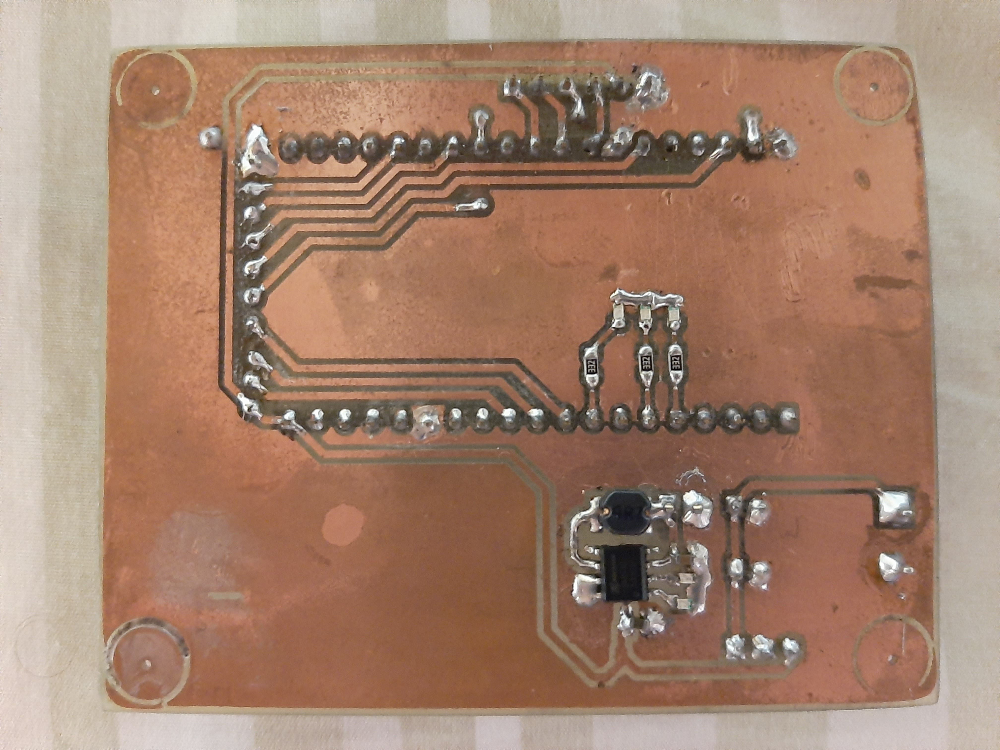
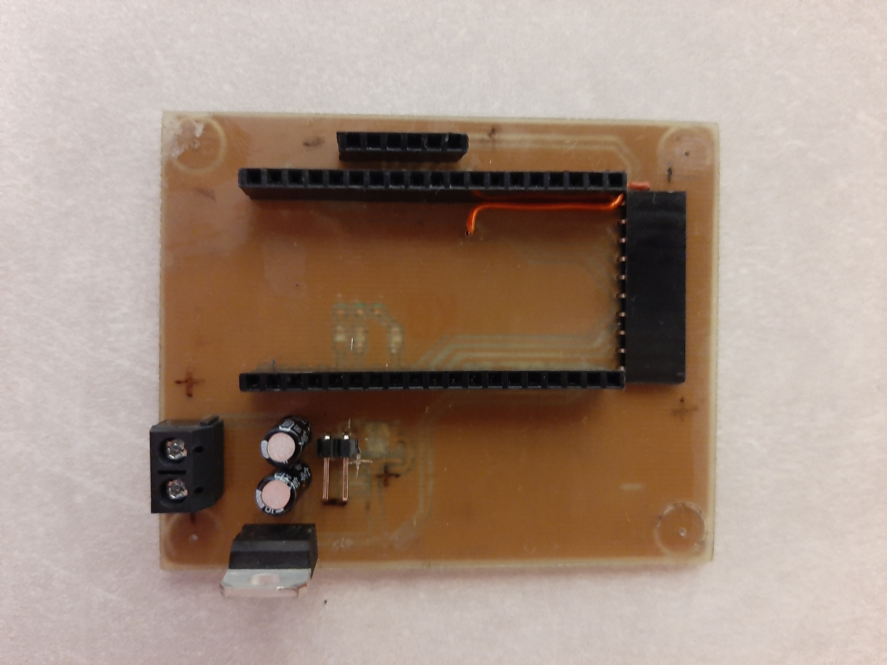
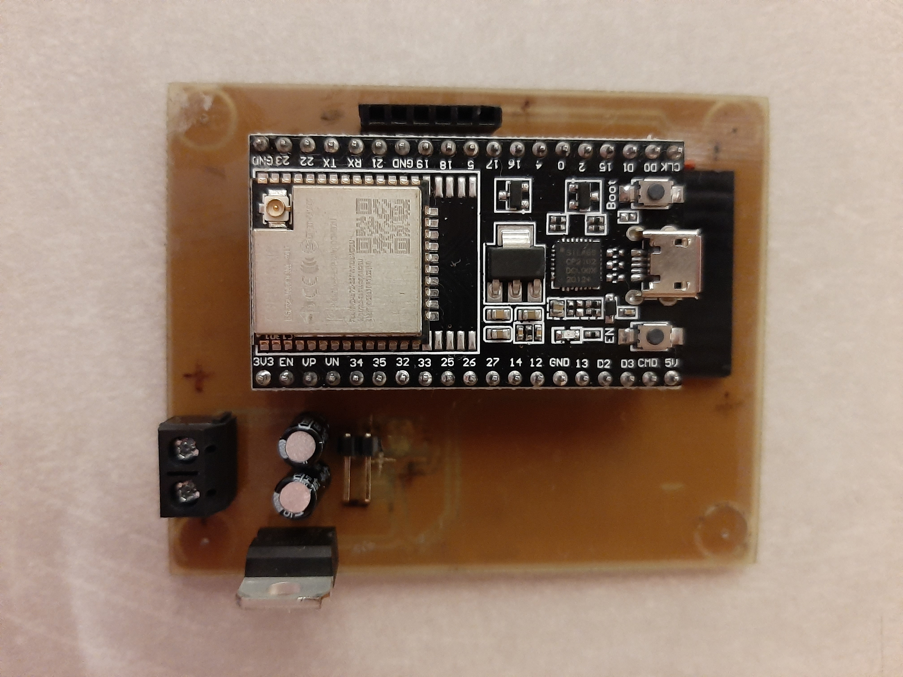

#### Bloco de relés e fonte externa

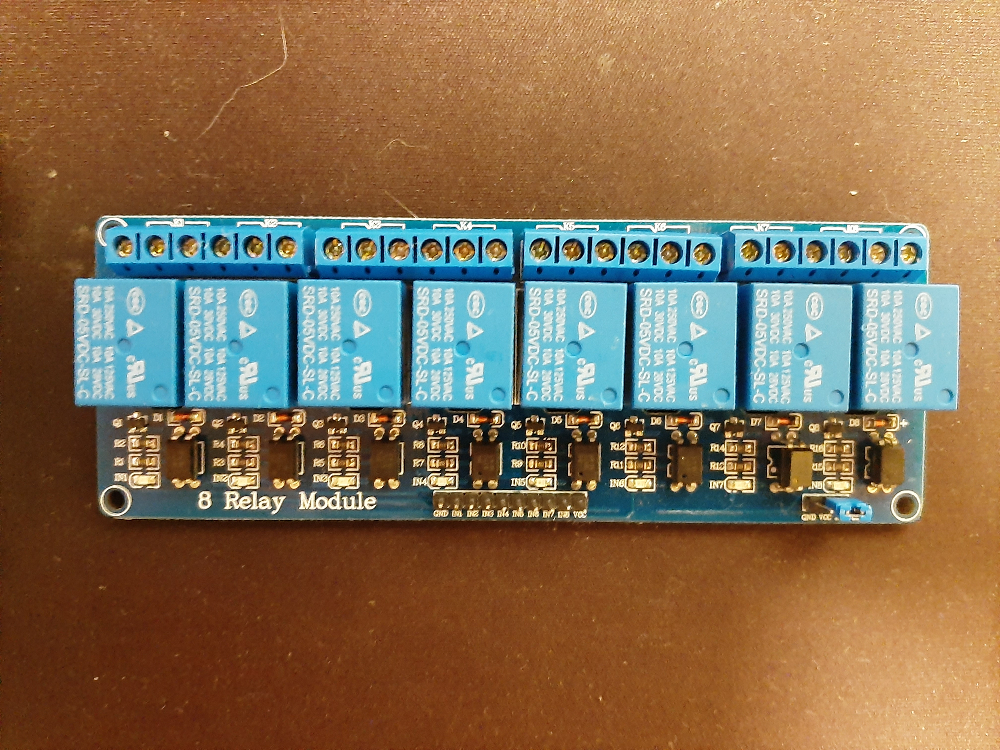


#### Das baterias utilizadas

A priori a equipe utilizou uma única célula de bateria de lítio de 3.7V convencional porém esta não performou de forma boa, não sendo capaz de fornecer energia suficiente para o módulo central.

##### Célula de bateria de lítio de 3.7V convencional utilizada no primeiro protótipo


Após a análise do primeiro protótipo, a equipe optou por utilizar uma bateria de lítio de 3.7V de alta capacidade, a bateria foi retirada de um banco de baterias de um notebook dell vostro 5470 que estava inutilizado, a bateria deste notebook é composta de 3 células de bateria de lítio, central é composta de 2 células de bateria de lítio em paralelo, aumentando a capacidade da bateria.

##### Bateria de lítio de 3.7V de alta capacidade utilizada no segundo protótipo

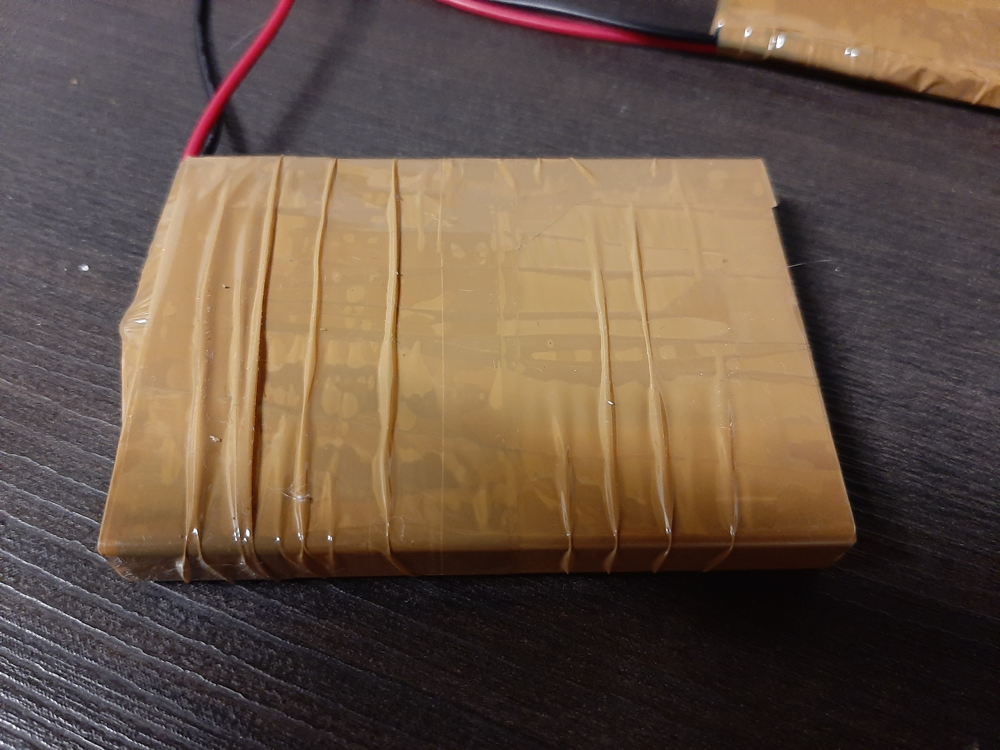

##### Realização de carga externa da bateria para testes

Para os primeiros testes foi utilizado um carregador externo para averiguar se as baterias estavam funcionando corretamente e para reduzir tempo de carga usando o carregador integrado dos módulos.

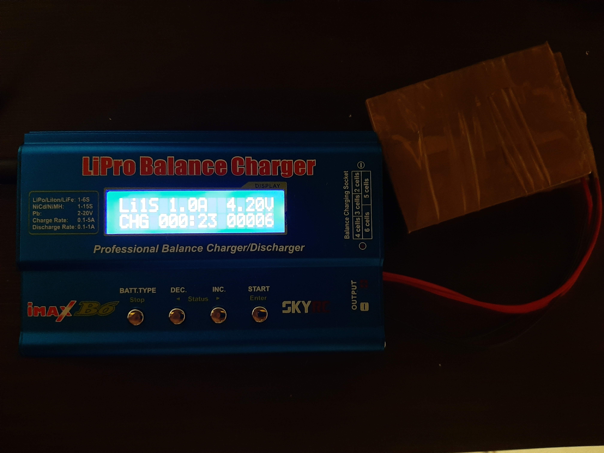

### Setor de status

**Durante o desenvolvimento, foi decidido que um setor de status seria útil para fornecer informações do estado do módulo central, para haver pistas de qual pode ser o erro caso haja algum mal funcionamento durante os testes da placa.**

O setor de status é responsável por fornecer informações sobre o estado do módulo central, o setor de status é composto por 3 leds, um led vermelho e 2 leds verdes. Estes leds possuem propósito geral e estão conectados a GPIOs do microcontrolador ESP32.


### Setor de controle

O setor de controle é responsável por acionar os relés da matriz de relés, o setor de controle é composto por simples 8 pinos GPIO do microcontrolador ESP32 que são conectados a matriz de relés.


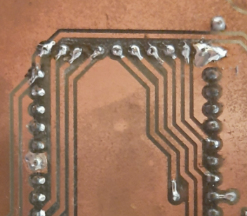

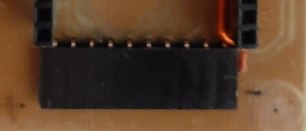

### Setor MicroSD

**Como sugerido no conceive**, o setor MicroSD é responsável por fornecer uma interface para cartão microSD para armazenamento dos logs de monitoramento, o setor MicroSD é composto por uma interface para cartão microSD e microcontrolador ESP32 usando o SPI do microcontrolador ESP32.

#### MicroSD shield utilizado

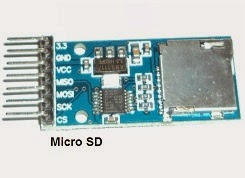

#### Interface para cartão microSD

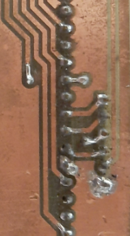
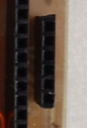

### Setor de alimentação

O setor de alimentação é responsável por fornecer energia para o módulo central. O módulo central é alimentado por uma fonte externa conectada a rede 110~220Vac que realiza a conversão para uma tensão 6.5~12Vdc, a tensão da fonte externa por sua vez é regulada para 5V por um regulador de tensão LM7805. A tensão de 5V é utilizada para alimentar o microcontrolador ESP32 e a matriz de relé bem como a tensão de 5V também é utilizada para alimentar o módulo de carga / descarga de bateria baseado na implementação do módulo 134n3p que por sua vez realiza a carga da bateria quando a fonte externa está ativa e a descarga da bateria quando a fonte externa está inativa, mantendo assim a alimentação do módulo central mesmo quando a fonte externa está inativa.


#### Caminho da energia no módulo central

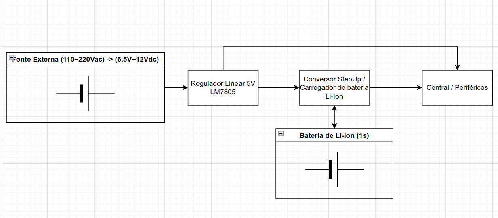

O caminho da energia do módulo se resume em:
* Fonte externa ligada, nesse cenário a tensão regulada de 5V é fornecida para o módulo central e para o módulo de carga / descarga de bateria que por sua vez carrega a bateria, assim o módulo central é alimentado pela fonte externa e regulado pelo LM7805.
* Fonte externa desligada, nesse cenário por não haver tensão regulada no LM7805, o módulo de carga / descarga de bateria realiza a descarga e elevação da tensão da bateria de 3.7V para 5V, assim o módulo central é alimentado pela bateria.

#### Classificações máximas e determinações de cenários de falha por sobrecarga

Primeiramente, não foi realizado uma análise aprofundada do consumo do módulo central por requerir uma análise profunda de todos os aspectos, porém uma estimativa foi realizada para estipular a carga máxima requerida pelo módulo central.

A estimativa se baseia na análise dos seguintes pontos:
* O microcontrolador ESP32 possui uma corrente máxima de 250mA (Desconsiderando cenário de scan de rede WiFi que segundo fórums e datasheet pode atingir até 0.7A por um período de 10ms), esse dado foi extraído de fóruns e datasheet do microcontrolador considerando um cenário ativo de transmissão de dados via WiFi, segundo os fórums, o consumo médio do microcontrolador é de 80mA em tempo ocioso / em não transmissão de dados via WiFi.
* O consumo médio de um relé (**SRD-05VDC-SL-C**) é de 72mA, esse dado foi extraído de datasheet de relés de 5V. Dado que o módulo de relés é composto por 8 relés, o consumo total do módulo de relés é de 576mA.
  * 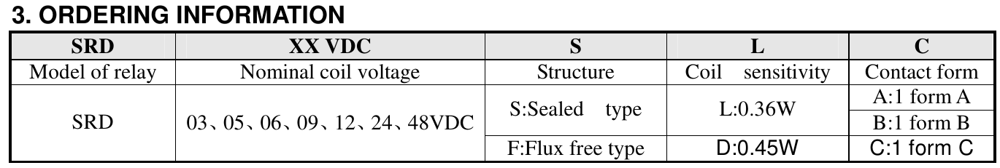
  * 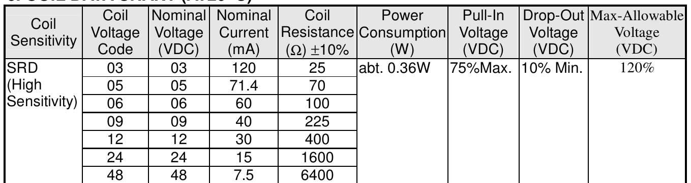
* O consumo do módulo de carga / descarga de bateria consegue atingir até 1A em caso de carga máxima, bateria em tensão minima.
  * 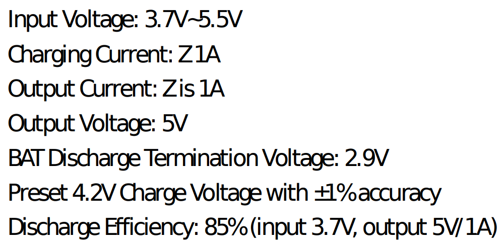

Assim sendo a estimativa de consumo máxima do módulo central é de 1.8A, considerando o cenário de carga máxima quando a fonte externa está ativa e um consumo médio de 0.8A quando a fonte externa está inativa e o módulo de carga / descarga de bateria está ativo.

Estresses aplicados no regulador de tensão LM7805 são:
* Tensão de entrada: 6.5~12Vdc
* Tensão de saída: 5Vdc
* Corrente máxima: 1.8A

Estresses aplicados no módulo de carga / descarga de bateria são:
* Tensão de entrada: 3.7~5Vdc
* Tenso de saída: 5Vdc
* Corrente máxima: 0.8A

#### Análise de dissipação de calor no LM7805

Primeiramente calculando os estresses aplicados no LM7805 utilizando carga máxima 1.8A com os cenários de estresse minimo, entrada em 6.5V e saída em 5V e estresse máximo, entrada em 12V e saída em 5V.

* Estresse mínimo:

$$
P = (V_{in} - V_{out}) \times I_{out} \\
P = (6.5 - 5) \times 1.8 \\
P = 2.7W
$$

* Estresse máximo:

$$
P = (V_{in} - V_{out}) \times I_{out} \\
P = (12 - 5) \times 1.8 \\
P = 12.6W
$$

Calculando a resistencia térmica total da junção / ambiente para ambos os estresses, utilizando as classificações máximas do LM7805.

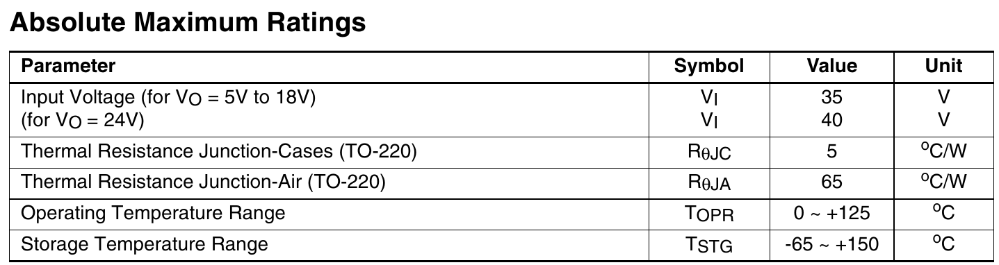

* Estresse mínimo:

$$
R_{th} = \frac{T_{j(max)} - T_{a}}{P_{d(max)}} \\
R_{th} = \frac{125 - 25}{2.7} \\
R_{th} = 30.37 \frac{^{\circ}C}{W}
$$

* Estresse máximo:

$$
R_{th} = \frac{T_{j(max)} - T_{a}}{P_{d(max)}} \\
R_{th} = \frac{125 - 25}{12.6} \\
R_{th} = 7.93 \frac{^{\circ}C}{W}
$$

Dado que a seguinte condição é válida:

$$
\theta_{jc} < R_{th} < \theta_{ja}
$$

É necessário a utilização de dissipadores de calor para ambos os estresses, porém deve-se considerar que o estresse máximo é o mais crítico, assim sendo, o dissipador de calor deve ser dimensionado para o estresse máximo.

$$
\theta_{SA} = \theta_{ja} - R_{th} \\
\theta_{SA} = 7.93 - 5 \\
\theta_{SA} = 2.93 \frac{^{\circ}C}{W}
$$

Como pode ser visto, a dissipação no ceário de estresse máximo é alta, assim a equipe optou por utilizar uma fonte de 6.5V para reduzir a dissipação de calor no regulador de tensão LM7805.

### Módulo Central Montado

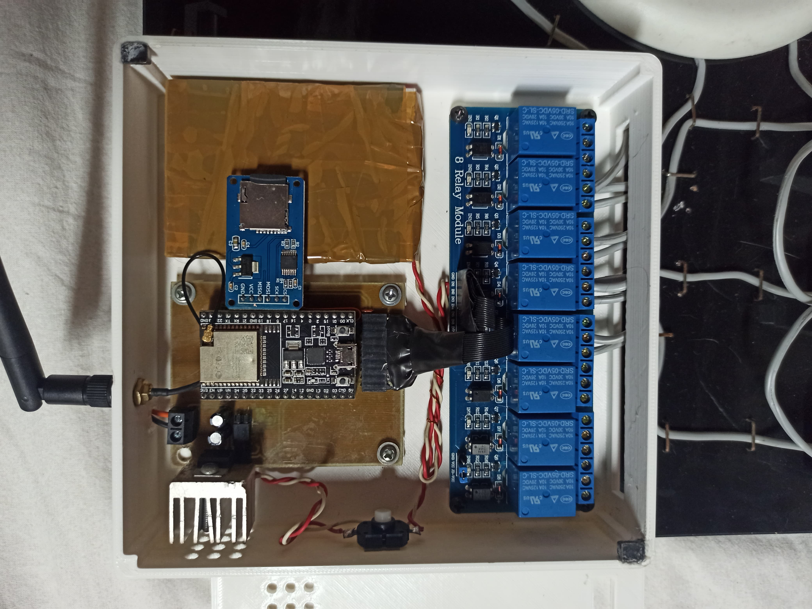
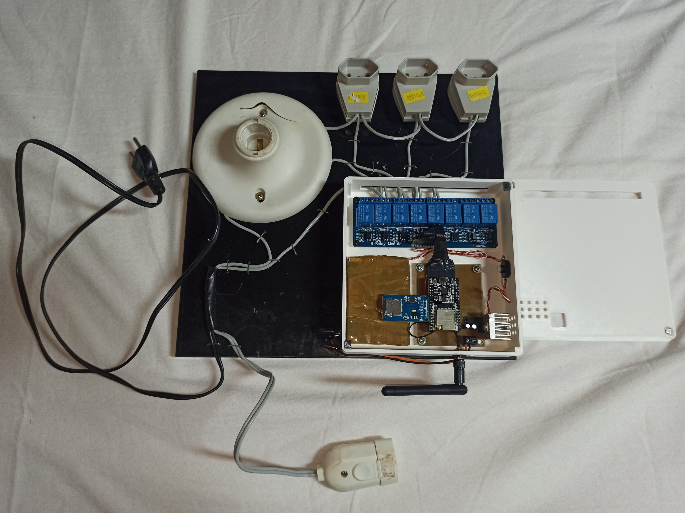

#### Software do módulo central

O projeto do módulo central, executado no ESP32 WROOM e utilizando a biblioteca painlessMesh para comunicação na mesh e PubSub para a conexão com o broker MQTT, é um sistema complexo que gerencia uma variedade de funções, incluindo comunicação de rede, interação com hardware, e processamento de regras. No geral o código se divide nas seguitnes implementações

##### 1. app.cpp e app.h
Estes arquivos definem a lógica principal da aplicação do módulo central. O arquivo `app.h` declara a classe principal, incluindo inicialização, gestão de tarefas, e interação com outros componentes do sistema. O `app.cpp` implementa estas funcionalidades.

##### 2. common.h
Contém definições comuns e configurações gerais utilizadas em todo o projeto. Pode incluir constantes, definições de tipos de dados, e parâmetros de configuração.

##### 3. flash.cpp e flash.h
Responsáveis pela gestão e conexão com o módulo SD. Esses arquivos podem implementar funcionalidades para salvar e recuperar configurações ou dados persistentes.

##### 4. hardware.h
Define a configuração de hardware do módulo central. Inclui definições para pinos de I/O, configurações de sensores e outros dispositivos periféricos conectados ao ESP32.

##### 5. main.ino
O ponto de entrada principal para o firmware do ESP32. Este arquivo inicializa o sistema e entra em um loop de execução, chamando funções de gestão definidas em outros arquivos.

##### 6. mqtt.cpp e mqtt.h
Implementam a funcionalidade MQTT, um protocolo de mensagens leve para comunicação entre dispositivos. Esses arquivos podem gerenciar a conexão com um broker MQTT para enviar ou receber dados.

##### 7. network.cpp e network.h
Gerenciam a conectividade de rede do módulo central, incluindo a comunicação com outros módulos via painlessMesh. Esses arquivos lidam com a criação e manutenção da rede mesh, além do processamento de mensagens recebidas.

##### 8. relay.cpp e relay.h
Esses arquivos podem controlar relés ou outros dispositivos de comutação conectados ao módulo central, permitindo controlar cargas elétricas ou outros dispositivos externos.

##### 9. rules.cpp e rules.h
Contêm a lógica para processar "regras" - condições ou scripts que definem como o módulo central deve reagir a determinados inputs ou dados de sensores.

##### 10. serial.h
Pode ser usado para configurar e gerenciar a comunicação serial, útil para depuração, configuração, ou interação com dispositivos que usam comunicação serial.

##### 11. status.cpp e status.h
Gerenciam o status do sistema, possivelmente lidando com LEDs de indicação, logs, ou outras formas de feedback do estado do sistema.

##### Base de Implementação e Operação

O projeto é um sistema central de controle e monitoramento. Ele recebe dados de módulos sensoriais (como os que medem a qualidade do ar), processa esses dados (aplicando regras carregadas do SD e processadas em `rules.cpp/h`), e pode agir com base nesses dados (ativando relés, por exemplo). A comunicação entre o módulo central e os módulos sensoriais é realizada através de uma rede mesh painlessMesh, permitindo uma comunicação eficiente e flexível em ambientes com múltiplos dispositivos. A capacidade de armazenamento e recuperação de dados (flash.cpp/h) e a conectividade MQTT que permite ao sistema capacidade de interagir com uma infraestrutura de IoT mais ampla, como um servidor em nuvem ou um sistema de automação residencial.

#### Dos arquivos de configuração da central a serem carregados no SD

A central espera encontrar os arquivos organizados da seguinte forma:

```
/rules/
  - node.sensor.gas.json
  - node.sensor.ligth.json
/config.json
```

O arquivo de configuração fuciona da seguinte forma:

```
{
	"wifi": {
		"ssid": "some_ssid",
		"password": "some_password",
		"hostname": "some-hostname"
	},
	"mqtt": {
		"host": "test.mosquitto.org",
		"port": 1883,
		"uniqueId": "abea99585f8a48f9",
		"topics": {
			"relay": {
				"1": {
					"in": "relay/73f84c51/in",
					"out": "relay/73f84c51/out"
				},
				"2": {
					"in": "relay/a7af0637/in",
					"out": "relay/a7af0637/out"
				},
				"3": {
					"in": "relay/0b766ff0/in",
					"out": "relay/0b766ff0/out"
				},
				"4": {
					"in": "relay/153fb673/in",
					"out": "relay/153fb673/out"
				},
				"5": {
					"in": "relay/9151494d/in",
					"out": "relay/9151494d/out"
				},
				"6": {
					"in": "relay/8cf58bc7/in",
					"out": "relay/8cf58bc7/out"
				},
				"7": {
					"in": "relay/22551182/in",
					"out": "relay/22551182/out"
				}
			},
			"validator": {
				"in": "validator/bf7879d9/in",
				"out": "validator/bf7879d9/out"
			}
		}
	},
	"startup": {
		"relay": 2
	}
}
```

Este arquivo de configuração define as configurações para um sistema usar conexão Wi-Fi e MQTT para comunicação. Cada seção do arquivo configura um aspecto diferente do sistema:

##### Seção "wifi"
Esta seção configura as credenciais e parâmetros para a conexão Wi-Fi do dispositivo.
- **ssid**: O nome da rede Wi-Fi à qual o dispositivo se conectará.
- **password**: A senha da rede Wi-Fi.
- **hostname**: O nome do host para o dispositivo na rede, útil para identificação em redes locais.

##### Seção "mqtt"
Configurações para a comunicação do dispositivo usando o protocolo MQTT (Message Queuing Telemetry Transport), um protocolo de mensagens leve usado em dispositivos de Internet das Coisas (IoT).
- **host**: O endereço do servidor MQTT (broker) ao qual o dispositivo se conectará. Aqui, "test.mosquitto.org" é um broker MQTT público.
- **port**: A porta de rede usada para conectar ao servidor MQTT. A porta 1883 é o padrão para conexões MQTT não criptografadas.
- **uniqueId**: Um identificador único para o dispositivo. Isso pode ser usado para identificar o dispositivo no broker MQTT.
- **topics**: Define os tópicos MQTT para interação com o dispositivo. Os tópicos são usados para publicar e receber mensagens.
    - **relay**: Cada número de relay (1 a 7) tem tópicos "in" e "out". 
        - **"in"**: Tópico usado para receber comandos ou dados para o relay correspondente.
        - **"out"**: Tópico para publicar dados ou status do relay.
    - **validator**: Possui também tópicos "in" e "out" para algum tipo de validação ou funcionalidade específica.

##### Seção "startup"
Configurações iniciais ao ligar o dispositivo.
- **relay**: Indica uma bitmask de 8 bits, ou seja um uint8_t que será comparado para acionar os relés correspondes, por exemplo 0b00000001 irá acionar o primeiro relé, ao passo que 0b00001001 irá acionar o primeiro e o quarto relé.

#### Dos aqruivos em rules a serem carregados no SD

Os arquivos são basicamente match cases e condicionais de disparos para sensores genéricos, eles são baseados nas definições dos módulos de sensores a seguir:

BOARD_TYPE "node"
BOARD_SENSOR_TYPE "sensor/gas"

Nesse exemplo, o validador tentará carregar uma regra node.sensor.gas.json dentro da pasta rules. Um exemplo de regra segue:

```
{
	"id": "node.sensor.gas",
	"name": "Gas Sensor Triggered",
	"condition": {
		"mq5": {
			"value": 50,
			"comparator": ">",
			"action": 4
		},
		"mq6": {
			"value": 50,
			"comparator": ">",
			"action": 28
		},
		"mq7": {
			"value": 50,
			"comparator": ">",
			"action": 16
		}
	}
}
```

Esta regra de disparo define condições específicas para quando certos eventos relacionados a sensores devem serem disparados:

### Geral
- **id**: "node.sensor.gas" - Identifica a regra
- **name**: "Gas Sensor Triggered" - Nome descritivo da regra

### Condições Específicas para Cada Sensor de Gás
A seção "condition" lista condições para diferentes sensores de um mesmo módulo de sensoriamento. Cada sensor tem um conjunto de parâmetros que definem quando a condição é verdadeira.

#### Para cada sensor (MQ5, MQ6, MQ7):
- **value**: 50 - Este é o valor de limiar para a condição. A regra compara a leitura do sensor com este valor.
- **comparator**: ">" - Este é o operador de comparação. Neste caso, a condição é verdadeira se a leitura do sensor for maior que o valor de limiar.
- **action**: Indica uma bitmask de 8 bits, ou seja um uint8_t que será comparado para acionar os relés correspondes, por exemplo 0b00000001 irá acionar o primeiro relé, ao passo que 0b00001001 irá acionar o primeiro e o quarto relé.

### Funcionamento da Regra
Quando a regra é avaliada:
- Se a leitura do sensor MQ5 for maior que 50, a ação 4 (0b00000100) será acionada.
- Se a leitura do sensor MQ6 for maior que 50, a ação 28 (0b00010000) será acionada.
- Se a leitura do sensor MQ7 for maior que 50, a ação 16 (0b00001000) será acionada.

Essencialmente, esta regra define um conjunto de condições de disparo baseadas nas leituras dos sensores, onde cada condição, se atendida, resulta em uma ação específica.

### Complexidades de utilização do painlessMesh (Rede Mesh) em conjunto com PubSub (MQTT)

Dado o fato que ambos sistemas utilizam o hardware WiFi do ESP32, a utilização de ambos sistemas em conjunto pode causar problemas devido ao fato de utilizarem Schedulers e de ambos sistemas terem um carater asíncrono porém com alguns métodos contendo block do processamento.
Para fazer a utilização do PubSub com a painlessMesh, necessita que se faça a inicialização na seguinte forma.

* Primeiramente garanta de criar a rede mesh e seu scheduler.
* Após isso sete os callbacks na parte de mesh da network como onReceive, onNewConnection, onChangedConnections e onNodeTimeAdjusted.
* Após isso faça a configuração de tipos de mensagnes para debug setDebugMsgTypes e inicialize a rede mesh com o método init na seguinte forma init(MESH_PREFIX, MESH_PASSWORD, &m_AppScheduler, MESH_PORT, WIFI_AP_STA)
* Com isso realizado, faça a configuração manual da estação de wifi usando mesh.stationManual e mesh.setHostname
* Com o WiFi configurado faça a configuração do broker MQTT usando setServer e setCallback
* Por fim habilite duas tasks, uma responsável por chamar o método loop do cliente mqtt e outra responsável para chamar a connect do cliente mqtt caso não esteja conectado.
* Com isso feito sete o nó como raiz setRoot e notifique os outros nós da presença de um nó raiz setContainsRoot
* Após isso, apenas aguarde o método connect da task de conexão do cliente mqtt conectar ao broker e pronto, bast se inscrever nos tópicos que deseja escutar e ou publicar.

## Módulo Sensor

O módulo sensor é responsável por realizar o sensoriamento dos vazamentos de diversos gases, o módulo sensor é composto por um microcontrolador ESP32, com acesso ao módulo central utilizando protocolo ESP-NOW, e com conexão a 3 sensores de gases, sendo estes 1xMQ-5, 1xMQ-6 e 1xMQ-7.

### Da implementação da placa de circuito impresso

#### Placa de circuito impresso Kicad

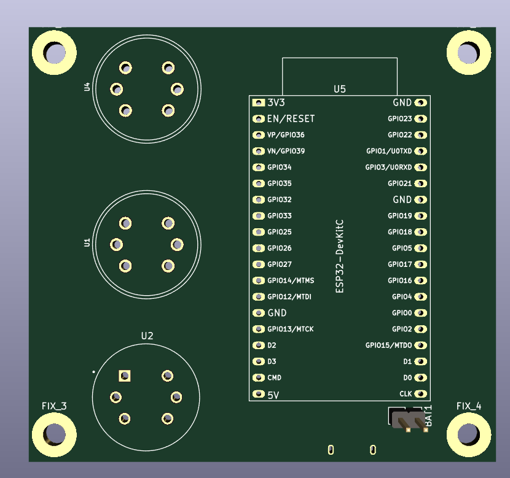
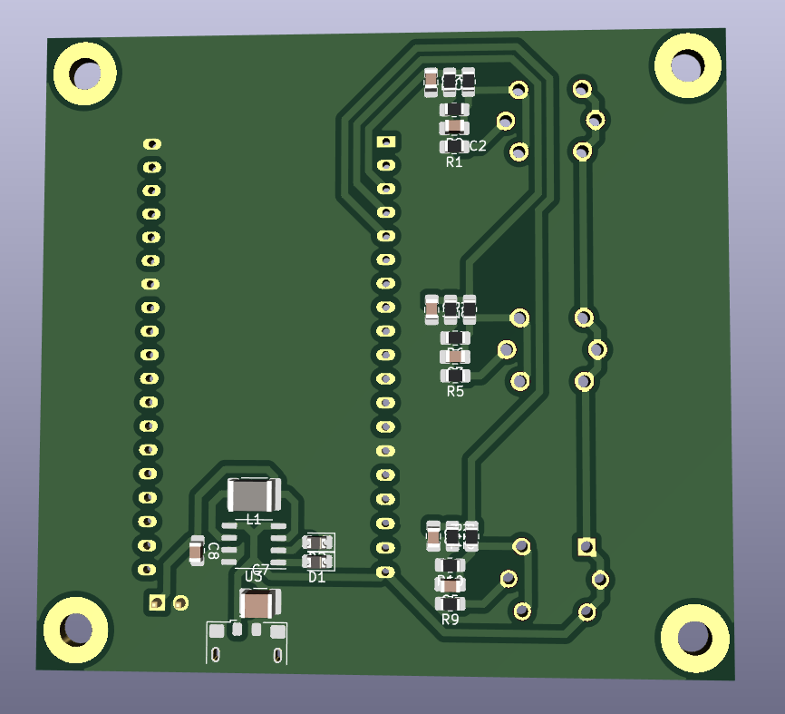

#### Placa de circuito impresso fabricada e montada

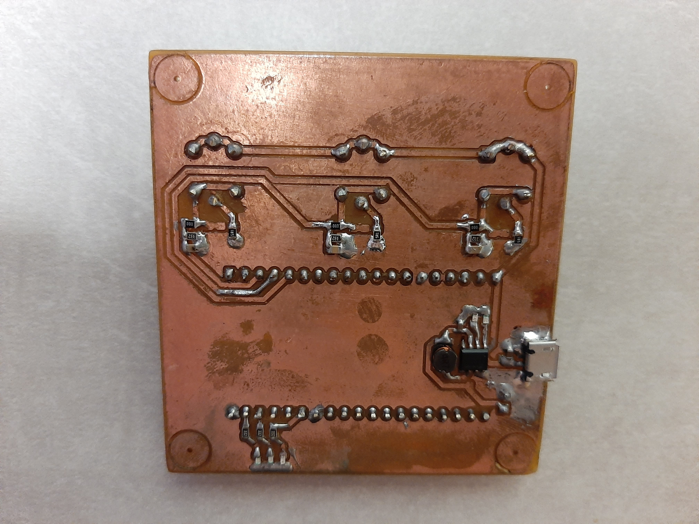
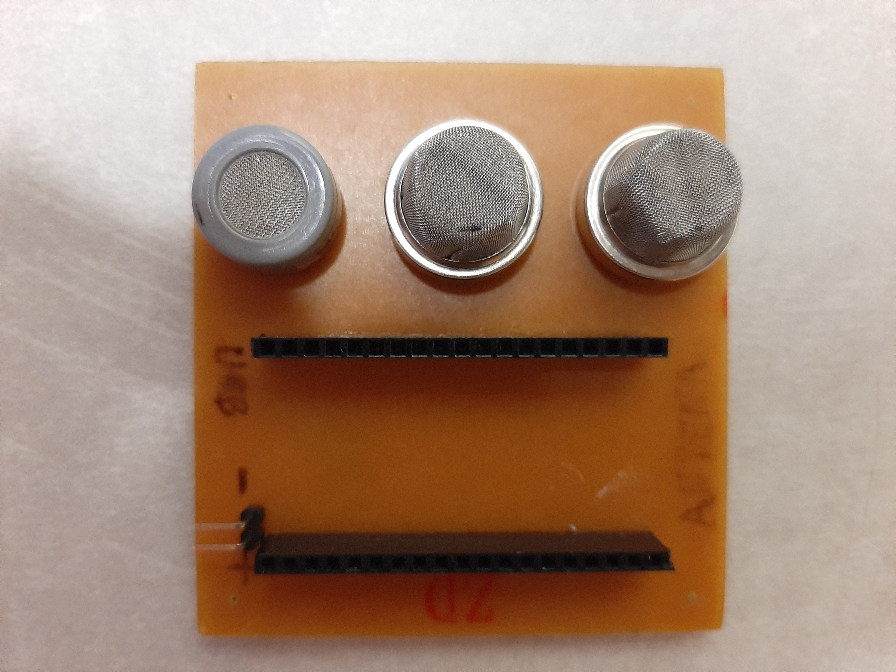
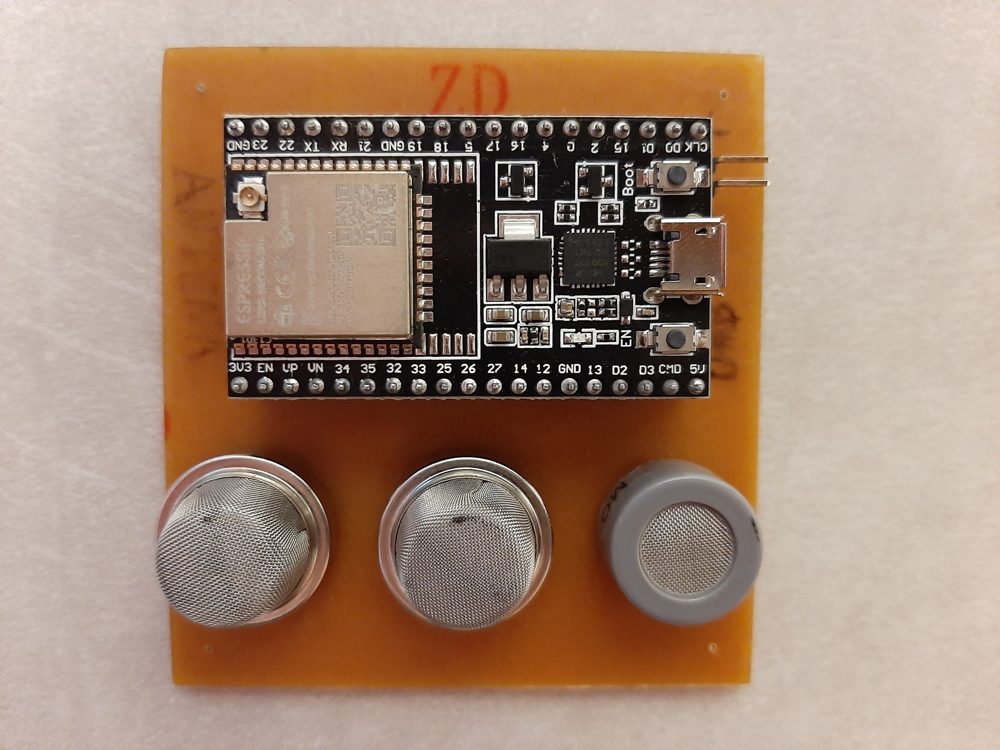

#### Shields MQ usadas e fonte externa

Os sensores foram adquiridos em forma de shields, por ser fácil de encontrar estes, porém a equipe realizou a desmontagem dos shields e soldagem dos sensores diretamente na placa de circuito impresso do módulo sensor.

##### Sensores MQ shield


#### Quanto a fonte externa para alimentação do módulo sensor

O módulo sensor é alimentado por um carregador de celular de 5V comum, única nota é o fata de o conector utilizado na placa se tratar de um conector micro USB por ser difil a soldagem de conectores USB-C modernos sem métodos avançados de soldagem. Assim cabos de carregadores de celular com conector micro USB são utilizados para alimentar o módulo sensor.

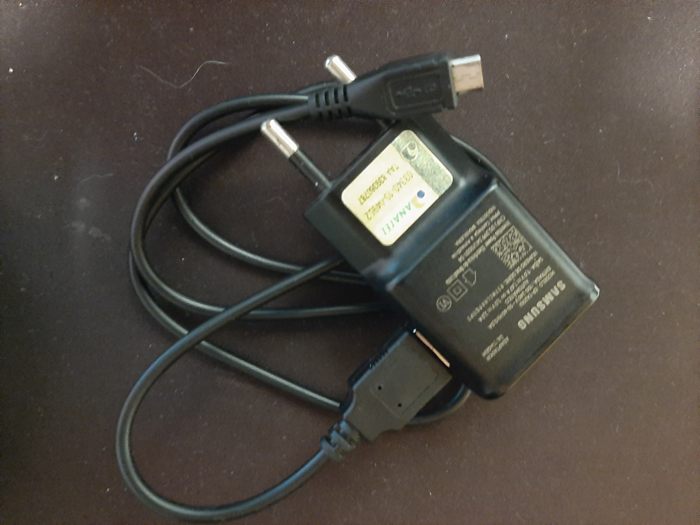

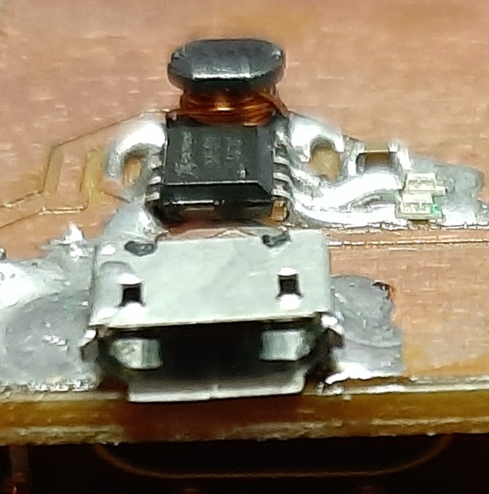

#### Das baterias utilizadas

A priori, assim como na central, a equipe utilizou uma única célula de bateria de lítio de 3.7V convencional porém esta não performou de forma boa, não sendo capaz de fornecer energia suficiente para o módulo de sensor, principalmente devido ao alto consumo dos sensores, de aproximadamente 650mW por sensor utilizado no elemento de aquecimento destes.

##### Célula de bateria de lítio de 3.7V convencional utilizada no primeiro protótipo


Apó s a análise do primeiro protótipo, a equipe optou por utilizar uma bateria de lítio de 3.7V de alta capacidade, assim como no módulo central, a bateria foi retirada de um banco de baterias de um notebook dell vostro 5470 que estava inutilizado, a bateria deste notebook é composta de 3 células de bateria de lítio, a do sensor é composta de 1 célula da bateria de lítio.

##### Bateria de lítio de 3.7V de alta capacidade utilizada no segundo protótipo

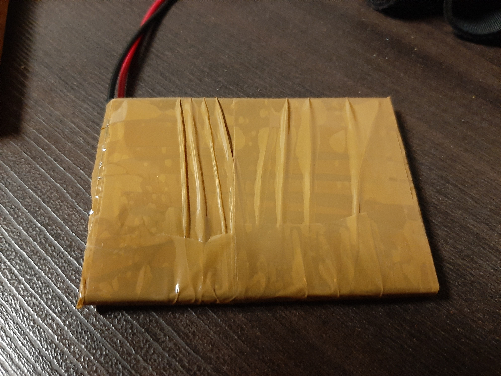

### Setor de status

Assim como no módulo central, o setor de status é responsável por fornecer informações sobre o estado do módulo central, o setor de status é composto por 3 leds, um led vermelho e 2 leds verdes. Estes leds possuem propósito geral e estão conectados a GPIOs do microcontrolador ESP32.


### Setor de sensoriamento

O setor de sensoriamento é responsável por realizar o tratamento da tensão de saída dos sensores e transmitir esses valores para o ADC do microcontrolador ESP32, o setor de sensoriamento é composto por 3 sensores de gases, sendo estes 1xMQ-5, 1xMQ-6 e 1xMQ-7, além disso possui um divisor de tensão para permitir o ajuste para o range de tensão de entrada do ADC do microcontrolador ESP32 e um filtro para reduzir ruídos na tensão de saída dos sensores. Além disso possui uma resistência série com o elemento de aquecimento dos sensores para limitar a corrente de aquecimento dos sensores e evitar sobrecarga no módulo de carga / descarga de bateria responsável por alimentar o módulo sensor.


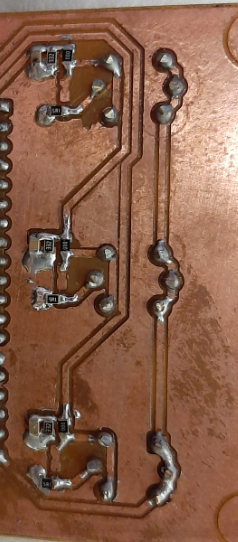

### Setor de alimentação

O setor de alimentação é responsável por fornecer energia para o módulo sensor. Ao contrário do módulo central, o módulo sensor utiliza uma entrada externa ja regulada de 5V usando um carregador de celular em sua micro USB, a tensão de 5V é utilizada para alimentar o microcontrolador ESP32, os sensores e também é utilizada para alimentar o módulo de carga / descarga de bateria baseado na implementação do módulo 134n3p que por sua vez realiza a carga da bateria quando o carregador externo está ativo e a descarga da bateria quando o carregador externo está inativo, mantendo assim a alimentação do módulo sensor mesmo quando o carregador externo está inativo.

#### Caminho da energia no módulo central

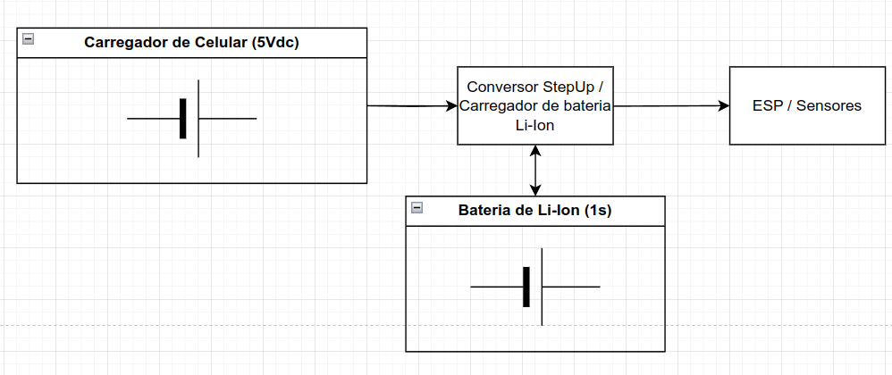

O caminho da energia do módulo se resume em:
* Carregador conectado, nesse cenário a tensão de 5V é fornecida para o módulo sensor e para o módulo de carga / descarga de bateria que por sua vez carrega a bateria, assim o módulo central é alimentado pelo carregador externo.
* Carregador desconectado, nesse cenário por não haver tensão de entrada na placa, o módulo de carga / descarga de bateria realiza a descarga e elevação da tensão da bateria de 3.7V para 5V, assim o módulo sensor é alimentado pela bateria.

#### Classificações máximas e determinações de cenários de falha por sobrecarga

Primeiramente, não foi realizado uma análise aprofundada do consumo do módulo sensor por requerir uma análise profunda de todos os aspectos, porém uma estimativa foi realizada para estipular a carga máxima requerida pelo módulo central.

A estimativa se baseia na análise dos seguintes pontos:
* O microcontrolador ESP32 possui uma corrente máxima de 250mA (Desconsiderando cenário de scan de rede WiFi que segundo fórums e datasheet pode atingir até 0.7A por um período de 10ms), esse dado foi extraído de fóruns e datasheet do microcontrolador considerando um cenário ativo de transmissão de dados via WiFi, segundo os fórums, o consumo médio do microcontrolador é de 80mA em tempo ocioso / em não transmissão de dados via WiFi.
* O consumo médio de cada sensor é basicamente a potencia dissipada em seu elemento de aquecimento, assim sendo o consumo médio de cada sensor é de 650mW ou seja 130mA por sensor e um total de 390mA para os 3 sensores.
* O consumo do módulo de carga / descarga de bateria pode ser desconsiderado aqui pois assume-se que o carregador será capaz de alimentar o módulo e fazer as regulações necessárias para manter-se em suas classificações máximas.

Assim sendo a estimativa de consumo máxima do módulo central é de 650mA, considerando o cenário de carga máxima, quando o módulo está totalmente sendo alimentado pela bateria apenas.

Estresses aplicados no módulo de carga / descarga de bateria são:
* Tensão de entrada: 3.7~5Vdc
* Tenso de saída: 5Vdc
* Corrente máxima: 0.65A

Por os valores estarem dentro do suportado pelo módulo de carga / descarga de bateria, não é necessário a utilização de dissipadores de calor.

### Do case do módulo sensor

O case do módulo sensor foi projetado para ser impresso em 3D, o case é composto por 2 partes, uma parte superior e uma parte inferior, a parte superior é responsável por proteger os sensores e a parte inferior é responsável por proteger o módulo de carga / descarga de bateria e o microcontrolador ESP32.

#### Projeto 3D do case do módulo sensor no software de modelagem Blender

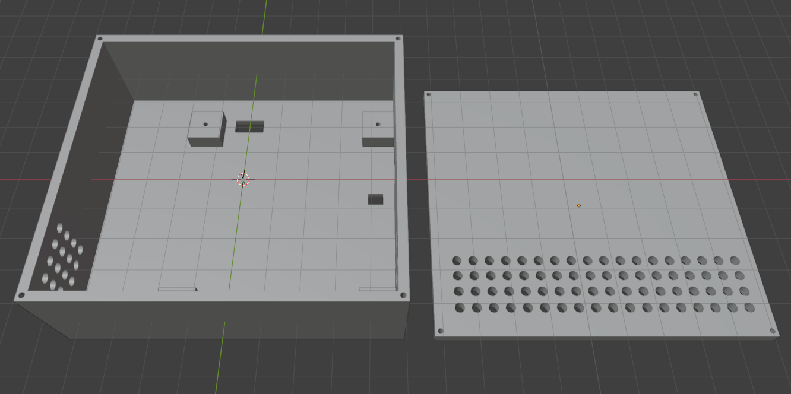

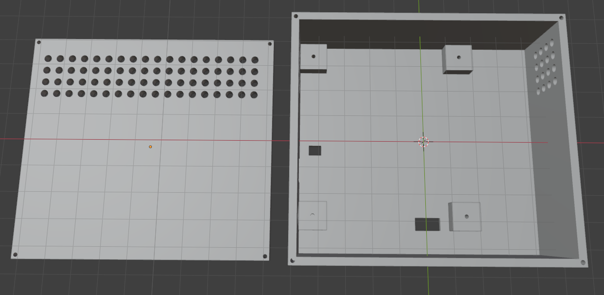

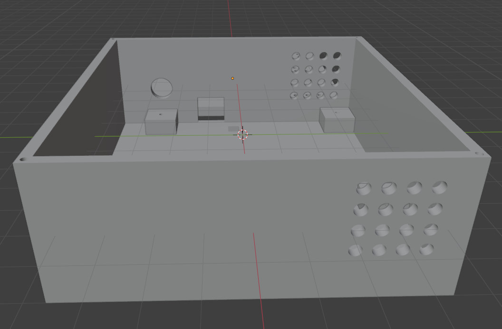

#### Projeto 3D do case do módulo sensor no software Cura3D para fatiamento

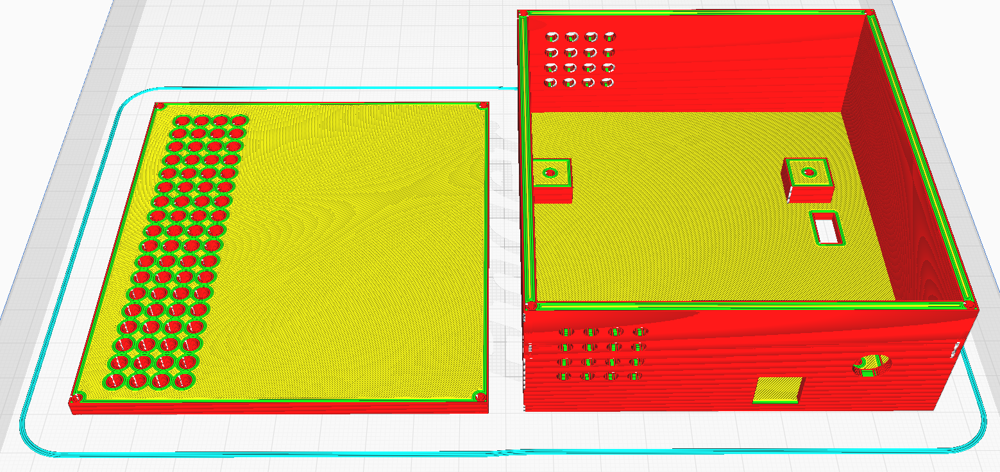

#### Case do módulo sensor em impressão 3D


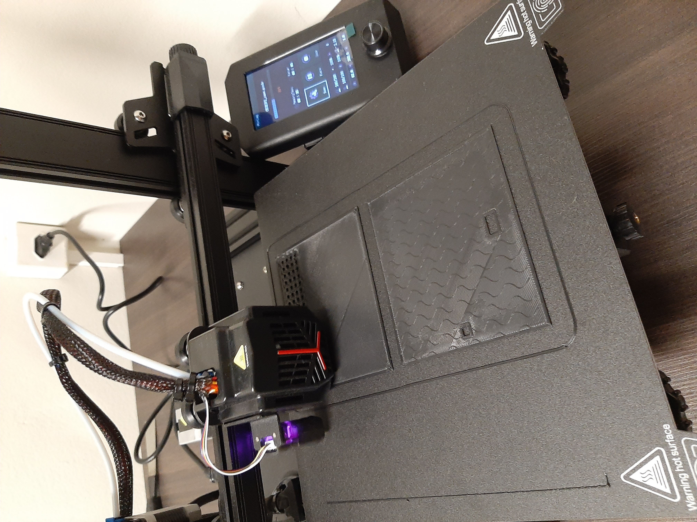

### Módulo Central Montado

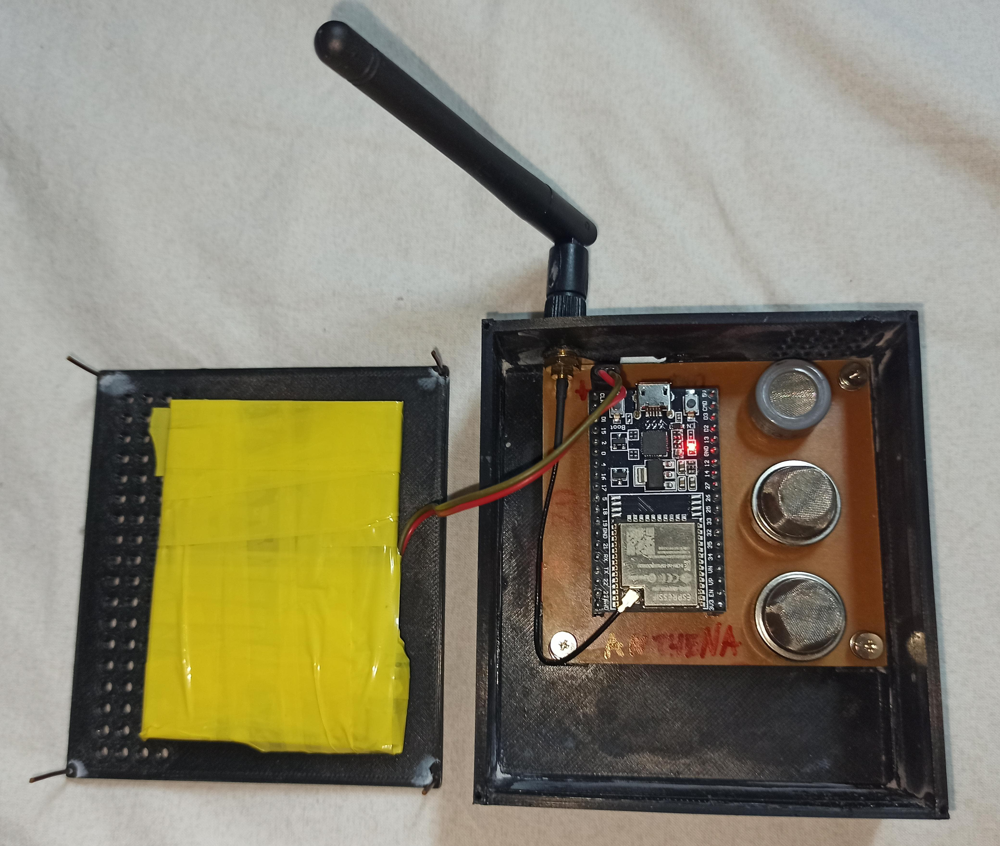

### Software do módulo sensor

O software do módulo sensor desenvolvido tem como alvo o microcontrolador ESP32 WROOM, este projeto tira proveito de suas capacidades robustas de processamento e conectividade. A comunicação entre o módulo sensor e o módulo central é estabelecida utilizando a biblioteca painlessMesh, uma escolha estratégica que proporciona uma rede mesh auto-organizável e flexível.

O conjunto de arquivos do projeto sensor inclui:

1. **app.cpp e app.h**: Contém a lógica principal da aplicação, gerenciando o fluxo de operações e a integração dos diversos componentes do sistema.

2. **common.h**: Este arquivo é um repositório central para definições e funções comuns, promovendo a reutilização de código e a manutenção simplificada.

3. **hardware.h**: Especificamente destinado à interface com o hardware, este arquivo contem definições de pinos, configurações de dispositivos e funções de baixo nível.

4. **main.ino**: O ponto de entrada principal do programa, responsável por inicializar o sistema e direcionar o ciclo principal de operações.

5. **network.cpp e network.h**: Gerenciam todas as funcionalidades relacionadas à rede, incluindo a comunicação via painlessMesh, garantindo uma conexão estável e eficiente com o módulo central.

6. **sensing.cpp e sensing.h**: Esses arquivos são focados na aquisição e processamento dos dados de gás, transformando leituras brutas em informações úteis.

7. **status.cpp e status.h**: Oferecem funcionalidades para monitorar e reportar o estado do sistema utilizando os LEDs presentes no projeto do módulo sensor, facilitando a detecção de problemas e a manutenção preventiva.

#### Fluxo Geral

Cada um desses arquivos desempenha um papel crucial na garantia de que o módulo sensor funcione conforme o esperado, oferecendo uma solução robusta e eficiente para monitoramento de gases.

Os arquivos `app.h`, `app.cpp`, `common.h`, `hardware.h` e `main.ino` formam a espinha dorsal do software de um módulo sensor para monitoramento de gases, projetado para o microcontrolador ESP32 WROOM e utilizando a biblioteca painlessMesh para comunicação em rede.

##### 1. main.ino
Este é o ponto de entrada do programa. Ele instancia um objeto da classe `Application` e invoca seus métodos `Setup` e `Loop`. Esses métodos são responsáveis por inicializar e manter o ciclo principal de operações do módulo.

##### 2. app.h
Este arquivo define a classe `Application`, que atua como o núcleo do software. Esta classe encapsula a lógica de inicialização, gestão de tarefas periódicas e a coordenação entre diferentes módulos como rede, sensores e status.

##### 3. app.cpp
Este arquivo implementa os métodos da classe `Application`. Na construção, ele inicializa vários componentes (status, sensing, network) e configura uma tarefa (m_AppTask) para ser executada periodicamente. O método `Setup` inicializa o serial (se o debug estiver habilitado) e configura a rede mesh. O método `RunApp` lê dados dos sensores e envia para a rede mesh.

##### 4. common.h
Contém definições comuns usadas em todo o projeto. Inclui configurações para debug, parâmetros da rede mesh, e identificadores únicos para o dispositivo. Essas definições fornecem uma base para a personalização e configuração do módulo sensor.

##### 5. hardware.h
Define os aspectos físicos e as configurações de hardware do módulo, como os pinos dos sensores de gás (MQ-5, MQ-6, MQ-7) e LEDs de status. Este arquivo é crucial para mapear as funcionalidades do software aos componentes físicos do dispositivo.

#### Fluxo geral do software de rede dos sensores

Os arquivos `network.h` e `network.cpp` formam a base para a gestão da rede do módulo sensor, utilizando a biblioteca painlessMesh para criar e gerenciar uma rede mesh. Esses arquivos definem a lógica para enviar dados dos sensores, buscar um nó mestre na rede, e lidar com a recepção de mensagens de outros nós.

### Estrutura de Mensagens
- `MessageSensorData`: Estrutura para armazenar e enviar os dados dos sensores MQ5, MQ6, e MQ7, incluindo seus históricos de valores.

### Classe NetWork
- **Construtor e Destrutor**: Configuram as funções de callback para diferentes eventos de rede, como recebimento de mensagens, novas conexões, alterações de conexão e ajustes de tempo.
- **SendData**: Envio dos dados dos sensores. Verifica se existe um nó mestre conectado. Se não, inicia a busca por um mestre. Empacota os dados em um documento JSON e os envia para o nó mestre.
- **SearchMaster**: Busca um nó mestre na rede mesh, enviando uma mensagem de broadcast.
- **OnReceive**: Callback para o recebimento de mensagens. Analisa o tipo de mensagem recebida e, se for uma resposta de um nó mestre, chama `OnFoundMasterMessage`.
- **OnNewConnection, OnChangedConnection, OnNodeTimeAdjusted**: Callbacks para eventos de rede, utilizados principalmente para fins de debug e monitoramento do estado da rede.

### Operação Geral
1. **Inicialização**: Ao ser instanciada, a classe `NetWork` configura os callbacks para eventos relevantes da rede mesh.
2. **Envio de Dados**: Regularmente, o módulo tenta enviar os dados dos sensores para o nó mestre. Se o mestre não for conhecido ou estiver desconectado, ele inicia a busca por um novo mestre.
3. **Busca por Mestre**: Se não houver um mestre conectado, o módulo envia um broadcast para encontrar um novo mestre, recebendo eventualmente uma resposta que identifica o nó mestre.
4. **Recebimento de Mensagens**: Ao receber mensagens, o módulo processa o conteúdo. Se a mensagem for uma resposta de um nó mestre, o módulo atualiza seu ID mestre e altera seu status.
5. **Monitoramento de Conexão**: Os callbacks para novas conexões, alterações de conexão e ajustes de tempo oferecem visibilidade sobre o estado da rede mesh, essencial para manter a estabilidade e eficiência da rede.

Essa estrutura de rede permite que o módulo sensor se comunique eficientemente dentro de uma rede mesh, adaptando-se a mudanças na topologia da rede e garantindo a entrega de dados de sensoriamento de forma confiável.
