# ESTUFA HIDROPÔNICA VERTICAL INTELIGENTE
# IMPLEMENT
Para melhor entendimento do desenvolvimento dos componentes e sistemas presente na Estufa Hidropônica Vertical Inteligente, o projeto será divido em 6 grandes tópicos.
- Planta Mecânica
- Planta Eletrônica
- Lista de Materiais
- Etapas de Funcionamento do Código
- Protocolo de Comunicação
- Aplicativo

Video de Testes da estufa https://www.youtube.com/watch?v=nC_NTJvr43A&ab_channel=MateusSalgado

## PLANTA MECÂNICA
Podemos observar na figura abaixo os componentes e disposição dos mesmos nos sistemas. Será abordado de forma individual cada grupo de componentes.
- Sistema Hidráulico
- Sistema de Iluminação
- Sistema Temperatura

**Figura 1 - Planta Mecânica do Projeto Final**
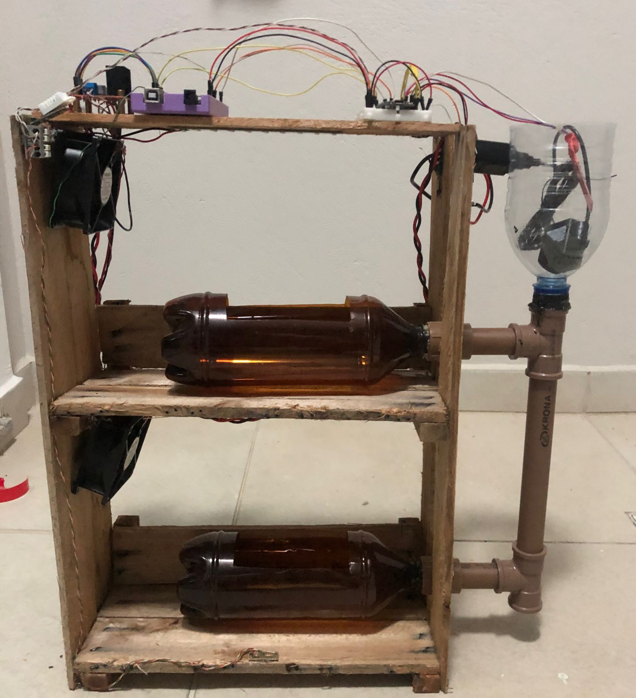

### SISTEMA HIDRÁULICO
O sistema hidráulico foi implementado na busca de integrar simples componentes buscando assegurar uma circulação eficiente da água na estufa vertical. A reutilização e reciclagem de materiais, alinhando-se a princípios sustentáveis, foi um grande desafio ao implementar, e acabamos tendo alguns pontos de melhorias a serem implementados em uma futura oportunidade.

- Melhor concepção e design do sistema hidráulico
- Melhoria nas conexões hidráulicas
- Aquisição de bomba de 2 vias

**Figura 2 - Planta Mecânica do Sistema Hidráulico**
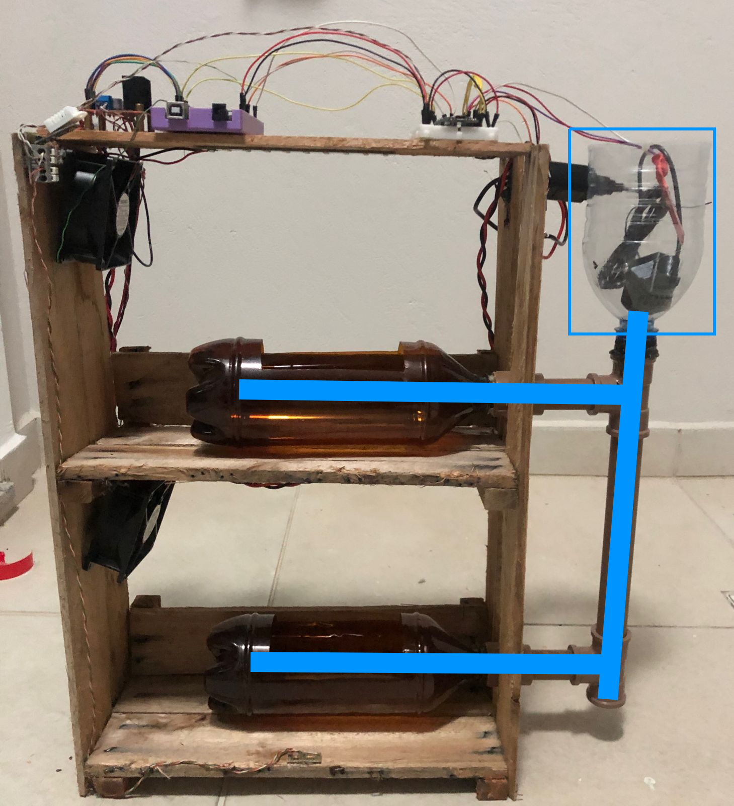
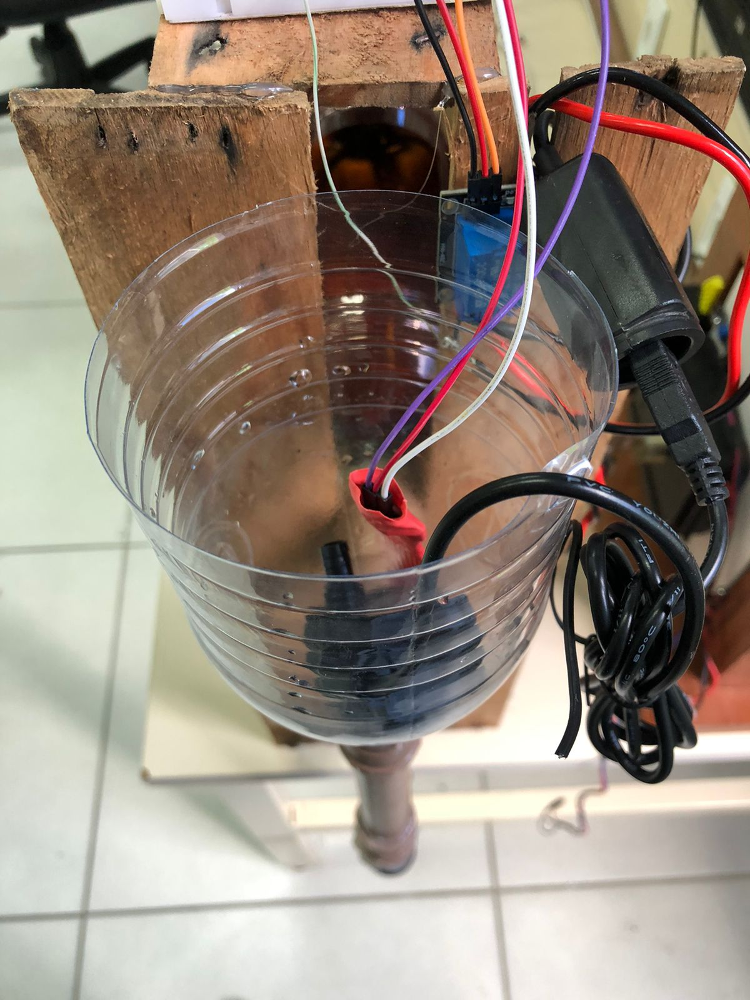

### SISTEMA ILUMINAÇÃO
O projeto do sistema de iluminação foi concebido com foco na otimização da eficiência luminosa, essencial para o crescimento saudável das plantas na estufa hidropônica vertical. Na imagem abaixo podemos visualizar onde foram posicionados as fita de LED e o sensor LDR, posicionado estratégicamente em local que temos menos luminosidade da estufa.

**Figura 3 - Planta Mecânica do Sistema de Iluminação**
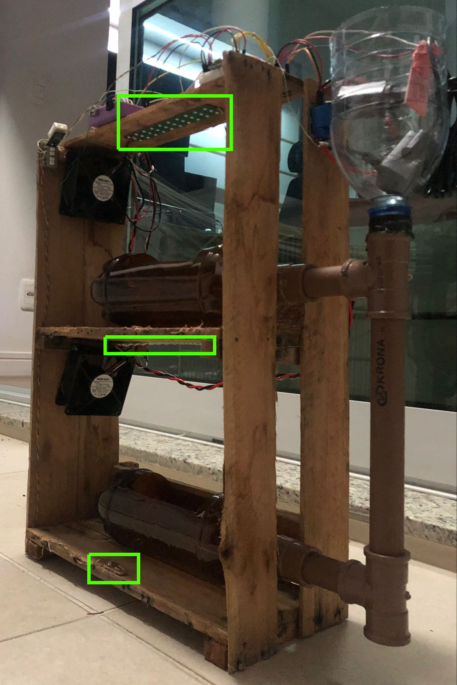
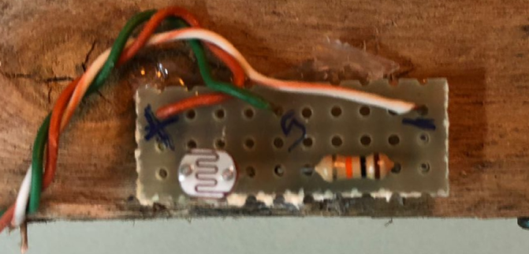

### SISTEMA TEMPERATURA
O sistema de controle de temperatura projetado para a estufa hidropônica vertical visa criar um ambiente controlado e estável para o cultivo de plantas.
Na imagem abaixo podemos visualizar onde foram posicionados os cooler e os sensores DHT22, posicionado estratégicamente em locais para aferirmos temperatura e humidade, e garantir boa ventilação da estufa.

**Figura 4 - Planta Mecânica do Sistema de Temperatura**
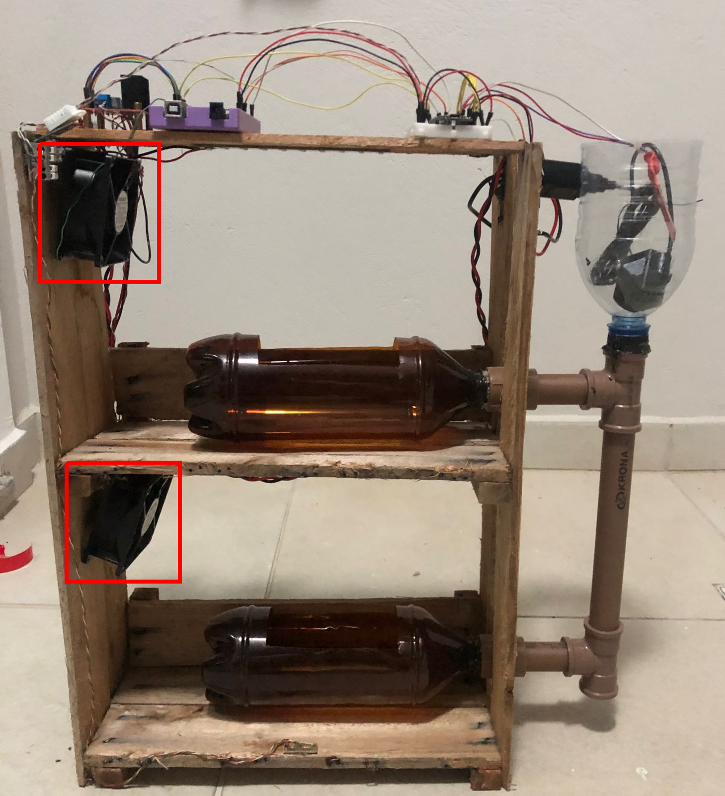
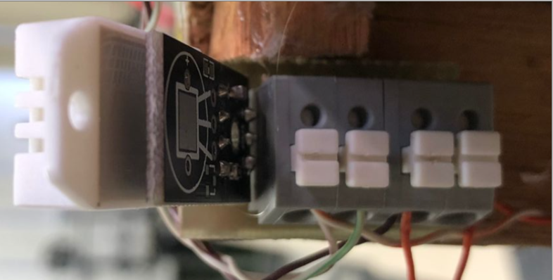

## PLANTA ELETRÔNICA
### ESQUEMA ELÉTRICO
**Figura 4 - Esquema Elétrico**
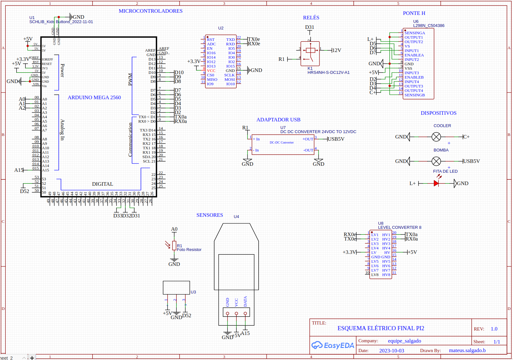
#### LIGAÇÕES ELÉTRICAS
##### MICROCONTROLADORES
- Arduino Mega - É responsável por toda aferição de sensores e controle dos devices de potência.
- Placa de desenvolvimeno ESP32 - É responsável pela comunicação Wifi com Aplicativo.
##### SENSORES
###### Fotoresistor 
Possui uma resistência que varia conforme à exposição à luz. Será conectado ao pino Analógico A0 para leitura de sua resistência.

    Pino do Sensor	Pino do Arduino
        + VCC	      5V
        - GND             GND
        S 	              A0

###### Sensor de água
O Sensor T1692, retorna valores analógicos, por isso foi conectado à porta A15 de saída. Já seu pino de alimentação, foi conectado em um pino digital, devido a relatos em fórum na internet, que ao deixar o sensor ligado por um grande espaço de tempo, ele queimaria. Por isso foi implementado na função de leitura dos sensoresm,

    Pino do Sensor	Pino do Arduino
        + VCC	      53
        - GND             GND
        S 	              A15
      

###### Sensor temperatura umidade DHT22
O sensor DHT22 foi conectado à porta digital 52, ele retorna as informações de temperatura e hummidade através de uma struct criada na biblioteca do sensor.

    Pino do Sensor	Pino do Arduino
        + VCC	      5V
        - GND             GND
        S 	              52

##### DEVICES DE POTÊNCIA
- Cooler 12V 0.58A 
- Fita de LED
- Bomba d'água

A Bomba está conectada ao pino NA do relé.
O Cooler e o Led foram ligados de forma que conseguimos tanto inverter os pinos de alimentação, quanto acionar PWM deles.

##### DEVICES AUXILIARES
###### Conversor USB 12V-5V
Se faz necessário devido à bomba d'água ser de conexão USB e alimentação 5V DC.

###### Módulo Relé
Se faz necessário devido à intuição de controle do funcionamento dos devices de potência. Teremos 12V entre os Terminais NA, e quando houver um sinal lógico em seu in(n) ele fechará a bobina. Sua alimentação lógica é de 5V compartilhando a mesma malha GND do arduino. Cada Pino Digital é respónsável pelo acionamento de um device de potência.

    Pino do Relé	Pino do Arduino
        + VCC	      5V
        - GND             GND
        IN1 	      D50

###### Ponte H
Se faz necessário devido à intuição de controle do funcionamento dos devices de potência. Teremos 12V entre os Terminais de alimentação do dispositivo, entradas e saídas de lógicas e de potência, e um input de PWM desejado na saída.

    Pino da Ponte H	Pino do Arduino
        + VCC	      5V
        - GND             GND
        IN1 	      D07
        IN2 	      D06
        IN3 	      D02
        IN4 	      D04
        OUT1+ 	      LED+
        OUT1- 	      LED-
        OUT2+ 	      COOLER+
        OUT2- 	      COOLER+
        EN1 	      D05
        EN2 	      D03

## LISTA DE MATERIAIS
Na fase de implementação do projeto, foram realizadas as etapas de construção tanto da parte mecânica quanto eletrônica. Os componentes utilizados para a implementação incluíram:

    Lista de Materiais:
        Fotoresistor
        Sensor de água
        Sensor de temperatura e umidade DHT22
        Módulo Relé
        Ponte H
        Arduino Mega
        Placa de desenvolvimento ESP32
        2 Coolers 12V 0.58A
        2 Fitas de LED
        Conector P4
        Conversor USB 12V-5V
        Bomba d'água
        Estrutura de Madeira
        Sistema Hidráulico
            3 Garrafas PET de 1 litro
            Conexões Hidráulicas

## ETAPAS DE FUNCIONAMENTO DO CÓDIGO
O entendimento do código e da dinâmica entre o Arduino e a ESP é crucial para o funcionamento adequado do sistema.

O Arduino incorpora as classes SensorController, DeviceController e Communication, sendo esta última compartilhada com a ESP.
- A classe SensorController é responsável pela leitura dos sensores da Estufa. 
- A classe DeviceController é responsável pelo controle dos devices da Estufa.
- A classe Communication é responsável pela comunicação entre o Microcontrolador da Estufa (Arduino) e o do Aplicativo (ESP).

A condição padrão do Arduino consiste em aguardar a recepção de Pacotes de Comunicação enviados pela ESP, a ESP por sua vez, envia pacote toda vez que tem alguma alteração de valor nos seus pinos virtuais. 
Esses pacotes têm o propósito de ajustar os valores de Threshold e PWM dos Dispositivos, bem como a máquina de estados do Arduino. Em resposta, o Arduino envia o Status Geral da Estufa, indicando os valores dos sensores, thresholds e PWM dos circuitos a serem controlados. d

### Classe SensorController
Foram escritas as classes e funções de controle dos sensores. Vale ressaltar que todas as leituras dos sensores são atribuídas a uma variável do tipo int, isto se deve devido a padronização para o envio do protocolo.
Foram declaradas as funções de leitura individuais de cada sensor. Todas funções recebem o boleano debug, este que quando ativo, printa serialmente os valores lidos.
~~~c++
#ifndef SensorController_h
#define SensorController_h

#include <DHT.h>

class SensorController {
private:
  const int LDRpin;
  const int T1592vcc;
  const int T1592pin;
  const int DHTpin;
  DHT dht;

public:
  SensorController(int ldrPin, int t1592vcc, int t1592pin, int dhtPin);
  struct SensorValues {
    int lighting;
    int level;
    int temperature;
    int humidity;
  };
  SensorValues readAllSensors(bool debug = false);

private:
  struct DHT22Value {
    int temperature;
    int humidity;
  };
  int readLDR(bool debug);
  int readT1592(bool debug);
  DHT22Value readDHT22(bool debug);
};

#endif
~~~
#### int readLDR(bool debug);
~~~c++
int SensorController::readLDR(bool debug) {
  int ldrValue = analogRead(LDRpin);

  if (debug) {
    Serial.print("\nLuminosidade LDR: ");
    Serial.println(ldrValue);
  }

  return ldrValue;
}
~~~
#### int readT1592(bool debug);
Esta função como podemos ver abaixo, aciona o pino digital do sensor antes de ler. Isto devido a problemas com queima de sensores caso deixe ligado por muito tempo.
~~~c++
int SensorController::readT1592(bool debug) {
  digitalWrite(T1592vcc, HIGH);
  delay(3);
  int t1592Value = analogRead(T1592pin);
  digitalWrite(T1592vcc, LOW);

  if (debug) {
    Serial.print("Nível de água: ");
    Serial.println(t1592Value);
  }

  return t1592Value;
}
~~~
#### DHT22Value readDHT22(bool debug);
A struct DHT22Value foi declarada.
~~~
  struct DHT22Value {
    int temperature;
    int humidity;
  };
~~~
~~~c++
SensorController::DHT22Value SensorController::readDHT22(bool debug) {
  DHT22Value dhtValue;

  dhtValue.temperature = dht.readTemperature();
  dhtValue.humidity = dht.readHumidity();

  if (isnan(dhtValue.humidity) || isnan(dhtValue.temperature)) {
    Serial.println("Erro ao ler o sensor DHT22!\n");
    dhtValue.temperature = 0;
    dhtValue.humidity = 0;
  }

  if (debug) {
    Serial.print("Umidade: ");
    Serial.print(dhtValue.humidity);
    Serial.print(" %\t\n");
    Serial.print("Temperatura: ");
    Serial.print(dhtValue.temperature);
    Serial.println(" °C\n");
  }

  return dhtValue;
}
~~~
### SensorValues readAllSensors(bool debug);
Esta função chama todas outras, lendo os sensores,  e retornando uma variável do tipo SensorValues, que são todos valroes de sensores da estufa.
~~~
  struct SensorValues {
    int lighting;
    int level;
    int temperature;
    int humidity;
  };
~~~
~~~c++
SensorController::SensorValues SensorController::readAllSensors(bool debug) {
  SensorValues values;

  values.lighting = readLDR(debug);
  values.level = readT1592(debug);

  DHT22Value dhtData = readDHT22(debug);
  values.temperature = dhtData.temperature;
  values.humidity = dhtData.humidity;

  return values;
}
~~~
### Classe DeviceController
Foram escritas as classes e função de controle e leitura de Status dos devices da Estufa. 
~~~c++
#ifndef DeviceController_h
#define DeviceController_h

#include <Arduino.h>

class DeviceController {
public:
  DeviceController(int coolerPin1, int coolerPin2, int coolerPWM, int ledPin1, int ledPin2, int ledPWM, int bombaPin);

  struct DeviceStatus {
    int led;
    int cooler;
    int bomba;
  };

  DeviceStatus statusDevice();
  void controlDevice(int device, int pwm);

private:
  int COOLERpin1, COOLERpin2, COOLERpwm, LEDpin1, LEDpin2, LEDpwm, BOMBApin;
};

#endif
~~~

####  DeviceStatus statusDevice();
Foi criado a Struct DeviceStatus, para o retorno de cada pino dos dispositivos de potência.
~~~
  struct DeviceStatus {
    int led;
    int cooler;
    int bomba;
  };
~~~
~~~
DeviceController::DeviceStatus DeviceController::statusDevice() {
  DeviceStatus retorno;

  retorno.cooler = analogRead(COOLERpwm);
  retorno.led = analogRead(LEDpwm);
  retorno.bomba = digitalRead(BOMBApin);

  return retorno;
}
~~~
####  void controlDevice(int device, int pwm);
Na função de controle de dispositivos, é recebido um int com valor do dispositivo a ser controlado. E esta variável cai em um switch case, este que seleciona qual pino deve ser controlado.
~~~
void DeviceController::controlDevice(int device, int pwm) {
  switch (device) {
    // temperatura
    case 0:
      digitalWrite(COOLERpin1, HIGH);
      digitalWrite(COOLERpin2, LOW);
      analogWrite(COOLERpwm, pwm);
      break;

    // iluminacao
    case 1:
      digitalWrite(LEDpin1, HIGH);
      digitalWrite(LEDpin2, LOW);
      analogWrite(LEDpwm, pwm);
      break;

    // agua
    case 10:
      if (pwm > 0) {
        digitalWrite(BOMBApin, HIGH);
        }
      else{
        digitalWrite(BOMBApin, LOW);
        }
      break;
      
    default:
      break;
  }
}
~~~
### Classe Communication
Esta classe é responsável por ler, escrever e printar protocolos definidos.
Foi declarado uma struct com os campos do protocolo de comunicação.
~~~
#ifndef Communication_h
#define Communication_h

#include <Arduino.h>

class Communication {
public:
  struct Protocol {
    int device;
    int pwm;
    int sensor;
    int tsh;
  };

  Communication();

  void writeSerial(const Protocol& message);
  Protocol readSerial(bool debug);
  void printSerial(const char message[18]);
};

#endif
~~~
#### void writeSerial(const Protocol& message);
Esta função é responsável por receber uma variável do tipo Protocol, e transformar em uma mensagem do protocolo. Como o protocolo é o envio de caracteres serialmente, tivemos que através da função sprintf(), transformar int to char.
~~~
void Communication::writeSerial(const Protocol& message) {
  char device[3];
  char pwmvalue[4];
  char sensorvalue[5];
  char tshvalue[4];

  sprintf(device, "%02d", message.device);
  sprintf(pwmvalue, "%03d", message.pwm);
  sprintf(sensorvalue, "%04d", message.sensor);
  sprintf(tshvalue, "%03d", message.tsh);
  
  Serial.write('s');
  Serial.write(':');
  Serial.write(device[0]);
  Serial.write(device[1]);
  Serial.write(':');
  Serial.write(pwmvalue[0]);
  Serial.write(pwmvalue[1]);
  Serial.write(pwmvalue[2]);
  Serial.write(':');
  Serial.write(sensorvalue[0]);
  Serial.write(sensorvalue[1]);
  Serial.write(sensorvalue[2]);
  Serial.write(sensorvalue[3]);
  Serial.write(':');
  Serial.write(tshvalue[0]);
  Serial.write(tshvalue[1]);
  Serial.write(tshvalue[2]);
  Serial.write(':');
  Serial.write('e');
}
~~~
#### Protocol readSerial(bool debug);
Nesta função, ficamos tentando ler a serial, até que tenhamos uma mensagem de tamanho [19], após isso fazemos a conferência se realmente é um protocolo, e então retornamos os valores em int da mensagem recebida.
~~~

Communication::Protocol Communication::readSerial(bool debug) {
  Protocol retorno;
  char message[19];
  int i = 0;
  
  while (Serial.available()) {
    char receivedChar = Serial.read();
    Serial.write(receivedChar);
    if (receivedChar == 's') {
      i = 0;
      message[i++] = receivedChar;
    } else if(receivedChar == 'e') {
      message[i++] = receivedChar;
      break;
    } else {
      message[i++] = receivedChar;
    }
  }

  if (message[0] == 's' && message[18] == 'e') {
    char devicevalue[3];
    devicevalue[0] = message[2];
    devicevalue[1] = message[3];
    devicevalue[2] = '\0';
    
    char pwmvalue[4];
    pwmvalue[0] = message[5];
    pwmvalue[1] = message[6];
    pwmvalue[2] = message[7];
    pwmvalue[3] = '\0';
    
    char sensorvalue[5];
    sensorvalue[0] = message[9];
    sensorvalue[1] = message[10];
    sensorvalue[2] = message[11];
    sensorvalue[3] = message[12];
    sensorvalue[4] = '\0';

    char tshvalue[4];
    tshvalue[0] = message[14];
    tshvalue[1] = message[15];
    tshvalue[2] = message[16];
    tshvalue[3] = '\0';

    if (debug) {
      Serial.print("\n");
      Serial.print("Device Value: ");
      Serial.println(devicevalue);
      
      Serial.print("PWM Value: ");
      Serial.println(pwmvalue);
      
      Serial.print("Sensor Value: ");
      Serial.println(sensorvalue);
      
      Serial.print("TSH Value: ");
      Serial.println(tshvalue);
    }

    retorno.device = atoi(devicevalue);
    retorno.pwm = atoi(pwmvalue);
    retorno.sensor = atoi(sensorvalue);
    retorno.tsh = atoi(tshvalue);
    return retorno;
  }
  else{
     retorno.sensor = retorno.tsh = retorno.device = retorno.pwm = 0;
     return retorno;
    }
}
~~~
#### void printSerial(const char message[18]);
~~~
void Communication::printSerial(const char message[18]) {
  for (int j = 0; j < sizeof(message); j++) {
    Serial.print(message[j]);
  }
}
~~~
### Estados Estufa e Blynk
Os estados são baseados nessas duas structs, a struct Estufa.
~~~
struct Sistema {
  int pwm;
  int sensor;
  int tsh;
};

struct Estufa {
  Sistema luminosidade;
  Sistema temperatura;
  Sistema nivel;
};

~~~
O loop da Estufa é receber protocolo, e de 10 em 10 segundos enviar o status dos sensores para ESP8266.
~~~
void loop(){
  estufa = recieveProtocol(estufa, 1);

  static unsigned long lastTime1 = 0;
  static unsigned long lastTime2 = 0;
  unsigned long currentTime = millis();
  if (currentTime - lastTime2 >= 10000) {
    sendStatus(estufa, 1);
    lastTime2 = currentTime;
  }
}

~~~
Após realizar a leitura, é atualizado o estado da estufa, e feito o envio de 3 protocolos com a atualização de cada sistema.
~~~
void sendStatus(Estufa estufa, bool debug) {
  SensorController::SensorValues sensor = sensorController.readAllSensors(debug);
  
  message.device = 0;
  message.pwm = estufa.temperatura.pwm;
  message.sensor = sensor.temperature;
  message.tsh = estufa.temperatura.tsh;
  
  communication.writeSerial(message);
  
  message.device = 1;
  message.pwm = estufa.luminosidade.pwm;
  message.sensor = sensor.lighting;
  message.tsh = estufa.luminosidade.tsh;
  
  communication.writeSerial(message);
  
  message.device = 10;
  message.pwm = estufa.nivel.pwm;
  message.sensor = sensor.level;
  message.tsh = estufa.nivel.tsh;
  
  communication.writeSerial(message);
}
~~~
Ao receber o protocolo da ESP8266, o Arduino por sua vez atualiza os valores de TSH e PWM da estufa, e é neste momento que ele atua nos devices de potência da estufa.
~~~
Estufa recieveProtocol(Estufa estufa, bool debug) {
  Communication::Protocol message = communication.readSerial(debug);
  delay(8000);
  deviceController.controlDevice(message.device, message.pwm);

  switch (message.device) {
    // temperatura
    case 0:
      estufa.temperatura.tsh = message.tsh;
      estufa.temperatura.pwm = message.pwm;

      if(estufa.temperatura.tsh < estufa.temperatura.sensor){
        estufa.temperatura.pwm = 130;
        deviceController.controlDevice(message.device, estufa.temperatura.pwm);
      }
      
      break;

    // iluminacao
    case 1:
      estufa.luminosidade.tsh = message.tsh;
      estufa.luminosidade.pwm = message.pwm;
      
      if(estufa.luminosidade.tsh > estufa.luminosidade.sensor){
        estufa.luminosidade.pwm = 100;
        deviceController.controlDevice(message.device, estufa.luminosidade.pwm);
      }
      
      break;

    // agua
    case 10:
      estufa.nivel.tsh = message.tsh;
      estufa.nivel.pwm = message.pwm;

      if(estufa.nivel.tsh < estufa.nivel.sensor){
        estufa.nivel.pwm = 100;
        deviceController.controlDevice(message.device, estufa.nivel.pwm);
      }
      
      break;

    default:
      break;
  }

  return estufa;
}
~~~
Ou seja, o Arduino manda à ESP de 10 em 10 segundos 3 protocolos com a atualização de sensores, e ao receber o protocolo da ESP, atua em cima da mensagem.

Abaixo temos o recebimento de protocolo por parte da ESP, a qual interpreta o pacote e atua nos pinos virtuais dad estufa. Atualizando os valores no aplicativo
~~~
void recieveProtocol() {
  Communication::Protocol message = communication.readSerial(0);

  switch (message.device) {
    // temperatura
    case 0:
      Blynk.virtualWrite(V7, message.pwm);
      Blynk.virtualWrite(V6, message.sensor);
      Blynk.virtualWrite(V5, message.tsh);
      
      estufa.temperatura.sensor = message.sensor;
      estufa.temperatura.pwm = message.pwm;
      
      break;

    // iluminacao
    case 1:
      Blynk.virtualWrite(V8, message.pwm);
      Blynk.virtualWrite(V1, message.sensor);
      Blynk.virtualWrite(V2, message.tsh);
      
      estufa.luminosidade.sensor = message.sensor;
      estufa.luminosidade.pwm = message.pwm;

      break;

    // agua
    case 10:
      Blynk.virtualWrite(V0, message.pwm);
      Blynk.virtualWrite(V3, message.sensor);
      Blynk.virtualWrite(V4, message.tsh);
      
      estufa.nivel.sensor = message.sensor;
      estufa.luminosidade.pwm = message.pwm;
      
      break;

    default:
      break;
  }
}
~~~
O envio de protocolos da ESP, é dado por funções como esta, nativa do Blynk. Quando o aplicativo percebe mudança em um pino virtual, é chamada está função, onde ela monta um pacote com a mensagem a ser enviada, e envia o status da mudança do aplicativo.
~~~
BLYNK_WRITE(V7)
{
  estufa.temperatura.pwm = param.asInt();
  
  message.device = 0;
  message.pwm = estufa.temperatura.pwm;
  message.sensor = estufa.temperatura.sensor;
  message.tsh = estufa.temperatura.tsh;

  communication.writeSerial(message);
}
~~~
## PROTOCOLO DE COMUNICAÇÃO
O protocolo de comunicação segue o formato:

### s:00:000:0000:000:e

A interpretação deste pacote é a seguinte:

- start: indica o início do pacote.
- device: representa o dispositivo (cooler, LED, bomba).
- pwm: refere-se à largura de pulso modificada, variando de 0 a 255.
- sensor: indica o valor do sensor, variando conforme a aplicação.
- threshold: representa o valor de threshold, variando conforme a aplicação.
- e: indica o final do pacote.

A interpretação específica do pacote é detalhada da seguinte forma:

    Device 0 (cooler):
        PWM: 0-255
        Sensor: 0-50
        Threshold: 0-50

    Device 1 (LED):
        PWM: 0-255
        Sensor: 0-1000
        Threshold: 0-999

    Device 10 (bomba):
        PWM: 0-1
        Sensor: 0-1000
        Threshold: 0-999

Foram implementados em todas funções do software a função debug, que quando ativa, printa as informações na serial. Para debugar possíveis problemas e melhor confiança do que realmente está acontecendo na Estufa.
### Leitura dos sensores e envio de 3 protocolos para ESP
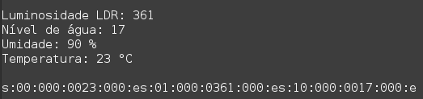

### Leitura dos pinos virtuais do Blynk e envio de 3 protocolos para o Arduino

Podemos visualizar a inicialização do aplicativo, e abaixo o envio de 3 pacotes do protocolo de comunicação.

### Arduino recebendo protocolo

Podemos visualizar o recebimento de um pacote vindo da ESP, e então interpretação dos valores e atualização nos estados da estufa.

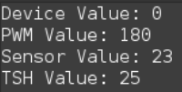

## APLICATIVO
Na imagem abaixo pode ser visto a interface com o usuário, nela você consegue visualizar os valores dos sensores, e definir os valores de Threshold e PWM.

Ao definir os valores limiares de Threshold, a estufa passa a monitorar se o valor lido dos sensores é maior ou menor que o limiar, e então toma a decisão de automaticamente acionar os dispositivos de potência.

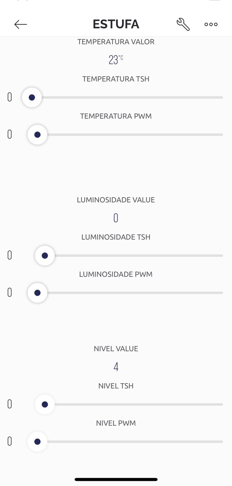