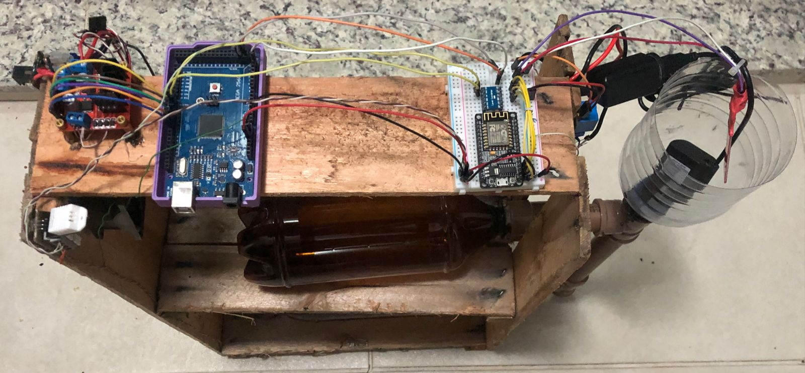
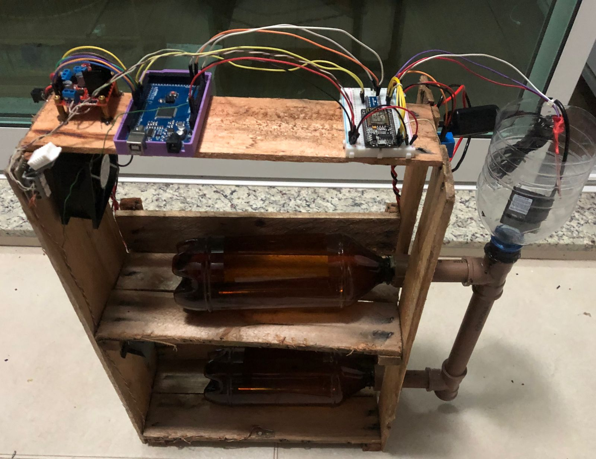

# ESTUFA HIDROPÔNICA VERTICAL INTELIGENTE
# IMPLEMENT
## LISTA DE MATERIAIS
Na fase de implementação do projeto, foram realizadas as etapas de construção tanto da parte mecânica quanto eletrônica. Os componentes utilizados para a implementação incluíram:

    Lista de Materiais:
        Fotoresistor
        Sensor de água
        Sensor de temperatura e umidade DHT22
        Módulo Relé
        Ponte H
        Arduino Mega
        Placa de desenvolvimento ESP32
        2 Coolers 12V 0.58A
        2 Fitas de LED
        Conector P4
        Conversor USB 12V-5V
        Bomba d'água
        Estrutura de Madeira
        Sistema Hidráulico
            3 Garrafas PET de 1 litro
            Conexões Hidráulicas

## ETAPAS DE FUNCIONAMENTO
O entendimento do código e da dinâmica entre o Arduino e a ESP é crucial para o funcionamento adequado do sistema.

O Arduino incorpora as classes SensorController, DeviceController e Communication, sendo esta última compartilhada com a ESP.
- A classe SensorController é responsável pela leitura dos sensores da Estufa. 
- A classe DeviceController é responsável pelo controle dos devices da Estufa.
- A classe Communication é responsável pela comunicação entre o Microcontrolador da Estufa (Arduino) e o do Aplicativo (ESP).

A condição padrão do Arduino consiste em aguardar a recepção de Pacotes de Comunicação enviados pela ESP, a ESP por sua vez, envia pacote toda vez que tem alguma alteração de valor nos seus pinos virtuais. 
Esses pacotes têm o propósito de ajustar os valores de Threshold e PWM dos Dispositivos, bem como a máquina de estados do Arduino. Em resposta, o Arduino envia o Status Geral da Estufa, indicando os valores dos sensores, thresholds e PWM dos circuitos a serem controlados.

## PROTOCOLO DE COMUNICAÇÃO
O protocolo de comunicação segue o formato:

### s:00:000:0000:000:e

A interpretação deste pacote é a seguinte:

- start: indica o início do pacote.
- device: representa o dispositivo (cooler, LED, bomba).
- pwm: refere-se à largura de pulso modificada, variando de 0 a 255.
- sensor: indica o valor do sensor, variando conforme a aplicação.
- threshold: representa o valor de threshold, variando conforme a aplicação.
- e: indica o final do pacote.

A interpretação específica do pacote é detalhada da seguinte forma:

    Device 0 (cooler):
        PWM: 0-255
        Sensor: 0-50
        Threshold: 0-50

    Device 1 (LED):
        PWM: 0-180
        Sensor: 0-1000
        Threshold: 0-999

    Device 10 (bomba):
        PWM: 0-1
        Sensor: 0-1000
        Threshold: 0-999

Foram implementados em todas funções do software a função debug, que quando ativa, printa as informações na serial. Para debugar possíveis problemas e melhor confiança do que realmente está acontecendo na Estufa.
### Leitura dos sensores e envio de 3 protocolos para ESP

### Leitura dos pinos virtuais do Blynk e envio de 3 protocolos para o Arduino

Podemos visualizar a inicialização do aplicativo, e abaixo o envio de 3 pacotes do protocolo de comunicação.

## APLICATIVO
Na imagem abaixo pode ser visto a interface com o usuário, nela você consegue visualizar os valores dos sensores, e definir os valores de Threshold e PWM.

## FOTOS DA ESTUFA

